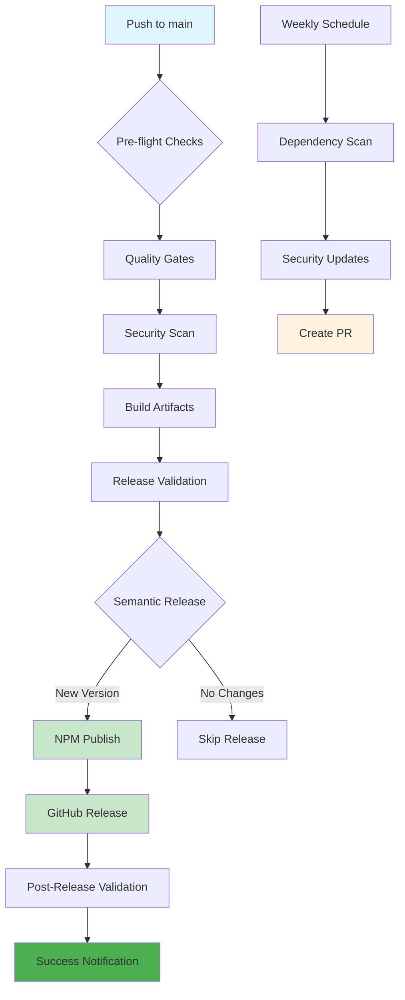

feat!: implement complete CI/CD pipeline with automated npm publishing

BREAKING CHANGE: Complete production-ready CI/CD infrastructure implemented

## 🚀 Major Changes

### CI/CD Pipeline Implementation
- Add comprehensive GitHub Actions workflows for CI, release, and dependency management
- Implement automated npm publishing to public registry with semantic-release
- Add multi-version Node.js testing (18, 20, 22) with quality gates
- Configure security scanning and automated vulnerability management
- Add automated dependency updates with weekly scheduling
- Implement post-release validation and monitoring
- Fix documentation workflow artifact download with resilient error handling

### Documentation & Setup
- Add comprehensive documentation for npm publishing setup
- Create CI/CD status tracking and troubleshooting guides
- Update package version to 2.0.0 for production release

### Security & Cleanup
- Remove sensitive files from git tracking (profiles, auth guides, personal docs)
- Maintain files locally but exclude from repository distribution
- Configure proper .gitignore patterns for sensitive data

## 🔧 Technical Details

### GitHub Actions Workflows
1. **Continuous Integration** (`.github/workflows/ci.yml`)
   - Multi-version Node.js testing matrix
   - Quality gates: ESLint, Prettier, TypeScript validation
   - Security scanning with audit-ci integration
   - Build artifact creation and validation
   - Documentation generation and link testing

2. **Release & Publish** (`.github/workflows/release.yml`)
   - Automated semantic release based on conventional commits
   - NPM publishing to public registry
   - GitHub release creation with compiled assets
   - Post-release validation (npm availability, installation testing)
   - Comprehensive notifications and status reporting

3. **Dependency Management** (`.github/workflows/dependency-update.yml`)
   - Weekly automated security updates
   - Patch-level dependency updates with testing
   - Automated PR creation with detailed summaries
   - Security monitoring and reporting

### Package Configuration
- Package name: `@dataproc/mcp-server`
- Public npm registry publishing
- Semantic versioning with conventional commits
- Automated changelog generation
- GitHub releases with compiled assets

## 🎯 Impact

This represents a complete transformation of the project's release process from manual to fully automated, enabling:

- **Zero-touch releases** after initial NPM token setup
- **Community distribution** via public npm registry
- **Production-grade quality gates** with comprehensive testing
- **Security automation** with vulnerability scanning and updates
- **Professional documentation** and setup guides

## 📦 Next Steps

1. Configure NPM_TOKEN secret in GitHub repository
2. Merge to main branch to trigger first automated release
3. Verify package publication to npm registry
4. Monitor automated dependency updates and security scanning

This establishes the foundation for professional open-source distribution and community engagement.

## 🔄 CI/CD Pipeline Flow

