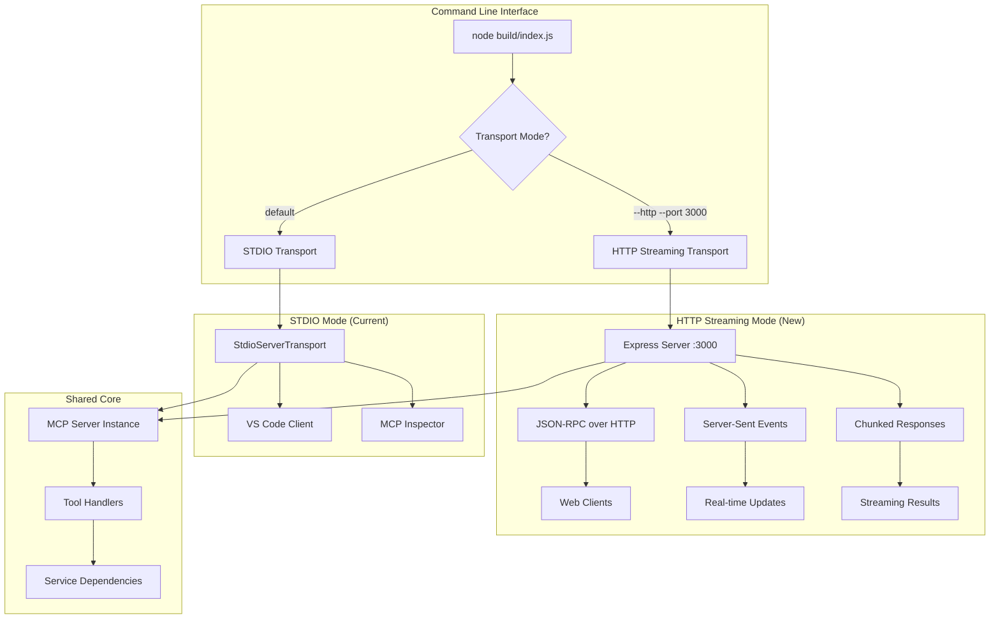

# Hybrid MCP Transport Implementation Plan

## Overview

This plan outlines the implementation of a hybrid transport system for the Dataproc MCP server, supporting both STDIO (current) and HTTP Streaming transports. The HTTP implementation will include chunked responses and Server-Sent Events (SSE) for real-time progress updates.

## HTTPS vs HTTP Considerations

### For Local Development (Current Need)
- **HTTP is sufficient** - Hosting locally on localhost/127.0.0.1
- **No security concerns** - Traffic never leaves the machine
- **Simpler implementation** - No certificate management needed
- **Better debugging** - Can inspect traffic easily

### HTTPS Implications for MCP
- **Required for production** - If exposing to external clients
- **Browser security** - Modern browsers require HTTPS for SSE from remote origins
- **Certificate complexity** - Need valid certs for remote access
- **MCP protocol agnostic** - MCP JSON-RPC works over any transport

**Recommendation:** Start with HTTP for local development, add HTTPS option later for production deployments.

## Architecture Overview



## Implementation Plan

### Phase 1: Core Transport Abstraction (2-3 hours)

#### 1.1 Create Transport Interface
- `src/transports/base-transport.ts` - Abstract transport interface
- `src/transports/stdio-transport.ts` - Wrap existing STDIO logic
- `src/transports/http-streaming-transport.ts` - New HTTP implementation

#### 1.2 Refactor Main Server
- Extract transport creation logic from `src/index.ts`
- Create transport factory based on command line args
- Maintain backward compatibility

### Phase 2: HTTP Streaming Transport (4-5 hours)

#### 2.1 Express Server Foundation
Core endpoints:
- `POST /mcp/tools/:toolName` - Execute MCP tools
- `GET /mcp/tools` - List available tools  
- `GET /mcp/resources` - List resources
- `GET /mcp/resources/:uri` - Get resource content
- `GET /mcp/events/:clientId` - SSE endpoint for real-time updates
- `GET /health` - Health check

#### 2.2 Streaming Implementation
- **Chunked Transfer Encoding** for long-running operations
- **Server-Sent Events** for progress updates
- **Connection management** for multiple clients
- **Rate limiting** using express-rate-limit

#### 2.3 MCP Protocol Mapping
- Translate HTTP requests to MCP JSON-RPC calls
- Handle MCP responses with streaming support
- Maintain MCP error code compatibility

### Phase 3: Integration & Testing (2-3 hours)

#### 3.1 Hybrid Mode Support
- Command line argument parsing
- Transport selection logic
- Graceful fallback mechanisms

#### 3.2 Testing Strategy
- Unit tests for transport abstraction
- Integration tests for HTTP endpoints
- End-to-end tests with real clients
- Performance tests for streaming

## Detailed File Structure

```
src/
├── transports/
│   ├── base-transport.ts           # Abstract transport interface
│   ├── stdio-transport.ts          # STDIO wrapper
│   ├── http-streaming-transport.ts # HTTP implementation
│   └── transport-factory.ts        # Transport creation logic
├── http/
│   ├── server.ts                   # Express server setup
│   ├── middleware.ts               # Rate limiting, CORS, etc.
│   ├── routes/                     # HTTP route handlers
│   │   ├── mcp-tools.ts           # Tool execution endpoints
│   │   ├── mcp-resources.ts       # Resource endpoints
│   │   └── sse-events.ts          # Server-Sent Events
│   └── streaming/
│       ├── chunked-response.ts     # Chunked transfer utilities
│       └── progress-tracker.ts     # Progress update management
└── index.ts                       # Updated main entry point
```

## Key Implementation Details

### Transport Interface
```typescript
interface MCPTransport {
  connect(server: Server): Promise<void>;
  disconnect(): Promise<void>;
  isConnected(): boolean;
  supportsStreaming(): boolean;
}
```

### HTTP Streaming Features
- **Progress Tracking**: Real-time updates for long operations
- **Connection Management**: Handle multiple concurrent clients
- **Error Handling**: Proper HTTP status codes and MCP error mapping
- **Rate Limiting**: Protect against abuse
- **CORS Support**: Enable web client access

### Command Line Usage
```bash
# STDIO mode (current default)
node build/index.js

# HTTP mode with default port 3000
node build/index.js --http

# HTTP mode with custom port
node build/index.js --http --port 8080

# Future HTTPS mode
node build/index.js --https --port 8443 --cert cert.pem --key key.pem
```

## Benefits of This Approach

1. **Backward Compatibility**: Existing STDIO clients continue working
2. **Gradual Migration**: Can test HTTP mode without breaking current setup
3. **Multiple Client Support**: HTTP mode supports concurrent connections
4. **Real-time Updates**: SSE provides live progress for long operations
5. **Web Integration**: Enables browser-based MCP clients
6. **Development Flexibility**: Easy switching between modes for testing

## Testing Strategy

1. **Unit Tests**: Transport abstraction and HTTP utilities
2. **Integration Tests**: Full HTTP endpoint functionality
3. **Streaming Tests**: SSE and chunked response behavior
4. **Performance Tests**: Concurrent client handling
5. **Compatibility Tests**: Ensure STDIO mode unchanged

## Implementation Dependencies

### New Dependencies to Add
```json
{
  "express": "^4.18.2",
  "express-rate-limit": "^7.1.5",
  "cors": "^2.8.5"
}
```

### Development Dependencies
```json
{
  "@types/express": "^4.17.21",
  "@types/cors": "^2.8.17",
  "supertest": "^6.3.3"
}
```

## Success Criteria

- [ ] STDIO transport continues working unchanged
- [ ] HTTP transport supports all existing MCP tools
- [ ] Streaming responses work for long-running operations
- [ ] SSE provides real-time progress updates
- [ ] Multiple concurrent HTTP clients supported
- [ ] Comprehensive test coverage for both transports
- [ ] Documentation updated with usage examples

## Future Enhancements

1. **HTTPS Support**: Add SSL/TLS for production deployments
2. **WebSocket Transport**: Alternative to SSE for bidirectional streaming
3. **Authentication**: Add API key or OAuth support for HTTP mode
4. **Load Balancing**: Support for multiple server instances
5. **Metrics**: Add Prometheus/monitoring endpoints