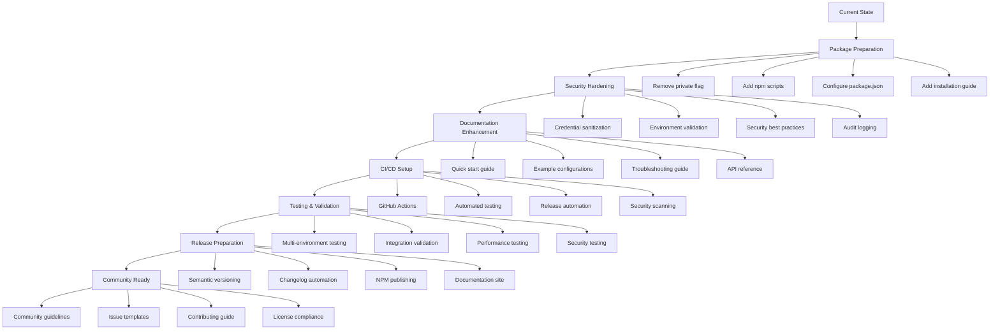

# 📋 Production Readiness Plan: Dataproc MCP Server

## Overview

This plan outlines the steps to transform the Dataproc MCP Server into a production-ready, standalone npm package that can be easily installed and used by other organizations with minimal configuration.

## Current State Analysis

### Strengths ✅
- Well-structured TypeScript codebase with proper separation of concerns
- Comprehensive testing infrastructure (unit, integration, manual tests)
- Smart default parameter management system
- Environment-independent authentication with service account impersonation
- 16 comprehensive tools covering cluster management and job execution
- MCP resource exposure for configuration and cluster information
- Excellent documentation (README, Configuration Guide, API docs)

### Areas for Improvement 🔧
- Package is currently marked as `"private": true`
- Missing production-grade npm package configuration
- No automated CI/CD pipeline
- Security and credential handling needs hardening
- Missing example configurations for different use cases
- No automated release process

## Implementation Roadmap



## Phase 1: Package Preparation 📦

### 1.1 NPM Package Configuration
- **Remove private flag**: Change `"private": true` to `"private": false` in `package.json`
- **Add package metadata**:
  - Keywords: `["mcp", "dataproc", "google-cloud", "bigdata", "hive", "spark"]`
  - Repository URL and homepage
  - Author and maintainer information
  - Proper description and tags
- **Configure npm scripts**:
  - `npm run start` for production mode
  - `npm run setup` for initial configuration
  - `npm run validate` for configuration validation
- **Add engines field**: Specify Node.js version requirements (>=18.0.0)
- **Optimize files field**: Include only necessary files for distribution

### 1.2 Installation & Setup
- **Create installation script**: `scripts/setup.js` that:
  - Creates necessary directories (`config/`, `profiles/`, `state/`)
  - Copies template configurations
  - Validates environment requirements
  - Guides user through initial setup
- **Add postinstall script**: Automatically run setup on first install
- **Provide template configurations**:
  - `templates/default-params.json.template`
  - `templates/server.json.template`
  - `templates/mcp-settings.json.template`
- **Environment detection**: Auto-detect and suggest optimal configurations

### 1.3 Binary Configuration
- **Enhance CLI support**: Improve existing `bin` configuration
- **Add global installation**: Support `npm install -g @your-org/dataproc-mcp-server`
- **Create wrapper scripts**: Different deployment scenarios (Docker, systemd, etc.)
- **Add CLI help**: `--help`, `--version`, `--config` flags

## Phase 2: Security Hardening 🔒

### 2.1 Credential Management
- **Implement credential validation**:
  - Validate service account key format
  - Check credential permissions
  - Verify project access
- **Add secure credential storage**:
  - Recommend encrypted storage solutions
  - Provide credential rotation guidance
  - Implement credential expiry warnings
- **Audit logging**: Log all authentication events and API calls
- **Credential sanitization**: Remove credentials from logs and error messages

### 2.2 Input Validation
- **Enhance Zod schemas**: Add comprehensive validation for all tool inputs
- **Rate limiting**: Implement configurable rate limits for API calls
- **Request sanitization**: Sanitize all user inputs
- **Parameter validation**: Validate all tool parameters against GCP constraints

### 2.3 Security Best Practices
- **Security headers**: Add appropriate security configurations
- **Secure defaults**: Implement principle of least privilege
- **Security configuration guide**: Document security best practices
- **Vulnerability scanning**: Integrate automated security scanning

## Phase 3: Documentation Enhancement 📚

### 3.1 Quick Start Guide
- **5-minute setup**: Step-by-step installation and first cluster creation
- **Common use cases**: Pre-configured examples for typical scenarios
- **Troubleshooting**: Common issues and solutions
- **Video tutorials**: Screen recordings or GIFs for complex setups

### 3.2 Configuration Examples
- **Multi-environment setup**: Development, staging, production configurations
- **Authentication scenarios**: Different service account setups
- **Custom profiles**: Examples for different workload types
- **MCP client integration**: Examples with different MCP clients

### 3.3 API Documentation
- **Auto-generated docs**: Generate API docs from Zod schemas
- **Tool usage examples**: Practical examples for each of the 16 tools
- **Resource documentation**: Document all MCP resources
- **Interactive documentation**: Swagger/OpenAPI-style documentation

## Phase 4: CI/CD Setup 🚀

### 4.1 GitHub Actions Workflow
```yaml
# .github/workflows/ci.yml
name: CI/CD Pipeline
on: [push, pull_request]
jobs:
  test:
    runs-on: ubuntu-latest
    strategy:
      matrix:
        node-version: [18, 20, 22]
    steps:
      - uses: actions/checkout@v4
      - uses: actions/setup-node@v4
        with:
          node-version: ${{ matrix.node-version }}
      - run: npm ci
      - run: npm run build
      - run: npm test
      - run: npm run test:integration
```

### 4.2 Release Automation
- **Semantic versioning**: Use conventional commits for automated versioning
- **Changelog generation**: Auto-generate CHANGELOG.md
- **NPM publishing**: Automated publishing to npm registry
- **GitHub releases**: Create releases with compiled assets

### 4.3 Quality Gates
- **Test coverage**: Require >90% test coverage
- **Security scanning**: Pass security vulnerability scans
- **Code quality**: ESLint, Prettier, TypeScript checks
- **Documentation**: Ensure documentation is updated

## Phase 5: Testing & Validation 🧪

### 5.1 Enhanced Testing
- **Integration tests**: Test all authentication methods
- **End-to-end scenarios**: Complete workflow testing
- **Performance benchmarks**: Measure and track performance
- **Chaos testing**: Test resilience and error handling

### 5.2 Multi-Environment Validation
- **Cross-project testing**: Test with different GCP projects
- **Service account validation**: Test various service account configurations
- **Cluster configuration testing**: Validate different cluster types
- **Platform compatibility**: Test on different operating systems

## Phase 6: Release Preparation 📋

### 6.1 Version Management
- **Semantic versioning strategy**: Major.Minor.Patch versioning
- **Migration guides**: Document breaking changes
- **Deprecation warnings**: Graceful deprecation of old features
- **Backward compatibility**: Maintain compatibility where possible

### 6.2 Distribution
- **NPM registry**: Publish to public npm registry
- **GitHub releases**: Create tagged releases with assets
- **Documentation hosting**: Host documentation on GitHub Pages
- **Package badges**: Add npm version, downloads, build status badges

## Phase 7: Community Readiness 🌟

### 7.1 Open Source Preparation
- **LICENSE file**: Add appropriate open source license (MIT/Apache 2.0)
- **CONTRIBUTING.md**: Guidelines for contributors
- **Issue templates**: Bug report and feature request templates
- **Code of conduct**: Community guidelines and standards

### 7.2 Community Support
- **Discussion forums**: GitHub Discussions or Discord server
- **Issue management**: Automated labeling and triage
- **Contributor recognition**: Acknowledge and celebrate contributors
- **Community events**: Plan demos, workshops, or meetups

## Implementation Priority 🎯

### High Priority (Week 1-2)
1. **Package configuration**: Remove private flag, enhance package.json
2. **Security hardening**: Credential management and input validation
3. **Quick start guide**: 5-minute setup documentation
4. **Basic CI/CD**: GitHub Actions for testing and building

### Medium Priority (Week 3-4)
1. **Advanced testing**: Integration and end-to-end tests
2. **Release automation**: Semantic versioning and publishing
3. **Community guidelines**: Contributing guide and templates
4. **Performance optimization**: Benchmarking and improvements

### Low Priority (Week 5-6)
1. **Advanced features**: Additional integrations and tools
2. **Community building**: Outreach and adoption strategies
3. **Documentation site**: Comprehensive documentation hosting
4. **Long-term maintenance**: Sustainability and governance planning

## Success Metrics 📊

### Adoption Metrics
- **Downloads per week**: Target 100+ weekly downloads within 3 months
- **GitHub stars**: Target 50+ stars within 6 months
- **Community engagement**: Active issues, PRs, and discussions

### Quality Metrics
- **Test coverage**: Maintain >90% code coverage
- **Security**: Zero critical security vulnerabilities
- **Performance**: <2 second average response time for tool calls
- **Reliability**: 99.9% uptime for published package

### User Experience Metrics
- **Time to first success**: <10 minutes from install to first cluster creation
- **Documentation satisfaction**: >4.5/5 user rating
- **Setup success rate**: >95% successful first-time setups
- **Support resolution**: <24 hour average response time

## Risk Mitigation 🛡️

### Technical Risks
- **Breaking changes**: Maintain backward compatibility, provide migration guides
- **Security vulnerabilities**: Regular security audits and automated scanning
- **Performance degradation**: Continuous performance monitoring
- **Dependency issues**: Regular dependency updates and security patches

### Community Risks
- **Low adoption**: Active marketing and community engagement
- **Poor documentation**: User feedback loops and continuous improvement
- **Maintenance burden**: Clear governance model and contributor onboarding
- **License issues**: Legal review of all dependencies and contributions

## Next Steps 🚀

1. **Review and approve** this plan
2. **Switch to implementation mode** to begin execution
3. **Start with Phase 1** (Package Preparation)
4. **Set up project tracking** for progress monitoring
5. **Establish communication channels** for coordination

This plan provides a comprehensive roadmap to transform the Dataproc MCP Server into a production-ready, community-friendly npm package that can be easily adopted by organizations worldwide.