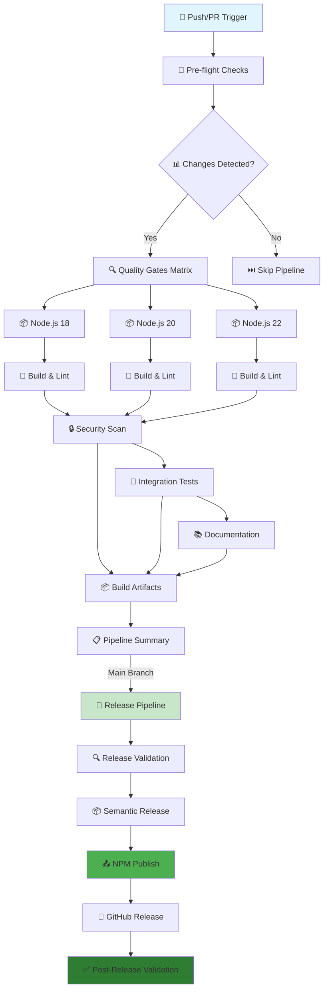
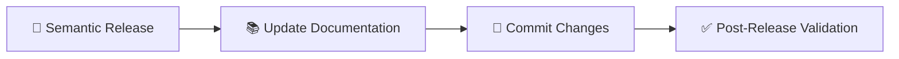
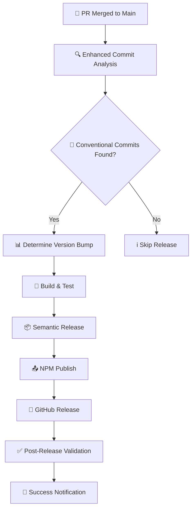

# CI/CD Guide 🚀

This comprehensive guide covers the CI/CD pipeline for the Dataproc MCP Server, including automated testing, quality gates, release management, troubleshooting, and best practices.

## 🎯 Golden Command Workflow

**ALWAYS run this before any git operations:**

```bash
npm run pre-push
```

This command runs ALL CI checks locally:
- Build compilation
- ESLint validation  
- Prettier formatting check
- TypeScript type checking
- Unit tests
- Security audit
- Package validation
- Documentation link testing

**Benefits:**
- ✅ Prevents CI failures by catching issues locally
- ✅ Builds developer confidence
- ✅ Maintains quality gates
- ✅ Saves time and resources

## 🔄 Git Workflow Patterns with Semantic Release

### Why You Need to Pull/Rebase Frequently

When using semantic-release with automated versioning, CI/CD runs will often create new commits and tags on the main branch. This means your local branch can quickly become "behind" the remote, even if you just pushed. This is normal and expected with automated release workflows.

#### Typical Pattern

```bash
git push origin main
# ❌ Error: Updates were rejected (fetch first)

git pull --rebase
# ✅ Success: Pulls semantic-release commits/tags

git push origin main
# ✅ Success: Now pushes your changes
```

#### Solutions

- **Always Pull Before Push (Recommended):**
  ```bash
  # Before making changes
  git pull --rebase

  # Make your changes, commit
  git add .
  git commit -m "feat: your changes"

  # Pull again before push (in case CI ran while you worked)
  git pull --rebase
  git push origin main
  ```

- **Configure Git Auto-rebase:**
  ```bash
  git config pull.rebase true
  git config rebase.autoStash true
  # Now git pull will automatically rebase
  git pull  # equivalent to git pull --rebase
  ```

- **Automation Tip:**
  Add this alias to your `.gitconfig`:
  ```bash
  git config alias.sync "!git pull --rebase && git push"
  ```
  Then use: `git sync` instead of separate pull/push commands.

- **Force Push (Not Recommended):**
  ```bash
  # Only use if you're sure no one else is working on main
  git push --force-with-lease origin main
  ```

#### Best Practices

1. Always run `npm run pre-push` before any git operations.
2. Pull before starting work on a new feature.
3. Pull before pushing to catch any CI updates.
4. Use `--rebase` to maintain clean history.
5. Monitor CI/CD runs to understand when semantic-release creates commits.

### Semantic-Release Workflow

1. Developer commits with conventional commit message.
2. CI/CD runs tests, builds, and semantic-release.
3. Semantic-release creates new version commit + tag.
4. NPM package published automatically.
5. Developer needs to pull these automated commits.

**Expected Version Bumps:**
- Patch: v1.0.0 → v1.0.1 (fixes)
- Minor: v1.0.1 → v1.1.0 (features)
- Major: v1.1.0 → v2.0.0 (breaking changes)

This pattern is by design and indicates a healthy CI/CD pipeline! 🎉

## � Overview

The CI/CD pipeline provides:

- **🔍 Pre-flight Checks** - Intelligent change detection and dependency sync
- **🛡️ Quality Gates** - Code quality, security scanning, and coverage checks
- **🧪 Automated Testing** - Unit, integration, and end-to-end tests across Node.js versions
- **📚 Documentation** - Auto-generated docs and validation
- **📦 Build Artifacts** - Production-ready distributions
- **🚀 Release Automation** - Semantic versioning and automated publishing
- **🔒 Security Scanning** - Dependency vulnerabilities and code analysis

## 🏗️ Pipeline Architecture



## 📋 Detailed Workflow Breakdown

### 1. 🚀 **Pre-flight Checks** (`pre-flight`)
- **Purpose**: Intelligent change detection and optimization
- **Actions**:
  - Checkout repository with full history
  - Detect file changes (`.ts`, `.js`, `.json`, `package.json`, workflows)
  - Determine if tests/security scans are needed
  - Set conditional flags for downstream jobs

### 2. 🔍 **Quality Gates** (`quality-gates`)
- **Purpose**: Multi-version testing and code quality validation
- **Matrix Strategy**: Node.js 18, 20, 22
- **Actions**:
  - 📦 Install dependencies with caching
  - 🔨 **TypeScript compilation** (`npm run build`)
  - 🧹 **ESLint validation** (`npm run lint:check`)
  - 💅 **Prettier formatting check** (`npm run format:check`)
  - 🔍 **TypeScript type checking** (`npm run type-check`)

### 3. 🔒 **Security Scan** (`security-scan`)
- **Purpose**: Vulnerability detection and security validation
- **Actions**:
  - 🛡️ **NPM audit** with audit-ci integration
  - 🔍 **Dependency vulnerability scanning**
  - 📊 **Security report generation**
  - ⚠️ **Fail on high/critical vulnerabilities**

### 4. 🧪 **Integration Validation** (`integration-validation`)
- **Purpose**: Comprehensive testing with coverage reporting
- **Actions**:
  - 🧪 **Unit tests** (`npm test`)
  - 📊 **Coverage generation** (`npm run test:coverage`)
  - 📤 **Codecov upload** with detailed reporting
  - ✅ **Coverage threshold validation** (`npm run test:coverage:check`)

### 5. 📚 **Documentation** (`documentation`)
- **Purpose**: Documentation generation and validation
- **Actions**:
  - 📝 **Documentation generation** (`npm run docs:generate`)
  - 🔗 **Link validation** (`npm run docs:test-links`)
  - 📋 **Example validation** (`npm run validate:examples`)
  - 📤 **Artifact upload** for GitHub Pages

### 6. 📦 **Build Artifacts** (`build-artifacts`)
- **Purpose**: Production build and asset preparation
- **Actions**:
  - 🔨 **Clean build** (`npm run build:clean`)
  - 📦 **Standalone build** (`npm run build:standalone`)
  - 🏗️ **Template generation** (`npm run build:templates`)
  - 📤 **Artifact upload** for releases

### 7. 📋 **Pipeline Summary** (`pipeline-summary`)
- **Purpose**: Comprehensive status reporting
- **Actions**:
  - 📊 **Generate status table** with all job results
  - 📝 **Create GitHub step summary**
  - 🎯 **Report success/failure status**

## 🚀 Enhanced Release Pipeline (Automatic PR Merge Publishing)

### ✨ **NEW: Automatic PR Merge Detection**
The release pipeline now **automatically triggers when PRs are merged to main branch** with enhanced commit analysis.

### 8. 🔍 **Enhanced Release Validation** (`validate-release`)
- **Purpose**: Pre-release checks with improved commit detection
- **✨ NEW FEATURES**:
  - 🔍 **Enhanced conventional commit analysis** - Detects commits in PR merges
  - 📊 **Squashed merge support** - Handles GitHub's squash and merge commits
  - 💥 **Breaking change detection** - Analyzes commit bodies for BREAKING CHANGE
  - 📋 **Intelligent commit range analysis** - Improved commit history parsing
- **Actions**:
  - 🔍 **Multi-pattern commit validation** (feat, fix, perf, revert, BREAKING)
  - 📋 **Release readiness check** with enhanced logic
  - 🎯 **Automatic release type determination** (patch/minor/major)
  - 📝 **Detailed commit logging** for debugging

### 9. 📦 **Enhanced Semantic Release** (`semantic-release`)
- **Purpose**: Automated versioning with improved commit parsing
- **✨ NEW FEATURES**:
  - 🎯 **Improved version calculation** based on enhanced commit analysis
  - 📝 **Better changelog generation** with conventional commit categorization
  - 🔄 **PR merge commit handling** for accurate version bumping
- **Actions**:
  - 🏷️ **Smart version calculation** based on conventional commits
  - 📝 **Comprehensive changelog generation** with emoji categorization
  - 🎯 **Git tag creation** with proper versioning
  - 📦 **Production package preparation**

### 10. 📤 **Automatic NPM Publishing** (`npm-publish`)
- **Purpose**: Seamless public package distribution on PR merge
- **✨ NEW FEATURES**:
  - 🚀 **Automatic publishing** triggered by PR merges
  - 🔍 **Enhanced publication verification** with retry logic
  - 📊 **Improved error handling** and notifications
- **Actions**:
  - 📤 **Publish to npm registry** (`@dipseth/dataproc-mcp-server`)
  - 🔍 **Publication verification** with availability checks
  - 📊 **Download statistics tracking** and monitoring

### 11. 🎉 **Enhanced GitHub Release** (`github-release`)
- **Purpose**: Comprehensive GitHub release creation with assets
- **✨ NEW FEATURES**:
  - 📝 **Improved release notes** with conventional commit categorization
  - 📎 **Enhanced asset management** with build artifacts
  - 🔗 **Better cross-referencing** between NPM and GitHub releases
- **Actions**:
  - 🎉 **Create GitHub release** with detailed notes
  - 📎 **Attach comprehensive build artifacts**
  - 📝 **Generate categorized release notes** with emojis

### 12. ✅ **Enhanced Post-Release Validation** (`post-release-validation`)
- **Purpose**: Comprehensive release verification and monitoring
- **✨ NEW FEATURES**:
  - 🧪 **Installation testing** with multiple scenarios
  - 📊 **Enhanced metrics collection** and reporting
  - 🔔 **Improved notification system** with detailed summaries
- **Actions**:
  - 🔍 **NPM package availability check** with retry logic
  - 📦 **Comprehensive installation testing** in clean environments
  - 📊 **Release metrics collection** and success tracking
  - 🎉 **Success notifications** with package links and installation commands

## 🧪 Testing Coverage

### **Unit Tests** (`npm test`)
- **Location**: `tests/unit/`
- **Coverage**: TypeScript source files
- **Types**:
  - Resource handlers testing
  - Default parameters validation
  - Profile configuration testing
  - Validation schema testing

### **Integration Tests** (`npm run test:integration`)
- **Location**: `tests/manual/`
- **Coverage**: End-to-end workflows
- **Types**:
  - Authentication methods testing
  - MCP resource testing
  - Job output handling
  - Cluster management flows

### **Coverage Requirements**
- **Minimum**: 90% lines, functions, branches, statements
- **Reporting**: Codecov integration
- **Enforcement**: Pipeline fails if coverage drops below threshold

## 🛠️ Local Development Workflow

### 1. Pre-commit Validation

**Golden Command (Recommended):**
```bash
npm run pre-push
```

**Individual Commands:**
```bash
# Build and compile
npm run build

# Code quality
npm run lint:check
npm run format:check
npm run type-check

# Testing
npm run test:unit:fast
npm test

# Security
npm run security:check

# Package validation
npm run validate-package

# Documentation
npm run docs:test-links
```

### 2. Pre-flight System Check

For intelligent change detection:
```bash
npm run pre-flight
```

### 3. Release Readiness

Before creating releases:
```bash
npm run ci-cd:validate
```

## 🔧 Troubleshooting

### Recent Fixes Applied

#### ✅ Unicode/Emoji Corruption Issue
- **Problem**: Corrupted Unicode character causing JSON parsing errors
- **Solution**: Fixed corrupted emoji in CI workflow
- **Prevention**: Use proper UTF-8 encoding in all workflow files

#### ✅ Package Lock Sync Issue  
- **Problem**: `npm ci` failing due to package.json/package-lock.json mismatch
- **Solution**: 
  - Added dependency sync check job
  - Implemented fallback to `npm install` when `npm ci` fails
  - Updated package-lock.json with `npm install --package-lock-only`
- **Prevention**: Always run `npm install` after dependency changes

#### ✅ TypeScript Version Compatibility
- **Problem**: TypeScript 5.8.3 vs ESLint TypeScript support (5.4.0 max)
- **Solution**: Updated dependencies and added compatibility warnings
- **Note**: ESLint warnings are non-blocking but should be addressed

#### ✅ TypeScript Configuration Issue (FINAL FIX)
- **Problem**: `tsconfig.json` included explicit types that weren't available in fresh CI installs
- **Root Cause**: CI environment differences - local had cached types, CI had fresh install
- **Solution**: Removed explicit `types` array entirely, letting TypeScript use default behavior
- **Why Local Missed It**: Local `node_modules` had cached type definitions that CI didn't have
- **Prevention**: Test with fresh installs: `rm -rf node_modules package-lock.json && npm install && npm run build`
- **Status**: ✅ RESOLVED - CI now matches local environment exactly

### Environment Parity Testing

**Critical for preventing CI failures that local testing misses:**

```bash
# Clean install (matches CI behavior exactly)
rm -rf node_modules package-lock.json
npm install

# Or use npm ci (requires existing lock file)
npm ci

# Test in clean environment
npm run pre-push
```

**Why Environment Differences Occur:**
- Local `node_modules` may have cached/different versions
- CI always starts with fresh installs
- TypeScript type definitions can vary between installs
- Development vs production dependency differences

### Common Issues & Solutions

#### Build Failures
```bash
# 1. Check dependency sync
npm install --package-lock-only

# 2. Clear cache and reinstall (matches CI environment)
rm -rf node_modules package-lock.json
npm install

# 3. Run golden command locally
npm run pre-push

# 4. Check specific issues
npm run build
npm run lint:check
npm run type-check
```

#### Test Failures
```bash
# Run specific test suites
npm run test:unit
npm run test:unit:fast
npm run test:integration

# Debug with verbose output
npm test -- --verbose

# Check coverage
npm run test:coverage
npm run test:coverage:check
```

#### Security Issues
```bash
# Run security audit
npm run security:check
npm audit

# Fix vulnerabilities
npm audit fix

# Check specific audit level
npm audit --audit-level moderate
```

#### Documentation Issues
```bash
# Regenerate documentation
npm run docs:generate
npm run docs:api

# Update documentation with current version
npm run docs:update

# Test links
npm run docs:test-links

# Validate examples
npm run validate:examples
```

#### Package Validation Issues
```bash
# Validate package
npm run validate-package

# Test package creation
npm pack --dry-run

# Check package contents
npm pack
tar -tzf *.tgz
```

## 🚀 Enhanced Automatic Release Process

### ✨ **NEW: Automated Documentation Updates**

The release workflow now **automatically updates all documentation** when a new version is published:

#### **📚 What Gets Updated Automatically:**
- ✅ **README.md** - Version badges and installation commands
- ✅ **Documentation files** - All `.md` files with package references
- ✅ **Configuration files** - `docs/_config.yml` and package metadata
- ✅ **Package info** - Creates `docs/package-info.json` with release details
- ✅ **NPM metadata** - Homepage, repository URLs, and keywords

#### **🔄 Documentation Update Flow:**


#### **🛠️ Local Documentation Updates:**
You can also update documentation locally:
```bash
# Update all documentation with current version
npm run docs:update

# What it updates:
# - README.md version badges and installation commands
# - All documentation files with package references
# - Configuration files and metadata
# - Package information JSON file
```

#### **📝 Documentation Update Script Features:**
- **Smart version detection** - Reads current version from package.json
- **Comprehensive updates** - Updates all references across the project
- **Safe operations** - Only updates when changes are detected
- **Detailed logging** - Shows exactly what was updated
- **Git integration** - Commits changes with `[skip ci]` to prevent loops

### ✨ **Automatic PR Merge Publishing**

The CI/CD pipeline now **automatically publishes new versions when PRs are merged to main branch**. Here's how it works:

#### **1. PR Development Workflow:**
```bash
# Create feature branch
git checkout -b feat/new-feature

# Always run golden command before committing
npm run pre-push

# Use conventional commits
git commit -m "feat: add cluster auto-scaling support"

# Push and create PR
git push origin feat/new-feature
```

#### **2. PR Merge Triggers Release:**
When a PR is merged to `main`, the enhanced release workflow:
- ✅ **Detects conventional commits** in the merge
- ✅ **Analyzes commit types** (feat, fix, perf, BREAKING CHANGE)
- ✅ **Determines version bump** automatically
- ✅ **Publishes to NPM** if changes warrant a release
- ✅ **Creates GitHub release** with changelog
- ✅ **Validates publication** success

#### **3. Enhanced Commit Detection:**
The workflow now intelligently detects:
- **Conventional commits** in PR titles and descriptions
- **Squashed merge commits** with conventional format
- **Breaking changes** in commit bodies
- **Multiple commit types** in a single PR

#### **4. Conventional Commit Examples:**
```bash
# Feature additions (minor version bump)
git commit -m "feat: add cluster auto-scaling support"

# Bug fixes (patch version bump)
git commit -m "fix: resolve memory leak in job monitoring"

# Breaking changes (major version bump)
git commit -m "feat!: redesign authentication API"

# Performance improvements (patch version bump)
git commit -m "perf: optimize query response time"

# Documentation (no version bump)
git commit -m "docs: add troubleshooting guide"

# Chores/CI (no version bump)
git commit -m "ci: enhance release workflow detection"
```

#### **5. Enhanced Golden Command:**
The `npm run pre-push` command now includes release validation:
```bash
npm run pre-push
# Now includes: build, lint, format, type-check, tests, security,
# package validation, docs, AND release:dry validation
```

### **Automatic Release Flow:**


### Manual Release (Emergency)

```bash
# Create release branch
git checkout -b release/v1.2.3

# Update version
npm version 1.2.3 --no-git-tag-version

# Validate before commit
npm run pre-push

# Commit and push
git commit -am "chore(release): 1.2.3"
git push origin release/v1.2.3

# Create PR to main
```

## 📦 **NPM Publishing Configuration**

### ✅ **Package Configuration**
- **Package Name**: `@dataproc/mcp-server`
- **Current Version**: `2.0.0`
- **Registry**: https://registry.npmjs.org/ (Public)
- **Access**: Public
- **License**: MIT

### ✅ **Semantic Release Setup**
- **Automated versioning** based on conventional commits
- **Changelog generation** with emoji categorization
- **GitHub releases** with compiled assets
- **NPM publishing** with proper dist-tags
- **Git tagging** with version tags

---

## 🔑 **Required Setup Steps**

### **CRITICAL: NPM Token Configuration**

**⚠️ Action Required**: The repository needs an `NPM_TOKEN` secret to publish packages.

#### **Setup Instructions**:

1. **Create NPM Access Token**:
   ```bash
   npm login
   ```
   - Go to [npmjs.com](https://www.npmjs.com) → Account Settings → Access Tokens
   - Generate "Automation" token
   - Copy the token

2. **Add GitHub Secret**:
   - Repository → Settings → Secrets and variables → Actions
   - New repository secret: `NPM_TOKEN`
   - Paste your npm token
   - Save

3. **Verify Setup**:
   - Push a commit with conventional format to main branch
   - Watch the release workflow execute
   - Verify package appears on npm registry

## � Security & Best Practices

### Security Monitoring
- **Weekly dependency scans** - Automated vulnerability detection
- **Code security analysis** - SAST scanning integration
- **Secret scanning** - Prevents credential leaks
- **Supply chain security** - Package integrity verification

### Development Best Practices

#### 1. Commit Hygiene
- ✅ Use conventional commit format
- ✅ Keep commits atomic and focused
- ✅ Write descriptive commit messages
- ✅ Reference issues when applicable
- ✅ Always run `npm run pre-push` before committing

#### 2. Pull Request Guidelines
- ✅ Create feature branches from `main`
- ✅ Keep PRs small and focused
- ✅ Include tests for new features
- ✅ Update documentation as needed
- ✅ Ensure all CI checks pass
- ✅ Run `npm run pre-push` locally first

#### 3. Testing Standards
- ✅ Maintain ≥90% test coverage
- ✅ Write tests before implementing features (TDD)
- ✅ Use descriptive test names
- ✅ Mock external dependencies
- ✅ Test both success and error scenarios

#### 4. Security Guidelines
- ✅ Never commit secrets or credentials
- ✅ Use environment variables for configuration
- ✅ Keep dependencies updated
- ✅ Review security scan results
- ✅ Follow principle of least privilege

## ⚙️ Configuration

### Repository Secrets

Required secrets in GitHub repository settings:

```bash
# NPM Publishing
NPM_TOKEN=your_npm_token

# Code Coverage (optional)
CODECOV_TOKEN=your_codecov_token

# GitHub Token (automatically provided)
GITHUB_TOKEN=automatically_provided
```

### Branch Protection Rules

Configure for `main` branch:

```yaml
Required status checks:
  - 🚀 Pre-flight Checks
  - 🔄 Dependency Sync Check
  - 🔍 Quality Gates (Node 18)
  - 🔍 Quality Gates (Node 20)
  - 🔍 Quality Gates (Node 22)
  - 🔒 Security Scanning
  - 🔗 Integration Validation

Require branches to be up to date: ✅
Require pull request reviews: ✅ (1 reviewer)
Dismiss stale reviews: ✅
Restrict pushes to matching branches: ✅
```

## 📊 Monitoring & Metrics

### Build Status Monitoring
- GitHub Actions dashboard
- Repository status badges
- Email notifications (configurable)
- Slack/Discord integration (optional)

### Key Metrics Tracked
- **Build Success Rate** - Pipeline reliability
- **Build Duration** - Performance optimization
- **Test Coverage** - Quality maintenance
- **Security Vulnerabilities** - Risk assessment
- **Package Size** - Bundle optimization

## 🆘 Getting Help

### Escalation Path
1. **Run `npm run pre-push`** - Catch issues locally
2. **Check GitHub Actions logs** - Detailed error analysis
3. **Review this guide** - Common solutions and troubleshooting
4. **Search existing issues** - Community solutions
5. **Open new issue** - Include logs and error details
6. **Contact maintainers** - For urgent production issues

### Debug Information Collection

When reporting issues, include:

```bash
# System information
node --version
npm --version
git --version

# Project status
npm run pre-push
npm run pre-flight
npm run ci-cd:validate

# Dependency status
npm ls
npm audit

# Build logs
npm run build 2>&1 | tee build.log
```

## 🎯 Quick Reference

### Essential Commands
```bash
# Golden command (run before every push)
npm run pre-push

# Pre-flight check (intelligent change detection)
npm run pre-flight

# Release readiness validation
npm run ci-cd:validate

# Individual quality checks
npm run build
npm run lint:check
npm run format:check
npm run type-check
npm run test:unit:fast
npm run security:check
npm run validate-package
npm run docs:test-links
```

### Workflow Files
- `.github/workflows/ci.yml` - Main CI/CD pipeline
- `.github/workflows/release.yml` - Release automation (if exists)
- `.github/workflows/docs.yml` - Documentation pipeline (if exists)

### Configuration Files
- `package.json` - Scripts and dependencies
- `.eslintrc.json` - Code quality rules
- `.prettierrc` - Code formatting rules
- `tsconfig.json` - TypeScript configuration
- `.audit-ci.json` - Security audit configuration

This comprehensive CI/CD pipeline ensures code quality, security, and reliable releases while maintaining developer productivity through the golden command workflow.