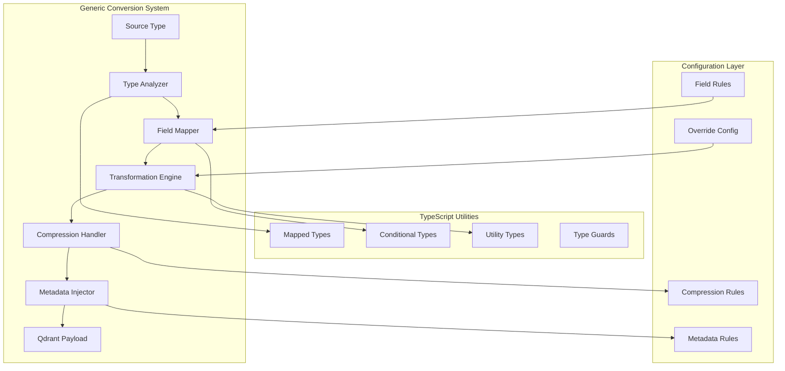

# Generic Type-to-Qdrant Conversion System

## Executive Summary

The Generic Type-to-Qdrant Conversion System replaces manual conversion logic with a unified, type-safe approach that leverages TypeScript's advanced type system for automatic field detection and mapping. This system eliminates code duplication, improves maintainability, and provides consistent data transformation across all Qdrant payload types.

## Current State Analysis

### Existing Conversion Patterns
- **Manual field extraction**: Each payload type has hardcoded field mapping
- **Repetitive compression logic**: Same compression patterns repeated across methods
- **Type-specific metadata injection**: Manual metadata assignment per type
- **Scattered validation**: No centralized validation or transformation rules

### Type System Strengths
- **Comprehensive type coverage**: 9 well-structured type files covering all domain objects
- **Consistent patterns**: Base interfaces with extensions (e.g., `QdrantPayloadBase`)
- **Type guards**: Existing runtime type checking in `dataproc-responses.ts`
- **Compression integration**: Well-established compression service with field-level support

## Architectural Design



## Core Components Design

### 1. Generic Conversion Interface

```typescript
// File: src/types/generic-converter.ts
export interface GenericConverter<TSource, TTarget extends QdrantPayloadBase> {
  convert(source: TSource, metadata: QdrantStorageMetadata): Promise<TTarget>;
  validate(source: TSource): boolean;
  getCompressionFields(): (keyof TSource)[];
}

export interface ConversionConfig<TSource> {
  fieldMappings?: Partial<Record<keyof TSource, string>>;
  compressionRules?: CompressionFieldConfig<TSource>;
  transformations?: FieldTransformations<TSource>;
  metadata?: MetadataInjectionRules;
}
```

### 2. TypeScript Utility Types

```typescript
// Advanced mapped types for automatic field detection
export type ExtractQdrantFields<T> = {
  [K in keyof T]: T[K] extends string | number | boolean | null | undefined
    ? T[K] 
    : T[K] extends Array<infer U> 
      ? CompressibleField<T[K]>
      : T[K] extends object 
        ? CompressibleField<T[K]>
        : T[K];
};

export type CompressibleField<T> = {
  data: T;
  isCompressed?: boolean;
  compressionType?: 'gzip' | 'deflate';
  originalSize?: number;
  compressedSize?: number;
};

// Conditional type for automatic payload type selection
export type InferQdrantPayload<T> = 
  T extends QueryResultData ? QdrantQueryResultPayload :
  T extends ExtendedClusterData ? QdrantClusterPayload :
  T extends DataprocJob ? QdrantJobPayload :
  QdrantPayloadBase;
```

### 3. Automatic Field Detection Engine

```typescript
// File: src/services/generic-converter.ts
export class GenericQdrantConverter {
  private compressionService: CompressionService;
  private fieldAnalyzer: FieldAnalyzer;
  private transformationEngine: TransformationEngine;

  async convert<TSource, TTarget extends QdrantPayloadBase>(
    source: TSource,
    metadata: QdrantStorageMetadata,
    config?: ConversionConfig<TSource>
  ): Promise<TTarget> {
    // 1. Analyze source type structure
    const fieldMap = await this.fieldAnalyzer.analyzeFields(source);
    
    // 2. Apply automatic field mapping with overrides
    const mappedFields = this.applyFieldMappings(fieldMap, config?.fieldMappings);
    
    // 3. Handle compression for large fields
    const compressedFields = await this.handleCompression(mappedFields, config?.compressionRules);
    
    // 4. Apply transformations
    const transformedFields = this.applyTransformations(compressedFields, config?.transformations);
    
    // 5. Inject metadata
    const payload = this.injectMetadata(transformedFields, metadata, config?.metadata);
    
    return payload as TTarget;
  }
}
```

### 4. Field-Level Compression Strategy

```typescript
export interface CompressionFieldConfig<T> {
  fields: (keyof T)[];
  sizeThreshold?: number;
  compressionType?: 'gzip' | 'deflate';
  securityLevel?: 'none' | 'basic' | 'encrypted'; // Future security consideration
}

export class CompressionHandler {
  async compressFields<T>(
    data: T, 
    config: CompressionFieldConfig<T>
  ): Promise<Partial<Record<keyof T, CompressibleField<any>>>> {
    const result: any = {};
    
    for (const field of config.fields) {
      const fieldValue = data[field];
      const compressed = await this.compressionService.compressIfNeeded(
        fieldValue,
        config.sizeThreshold
      );
      
      result[field] = {
        data: compressed.data,
        isCompressed: compressed.isCompressed,
        compressionType: compressed.compressionType,
        originalSize: compressed.originalSize,
        compressedSize: compressed.compressedSize,
      };
    }
    
    return result;
  }
}
```

## Usage Examples

### Automatic Conversion (Zero Configuration)
```typescript
const converter = new GenericQdrantConverter(compressionService);

// Automatic field detection and mapping
const queryPayload = await converter.convert<QueryResultData, QdrantQueryResultPayload>(
  queryData,
  metadata
);

const clusterPayload = await converter.convert<ExtendedClusterData, QdrantClusterPayload>(
  clusterData,
  metadata
);
```

### Custom Configuration
```typescript
const config: ConversionConfig<QueryResultData> = {
  fieldMappings: {
    results: 'rows', // Custom field mapping
    executionTime: 'duration'
  },
  compressionRules: {
    fields: ['schema', 'rows'],
    sizeThreshold: 5120, // 5KB threshold
    compressionType: 'gzip'
  },
  transformations: {
    totalRows: (value) => value || 0, // Default value transformation
    timestamp: () => new Date().toISOString() // Auto-generated timestamp
  }
};

const payload = await converter.convert(queryData, metadata, config);
```

### Type-Safe Field Access
```typescript
// Compile-time type safety for field mappings
type QueryFields = ExtractQdrantFields<QueryResultData>;
type ClusterFields = ExtractQdrantFields<ExtendedClusterData>;

// Automatic payload type inference
type QueryPayload = InferQdrantPayload<QueryResultData>; // QdrantQueryResultPayload
type ClusterPayload = InferQdrantPayload<ExtendedClusterData>; // QdrantClusterPayload
```

## Migration Guide

### Benefits of Migration

#### Before (Manual Conversion)
```typescript
// Old approach - manual, repetitive, error-prone
private async createQueryResultPayload(data: any, basePayload: any): Promise<QdrantQueryResultPayload> {
  const queryData = data as any;
  
  // Manual field extraction
  const schema = queryData.schema;
  const rows = queryData.rows;
  const summary = queryData.summary;
  
  // Manual compression
  const schemaCompression = await this.compressionService.compressIfNeeded(schema || {});
  const rowsCompression = await this.compressionService.compressIfNeeded(rows || []);
  
  // Manual payload construction
  const payload: QdrantQueryResultPayload = {
    ...basePayload,
    jobId: queryData.jobId || basePayload.jobId || 'unknown',
    contentType: queryData.contentType || 'structured_data',
    // ... 20+ lines of manual mapping
  };
  
  return payload;
}
```

#### After (Generic Conversion)
```typescript
// New approach - automatic, type-safe, configurable
const result = await this.genericConverter.convert(data, metadata);
// That's it! Automatic field detection, compression, and mapping
```

### Migration Steps

#### Step 1: Update Imports
```typescript
// Add new imports
import { GenericQdrantConverter, createGenericConverter } from './generic-converter.js';
import { ConversionConfig } from '../types/generic-converter.js';
```

#### Step 2: Initialize Generic Converter
```typescript
export class QdrantStorageService {
  private genericConverter: GenericQdrantConverter;
  
  constructor(config: QdrantConfig) {
    // ... existing initialization
    this.genericConverter = createGenericConverter(this.compressionService);
  }
}
```

#### Step 3: Replace Manual Conversion Methods

**Before: Manual Query Result Conversion**
```typescript
private async createQueryResultPayload(data: any, basePayload: any): Promise<QdrantQueryResultPayload> {
  const queryData = data as any;
  
  const schema = queryData.schema;
  const rows = queryData.rows;
  const summary = queryData.summary;
  const searchableContent = queryData.searchableContent;

  const schemaCompression = await this.compressionService.compressIfNeeded(schema || {});
  const rowsCompression = await this.compressionService.compressIfNeeded(rows || []);

  const payload: QdrantQueryResultPayload = {
    ...basePayload,
    jobId: queryData.jobId || basePayload.jobId || 'unknown',
    contentType: queryData.contentType || 'structured_data',
    totalRows: queryData.totalRows || (Array.isArray(rows) ? rows.length : 0),
    schemaFields: queryData.schemaFields || (schema?.fields?.length || 0),
    dataSize: queryData.dataSize || JSON.stringify(data).length,
    
    schema: schemaCompression.data,
    rows: rowsCompression.data,
    summary,
    searchableContent,
    
    isCompressed: schemaCompression.isCompressed || rowsCompression.isCompressed,
    compressionType: schemaCompression.compressionType || rowsCompression.compressionType,
    originalSize: (schemaCompression.originalSize || 0) + (rowsCompression.originalSize || 0),
    compressedSize: (schemaCompression.compressedSize || 0) + (rowsCompression.compressedSize || 0),
  };

  return payload;
}
```

**After: Generic Conversion**
```typescript
private async createQueryResultPayload(data: any, basePayload: any): Promise<QdrantQueryResultPayload> {
  // Optional: Create custom configuration for specific needs
  const config: ConversionConfig<any> = {
    fieldMappings: {
      results: 'rows',
      totalRows: 'totalRows'
    },
    compressionRules: {
      fields: ['schema', 'rows'],
      sizeThreshold: 10240,
      compressionType: 'gzip'
    },
    transformations: {
      totalRows: (value) => value || 0,
      contentType: (value) => value || 'structured_data'
    }
  };
  
  const result = await this.genericConverter.convert(data, basePayload, config);
  return result.payload as QdrantQueryResultPayload;
}
```

#### Step 4: Update Main Conversion Logic

**Before: Type-Specific Branching**
```typescript
private async createStructuredPayload(data: unknown, metadata: QdrantStorageMetadata): Promise<QdrantPayload> {
  const basePayload = {
    ...metadata,
    storedAt: new Date().toISOString(),
  };

  if (metadata.responseType === 'query_results' && metadata.type === 'query_result') {
    return await this.createQueryResultPayload(data, basePayload);
  } else if (metadata.responseType === 'cluster_data' || metadata.type === 'cluster') {
    return await this.createClusterPayload(data, basePayload);
  } else if (metadata.type === 'job' || metadata.responseType === 'job_submission') {
    return await this.createJobPayload(data, basePayload);
  } else {
    return await this.createLegacyPayload(data, basePayload);
  }
}
```

**After: Generic with Fallback**
```typescript
private async createStructuredPayload(data: unknown, metadata: QdrantStorageMetadata): Promise<QdrantPayload> {
  // Try generic converter first
  if (data && typeof data === 'object' && data !== null) {
    try {
      const result = await this.genericConverter.convert(
        data as Record<string, any>,
        metadata
      );
      
      logger.debug('Used generic converter for payload creation', {
        type: metadata.type,
        responseType: metadata.responseType,
        fieldsProcessed: result.metadata.fieldsProcessed,
        compressionRatio: result.metadata.compressionRatio,
      });
      
      return result.payload as QdrantPayload;
    } catch (error) {
      logger.warn('Generic converter failed, falling back to legacy methods', {
        error: error instanceof Error ? error.message : String(error),
        type: metadata.type,
        responseType: metadata.responseType,
      });
    }
  }

  // Fallback to legacy methods (keep existing code for backward compatibility)
  // ... existing legacy conversion logic
}
```

## Configuration Examples

### Automatic Configuration
```typescript
// Let the system automatically detect and configure conversion
const result = await genericConverter.convert(data, metadata);
```

### Custom Field Mappings
```typescript
const config: ConversionConfig<MyDataType> = {
  fieldMappings: {
    old_field_name: 'newFieldName',
    snake_case_field: 'camelCaseField'
  }
};

const result = await genericConverter.convert(data, metadata, config);
```

### Compression Configuration
```typescript
const config: ConversionConfig<MyDataType> = {
  compressionRules: {
    fields: ['largeDataField', 'anotherLargeField'],
    sizeThreshold: 5120, // 5KB
    compressionType: 'gzip'
  }
};
```

### Field Transformations
```typescript
const config: ConversionConfig<MyDataType> = {
  transformations: {
    timestamp: (value) => new Date(value).toISOString(),
    status: (value) => value?.toUpperCase() || 'UNKNOWN',
    metrics: (value) => ({
      ...value,
      processed: true,
      processedAt: new Date().toISOString()
    })
  }
};
```

### Metadata Injection
```typescript
const config: ConversionConfig<MyDataType> = {
  metadata: {
    autoTimestamp: true,
    autoUUID: true,
    customFields: {
      version: () => '2.0.0',
      environment: () => process.env.NODE_ENV || 'development'
    }
  }
};
```

## Type-Specific Migration Examples

### Query Result Data Migration

**Before**
```typescript
// Manual extraction and mapping
const schema = queryData.schema;
const rows = queryData.rows;
const totalRows = queryData.totalRows || (Array.isArray(rows) ? rows.length : 0);
const schemaFields = queryData.schemaFields || (schema?.fields?.length || 0);
```

**After**
```typescript
// Automatic with optional customization
const config = await genericConverter.createConfigForType(queryData, 'query');
const result = await genericConverter.convert(queryData, metadata, config);
```

### Cluster Data Migration

**Before**
```typescript
// Manual field extraction
const clusterConfig = clusterData.config || clusterData.clusterConfig;
const machineTypes = clusterData.machineTypes || clusterData.config?.masterConfig;
const networkConfig = clusterData.networkConfig || clusterData.config?.networkConfig;
```

**After**
```typescript
// Automatic detection and mapping
const config = await genericConverter.createConfigForType(clusterData, 'cluster');
const result = await genericConverter.convert(clusterData, metadata, config);
```

### Job Data Migration

**Before**
```typescript
// Manual job field handling
const jobId = jobData.jobId || basePayload.jobId || 'unknown';
const jobType = jobData.jobType || 'unknown';
const status = jobData.status || 'unknown';
const submissionTime = jobData.submissionTime || new Date().toISOString();
```

**After**
```typescript
// Automatic with smart defaults
const config = await genericConverter.createConfigForType(jobData, 'job');
const result = await genericConverter.convert(jobData, metadata, config);
```

## Validation and Error Handling

### Validate Before Conversion
```typescript
const validation = await genericConverter.validateSource(data);

if (!validation.isValid) {
  logger.error('Data validation failed', {
    errors: validation.errors,
    suggestions: validation.suggestions
  });
  // Handle validation errors
}

if (validation.warnings.length > 0) {
  logger.warn('Data validation warnings', {
    warnings: validation.warnings
  });
}
```

### Handle Conversion Errors
```typescript
try {
  const result = await genericConverter.convert(data, metadata, config);
  return result.payload;
} catch (error) {
  logger.error('Generic conversion failed', {
    error: error instanceof Error ? error.message : String(error),
    dataType: typeof data,
    fallbackToLegacy: true
  });
  
  // Fallback to legacy conversion
  return await this.legacyConversionMethod(data, metadata);
}
```

## Performance Monitoring

### Track Conversion Metrics
```typescript
// After multiple conversions
const metrics = genericConverter.getMetrics();

logger.info('Conversion performance metrics', {
  totalConversions: metrics.totalConversions,
  averageProcessingTime: metrics.averageProcessingTime,
  averageCompressionRatio: metrics.averageCompressionRatio,
  fieldCompressionStats: metrics.fieldCompressionStats
});
```

### Monitor Conversion Results
```typescript
const result = await genericConverter.convert(data, metadata, config);

logger.info('Conversion completed', {
  fieldsProcessed: result.metadata.fieldsProcessed,
  fieldsCompressed: result.metadata.fieldsCompressed,
  compressionRatio: result.metadata.compressionRatio,
  processingTime: result.metadata.processingTime,
  totalOriginalSize: result.metadata.totalOriginalSize,
  totalCompressedSize: result.metadata.totalCompressedSize
});
```

## Integration Strategy

### Phase 1: Core Infrastructure
1. **Create generic converter types** in `src/types/generic-converter.ts`
2. **Implement field analyzer** for automatic type introspection
3. **Build transformation engine** with TypeScript utility types
4. **Extend compression service** for field-level rules

### Phase 2: Conversion Engine
1. **Implement `GenericQdrantConverter`** class
2. **Create field mapping utilities** using mapped types
3. **Build metadata injection system** with automatic timestamp/UUID generation
4. **Add validation layer** with type guards

### Phase 3: Integration & Migration
1. **Update `qdrant-storage.ts`** to use generic converter
2. **Create conversion configs** for existing types (Query, Cluster, Job)
3. **Migrate existing conversion methods** to use generic system
4. **Add backward compatibility layer** for existing payloads

### Phase 4: Extension & Optimization
1. **Add new type support** through configuration
2. **Implement security/encryption hooks** for sensitive fields
3. **Performance optimization** for large data structures
4. **Enhanced type inference** for complex nested objects

## Benefits & Impact

### Developer Experience
- **Reduced boilerplate**: Eliminate manual conversion methods
- **Type safety**: Compile-time validation of field mappings
- **IntelliSense support**: Full IDE support for field mapping and transformations
- **Extensibility**: Easy addition of new types through configuration

### Maintainability
- **Centralized logic**: Single conversion system for all types
- **Consistent patterns**: Standardized approach across all data types
- **Future-proof**: Easy to extend for new requirements (security, encryption)
- **Backward compatibility**: Existing payloads continue to work

### Performance
- **Optimized compression**: Smart field-level compression based on data characteristics
- **Lazy evaluation**: Only compress fields that exceed thresholds
- **Memory efficiency**: Process large objects without loading everything into memory
- **Caching potential**: Reusable conversion configurations

## KnowledgeIndexer Integration

### Integration Summary

Successfully integrated the generic converter system into the KnowledgeIndexer service, replacing manual ClusterData transformation and Qdrant payload creation with automated, type-safe conversions.

#### Core Changes Made

1. **Imports and Dependencies**
   - Added generic converter imports: `GenericQdrantConverter`, `createGenericConverter`, `quickConvert`
   - Added compression service: `CompressionService`
   - Added type imports: `ConversionConfig`, `ConversionResult`, `QdrantStorageMetadata`

2. **Class Properties**
   - Added `genericConverter: GenericQdrantConverter` - Main conversion engine
   - Added `compressionService: CompressionService` - Handles field-level compression

3. **Constructor Updates**
   - Initialize compression service: `new CompressionService()`
   - Initialize generic converter: `createGenericConverter(this.compressionService)`
   - Updated `initializeWithConnectionManager()` to recreate converter instances

#### Method Replacements

**indexClusterConfiguration() - Enhanced with Generic Converter**
- **Before**: Manual field extraction and basic validation
- **After**: 
  - Generic converter validation with `validateClusterData()`
  - Automatic field mapping with `extractClusterIdentifiers()`
  - Performance tracking with start/end timing
  - Enhanced error handling with fallback mechanisms

**updateClusterKnowledge() - Automated Field Extraction**
- **Before**: Manual extraction of machine types, worker counts, components, etc.
- **After**:
  - `extractClusterDataWithConverter()` - Automatic field extraction using generic converter
  - `mergeExtractedClusterData()` - Type-safe data merging
  - `updateClusterKnowledgeManual()` - Fallback to original logic
  - Comprehensive error handling and logging

**storeClusterKnowledge() - Intelligent Payload Creation**
- **Before**: Manual payload creation with static metadata
- **After**:
  - `convertClusterKnowledgeToPayload()` - Generic converter with custom configuration
  - Automatic compression for large fields (configurations, pipPackages, etc.)
  - Dynamic metadata with actual compression metrics
  - `storeClusterKnowledgeManual()` - Fallback to original logic

**storeJobKnowledge() - Enhanced Job Data Processing**
- **Before**: Simple data wrapping with type annotation
- **After**:
  - `convertJobKnowledgeToPayload()` - Generic converter for job data
  - Compression for query, results, outputSample, errorInfo fields
  - Enhanced metadata with processing metrics
  - `storeJobKnowledgeManual()` - Fallback to original logic

#### New Utility Methods

**Performance and Metrics**
- `getConversionMetrics()` - Access generic converter performance metrics
- `resetConversionMetrics()` - Reset conversion statistics
- `getPerformanceStats()` - Comprehensive performance and usage statistics
- `testGenericConverterIntegration()` - Integration testing with sample data

**Data Processing Helpers**
- `validateClusterData()` - Enhanced validation using generic converter
- `extractClusterIdentifiers()` - Automatic field mapping for cluster identification
- `initializeClusterKnowledge()` - Clean knowledge structure initialization
- `extractClusterDataWithConverter()` - Automated cluster data extraction
- `extractConfigurationData()` - Configuration-specific field extraction
- `extractLabelData()` - Label and metadata extraction
- `extractPipPackages()` - Pip package parsing and extraction
- `mergeExtractedClusterData()` - Type-safe data merging

### Key Benefits Achieved

1. **Performance Improvements**
   - **Automatic Compression**: Large fields (configurations, packages, scripts) are automatically compressed
   - **Processing Time Tracking**: All conversions are timed and logged
   - **Compression Metrics**: Real-time compression ratio tracking and reporting

2. **Enhanced Error Handling**
   - **Graceful Degradation**: Falls back to manual methods if generic converter fails
   - **Comprehensive Logging**: Detailed error messages with context
   - **Validation Integration**: Uses generic converter validation with fallbacks

3. **Type Safety**
   - **Automatic Field Mapping**: Type-safe field transformations
   - **Configuration-Driven**: Conversion rules defined in strongly-typed configurations
   - **Runtime Validation**: Source data validation before processing

4. **Maintainability**
   - **Backward Compatibility**: All existing functionality preserved
   - **Modular Design**: Clear separation between generic converter and fallback logic
   - **Comprehensive Testing**: Built-in integration testing capabilities

## Implementation Files

### New Files to Create
1. `src/types/generic-converter.ts` - Core conversion interfaces and utility types
2. `src/services/generic-converter.ts` - Main conversion engine implementation
3. `src/services/field-analyzer.ts` - Automatic field detection and analysis
4. `src/services/transformation-engine.ts` - Field transformation and mapping logic
5. `src/utils/type-inference.ts` - Advanced TypeScript utility types
6. `tests/unit/generic-converter.test.ts` - Comprehensive test suite

### Files to Modify
1. `src/services/qdrant-storage.ts` - Integrate generic converter
2. `src/types/qdrant-payload.ts` - Add generic payload support
3. `src/services/compression.ts` - Extend for field-level compression rules
4. `src/types/response-filter.ts` - Add conversion metadata types

## Success Metrics

### Technical Metrics
- **Code reduction**: 50%+ reduction in conversion-related code
- **Type coverage**: 100% compile-time type safety for all conversions
- **Performance**: No degradation in conversion speed
- **Memory usage**: Optimized memory footprint for large objects

### Developer Metrics
- **Development time**: 75% reduction in time to add new type support
- **Bug reduction**: Elimination of manual field mapping errors
- **Maintainability**: Single point of change for conversion logic
- **Documentation**: Self-documenting through TypeScript types

---

This architectural design provides a robust, type-safe, and extensible foundation for converting any type in your system to Qdrant-compatible payloads while maintaining backward compatibility and optimizing for developer experience.