# Knowledge Base Semantic Search 🧠

The Dataproc MCP Server includes an advanced **knowledge base semantic search** feature that enables natural language queries against stored cluster configurations, job data, and operational insights. This feature provides intelligent data extraction and search capabilities with graceful degradation when optional components are unavailable.

## 🎯 How Semantic Search Works

The following diagram illustrates the difference between standard queries and semantic search using a real example:

```mermaid
graph LR
    A["🔍 User Query:<br/>'show me clusters with machine learning packages'"] --> B{"Qdrant Available?"}
    
    B -->|"✅ Semantic Search ON"| C["🧠 Semantic Processing"]
    B -->|"❌ Standard Mode"| D["📋 Standard Processing"]
    
    C --> C1["Vector Embedding Generation"]
    C1 --> C2["Similarity Search in Knowledge Base"]
    C2 --> C3["Confidence Scoring & Ranking"]
    C3 --> C4["🎯 Intelligent Results"]
    
    D --> D1["Keyword-based Filtering"]
    D1 --> D2["Standard Data Retrieval"]
    D2 --> D3["📊 Standard Results + Setup Guidance"]
    
    C4 --> E["📊 Response Comparison"]
    D3 --> E
    
    E --> F["🚀 WITH SEMANTIC SEARCH<br/><br/>🎯 Query: 'machine learning packages' (confidence: 0.89)<br/><br/>✨ Found 3 relevant clusters:<br/><br/>🤖 ml-training (confidence: 0.92)<br/>   • ML Packages: tensorflow, torch<br/>   • Machine: n1-highmem-8<br/><br/>📊 analytics-prod (confidence: 0.87)<br/>   • ML Packages: sklearn, pandas<br/>   • Machine: n1-standard-16<br/><br/>⚙️ data-pipeline (confidence: 0.84)<br/>   • ML Packages: numpy, scipy<br/>   • Machine: n1-standard-4<br/><br/>💡 Sources: pip packages, init scripts, configs"]
    
    E --> G["📋 WITHOUT SEMANTIC SEARCH<br/><br/>⚠️ Enhanced search unavailable - Qdrant not connected<br/>📋 Showing standard cluster information instead<br/><br/>🚀 Quick Setup:<br/>   docker run -p 6334:6333 qdrant/qdrant<br/><br/>📋 Standard Cluster List:<br/><br/>🟢 ml-training • RUNNING • n1-highmem-8<br/>🟢 analytics-prod • RUNNING • n1-standard-16<br/>🟢 data-pipeline • RUNNING • n1-standard-4<br/>🟢 web-cluster • RUNNING • n1-standard-2<br/>⭕ test-cluster • STOPPED • n1-standard-1<br/><br/>📝 No package analysis available"]

    style C fill:#e1f5fe
    style C4 fill:#c8e6c9
    style D fill:#fff3e0
    style D3 fill:#ffecb3
    style F fill:#e8f5e8
    style G fill:#fff8e1
```


## 🌟 Feature Overview

### What is Knowledge Base Semantic Search?

The knowledge base semantic search transforms how you interact with your Dataproc infrastructure by:

- **Natural Language Queries**: Ask questions like "show me clusters with pip packages" or "find high-memory configurations"
- **Intelligent Data Extraction**: Automatically extracts and indexes meaningful information from cluster configurations
- **Semantic Understanding**: Uses vector embeddings to understand query intent beyond keyword matching
- **Comprehensive Knowledge Base**: Stores cluster configs, job patterns, error histories, and operational insights

### Benefits Over Regular Queries

| Traditional Queries | Semantic Queries |
|-------------------|------------------|
| Exact keyword matching | Intent-based understanding |
| Rigid syntax requirements | Natural language flexibility |
| Limited context awareness | Rich contextual relationships |
| Manual data filtering | Intelligent relevance scoring |
| Shows all data | Shows relevant data with confidence |

### Optional Enhancement with Graceful Degradation

🎯 **Key Feature**: This is an **optional enhancement** that doesn't break core functionality:

- **✅ With Qdrant**: Full semantic search with confidence scores and vector similarity
- **✅ Without Qdrant**: Clean formatted output with helpful setup guidance
- **✅ Core Operations**: Always work regardless of Qdrant availability
- **✅ Zero Dependencies**: No required external services for basic functionality

## 🚀 Setup Instructions

### Prerequisites

- Node.js 18+ with the Dataproc MCP Server installed
- Docker (for Qdrant vector database)
- At least 2GB available RAM for optimal performance

### Step 1: Install and Start Qdrant

```bash
# Pull and run Qdrant vector database
docker run -p 6334:6333 qdrant/qdrant

# Verify Qdrant is running
curl http://localhost:6334/health
```

**Expected Response:**
```json
{"status":"ok"}
```

### Step 2: Configure Response Filter

The semantic search uses the configuration in [`config/response-filter.json`](../config/response-filter.json):

```json
{
  "qdrant": {
    "url": "http://localhost:6334",
    "collectionName": "dataproc_knowledge",
    "vectorSize": 384,
    "distance": "Cosine"
  }
}
```

**Configuration Parameters:**
- **`url`**: Qdrant server endpoint (default: `http://localhost:6334`)
- **`collectionName`**: Vector collection name (default: `dataproc_knowledge`)
- **`vectorSize`**: Embedding dimensions (384 for Transformers.js)
- **`distance`**: Similarity metric (`Cosine`, `Euclidean`, or `Dot`)

### Step 3: Verify Setup

Test the semantic search functionality:

```bash
# Check if Qdrant collections are created
curl http://localhost:6334/collections

# Test MCP server connection
# Use your MCP client to run: "List clusters with semantic query for machine types"
```

### Step 4: Optional Port Configuration

If you need to use a different port:

```json
{
  "qdrant": {
    "url": "http://localhost:6335",
    "collectionName": "dataproc_knowledge",
    "vectorSize": 384,
    "distance": "Cosine"
  }
}
```

Then start Qdrant with the custom port:
```bash
docker run -p 6335:6333 qdrant/qdrant
```

## 📖 Usage Examples

### Basic Semantic Queries

#### Using `query_cluster_data` Tool

```javascript
// Natural language cluster data queries
{
  "query": "pip packages installed on clusters",
  "limit": 5
}

{
  "query": "machine types and configurations",
  "projectId": "my-project",
  "region": "us-central1"
}

{
  "query": "network configuration and subnets",
  "clusterName": "my-cluster"
}
```

#### Using `list_clusters` with Semantic Query

```javascript
// Enhanced cluster listing with semantic filtering
{
  "projectId": "my-project",
  "region": "us-central1",
  "semanticQuery": "high memory configurations"
}

{
  "semanticQuery": "clusters with Jupyter notebooks",
  "verbose": false
}
```

#### Using `get_cluster` with Semantic Query

```javascript
// Focused cluster details extraction
{
  "projectId": "my-project",
  "region": "us-central1", 
  "clusterName": "analytics-cluster",
  "semanticQuery": "pip packages and Python libraries"
}

{
  "projectId": "my-project",
  "region": "us-central1",
  "clusterName": "ml-cluster", 
  "semanticQuery": "machine types and worker configuration"
}
```

### Advanced Query Examples

#### Infrastructure Analysis
```javascript
{
  "query": "clusters using preemptible instances for cost optimization",
  "limit": 10
}
```

#### Component Discovery
```javascript
{
  "query": "Spark and Hadoop configurations with custom properties",
  "projectId": "analytics-project"
}
```

#### Network and Security
```javascript
{
  "query": "service accounts and IAM configurations",
  "region": "us-central1"
}
```

#### Performance Optimization
```javascript
{
  "query": "SSD disk configurations and storage optimization",
  "limit": 8
}
```

## ⚙️ Configuration Details

### Response Filter Configuration Structure

The [`config/response-filter.json`](../config/response-filter.json) file controls all aspects of the semantic search:

```json
{
  "tokenLimits": {
    "list_clusters": 500,
    "get_cluster": 300,
    "default": 400
  },
  "extractionRules": {
    "list_clusters": {
      "maxClusters": 10,
      "essentialFields": [
        "clusterName", "status", "machineType", "numWorkers"
      ],
      "summaryFormat": "table"
    }
  },
  "qdrant": {
    "url": "http://localhost:6334",
    "collectionName": "dataproc_knowledge",
    "vectorSize": 384,
    "distance": "Cosine"
  },
  "formatting": {
    "useEmojis": true,
    "compactTables": true,
    "includeResourceLinks": true
  }
}
```

### Qdrant Collection Management

The system automatically manages two collections:

#### 1. `dataproc_knowledge` Collection
- **Purpose**: Stores extracted cluster knowledge and configurations
- **Content**: Machine types, pip packages, network configs, component lists
- **Usage**: Powers `query_cluster_data` and knowledge-based searches

#### 2. `dataproc_responses` Collection  
- **Purpose**: Stores full API responses for token optimization
- **Content**: Complete cluster and job response data
- **Usage**: Enables resource URI access and response optimization

### Configuration Options

#### Token Limits
```json
{
  "tokenLimits": {
    "list_clusters": 500,    // Max tokens for cluster lists
    "get_cluster": 300,      // Max tokens for single cluster
    "submit_hive_query": 400, // Max tokens for query responses
    "default": 400           // Default limit for other operations
  }
}
```

#### Extraction Rules
```json
{
  "extractionRules": {
    "list_clusters": {
      "maxClusters": 10,           // Limit clusters in response
      "essentialFields": [...],     // Key fields to include
      "summaryFormat": "table"      // Response format
    },
    "get_cluster": {
      "essentialSections": [...],   // Important config sections
      "includeMetrics": false,      // Performance data inclusion
      "includeHistory": false       // Historical data inclusion
    }
  }
}
```

### Troubleshooting Configuration Issues

#### Qdrant Connection Problems
```bash
# Check if Qdrant is running
docker ps | grep qdrant

# Test connection
curl http://localhost:6334/health

# Check logs
docker logs $(docker ps -q --filter ancestor=qdrant/qdrant)
```

#### Collection Issues
```bash
# List collections
curl http://localhost:6334/collections

# Check collection info
curl http://localhost:6334/collections/dataproc_knowledge
```

#### Configuration Validation
```bash
# Validate JSON syntax
cat config/response-filter.json | jq .

# Check MCP server logs for configuration errors
# Look for "Qdrant" or "semantic" in log output
```

## 🔄 Behavior Without Qdrant

### Graceful Degradation Explanation

When Qdrant is not available, the system provides **graceful degradation**:

#### What Users See

**Without Qdrant (Graceful Fallback):**
```
🔍 Semantic Query: "machine types"

⚠️  Enhanced search unavailable - Qdrant not connected
📋 Showing standard cluster information instead

🚀 To enable semantic search:
   1. Install: docker run -p 6334:6333 qdrant/qdrant  
   2. Verify: curl http://localhost:6334/health

[Standard cluster data follows...]
```

**With Qdrant (Full Functionality):**
```
🔍 Semantic Query: "machine types" (confidence: 0.89)

🎯 Found 3 relevant clusters:
┌─────────────────┬──────────────────┬─────────────┬──────────────┐
│ Cluster         │ Machine Type     │ Workers     │ Confidence   │
├─────────────────┼──────────────────┼─────────────┼──────────────┤
│ analytics-prod  │ n1-highmem-8     │ 4           │ 0.92         │
│ ml-training     │ n1-standard-16   │ 8           │ 0.87         │
│ data-pipeline   │ n1-standard-4    │ 2           │ 0.84         │
└─────────────────┴──────────────────┴─────────────┴──────────────┘
```

### Core Functionality Preservation

**Always Available (No Qdrant Required):**
- ✅ Cluster creation and management
- ✅ Job submission and monitoring  
- ✅ Profile management
- ✅ Standard data retrieval
- ✅ All MCP tool functionality

**Enhanced with Qdrant:**
- 🚀 Semantic search capabilities
- 🚀 Natural language queries
- 🚀 Intelligent data extraction
- 🚀 Confidence scoring
- 🚀 Vector similarity matching

### Setup Guidance Integration

The system automatically provides setup guidance when semantic features are requested but Qdrant is unavailable:

```
💡 Semantic Search Setup:

1. 🐳 Start Qdrant:
   docker run -p 6334:6333 qdrant/qdrant

2. ✅ Verify Connection:
   curl http://localhost:6334/health

3. 🔄 Restart MCP Server:
   The server will automatically detect Qdrant and enable semantic features

4. 📖 Documentation:
   See docs/KNOWLEDGE_BASE_SEMANTIC_SEARCH.md for detailed setup
```

## 🎯 Best Practices

### Query Optimization

#### Effective Query Patterns
```javascript
// ✅ Good: Specific and focused
{ "query": "pip packages for machine learning" }

// ✅ Good: Infrastructure-focused  
{ "query": "high-memory instances with SSD storage" }

// ❌ Avoid: Too vague
{ "query": "stuff" }

// ❌ Avoid: Too complex
{ "query": "show me all clusters with specific configurations that might be related to data processing or analytics workloads in production environments" }
```

#### Performance Tips

1. **Use Filters**: Combine semantic queries with project/region filters
2. **Limit Results**: Set appropriate `limit` values (5-10 for exploration)
3. **Cache Results**: Semantic queries are cached for 5 minutes by default
4. **Specific Queries**: More specific queries return better results

### Monitoring and Maintenance

#### Health Checks
```bash
# Daily Qdrant health check
curl http://localhost:6334/health

# Check collection sizes
curl http://localhost:6334/collections/dataproc_knowledge | jq '.result.points_count'

# Monitor MCP server logs for Qdrant connectivity
grep -i "qdrant\|semantic" /path/to/mcp/logs
```

#### Performance Monitoring
- **Query Response Time**: Should be < 2 seconds for most queries
- **Collection Size**: Monitor growth and consider cleanup policies
- **Memory Usage**: Qdrant typically uses 100-500MB for moderate datasets

## 🚨 Troubleshooting

### Common Issues and Solutions

#### Issue: "Qdrant connection failed"
```bash
# Check if Qdrant is running
docker ps | grep qdrant

# If not running, start it
docker run -p 6334:6333 qdrant/qdrant

# Check port conflicts
lsof -i :6334
```

#### Issue: "Collection not found"
```bash
# Check existing collections
curl http://localhost:6334/collections

# Collections are auto-created, but you can manually create:
curl -X PUT http://localhost:6334/collections/dataproc_knowledge \
  -H "Content-Type: application/json" \
  -d '{"vectors": {"size": 384, "distance": "Cosine"}}'
```

#### Issue: "Poor search results"
- **Solution**: Ensure you have indexed cluster data by running some `list_clusters` or `get_cluster` operations first
- **Check**: Verify collections have data: `curl http://localhost:6334/collections/dataproc_knowledge`

#### Issue: "Semantic queries return empty results"
```bash
# Check if embeddings service is working
# Look for "TransformersEmbeddingService" in MCP server logs

# Verify collection has vectors
curl http://localhost:6334/collections/dataproc_knowledge | jq '.result.points_count'
```

### Getting Help

1. **Check Logs**: Enable debug logging with `LOG_LEVEL=debug`
2. **Verify Setup**: Use the verification steps in the setup section
3. **Test Incrementally**: Start with basic queries and add complexity
4. **Community Support**: Check [GitHub Issues](https://github.com/dipseth/dataproc-mcp/issues) for similar problems

## 🔗 Related Documentation

- **[Quick Start Guide](QUICK_START.md)** - Basic MCP server setup
- **[Configuration Guide](CONFIGURATION_GUIDE.md)** - Detailed configuration options
- **[API Reference](API_REFERENCE.md)** - Complete tool documentation
- **[Response Optimization Guide](RESPONSE_OPTIMIZATION_GUIDE.md)** - Token optimization features

---

**🎉 Ready to explore your Dataproc infrastructure with natural language queries!**

The knowledge base semantic search transforms complex infrastructure queries into simple, intuitive conversations. Start with basic queries and discover the power of semantic understanding in your data operations.