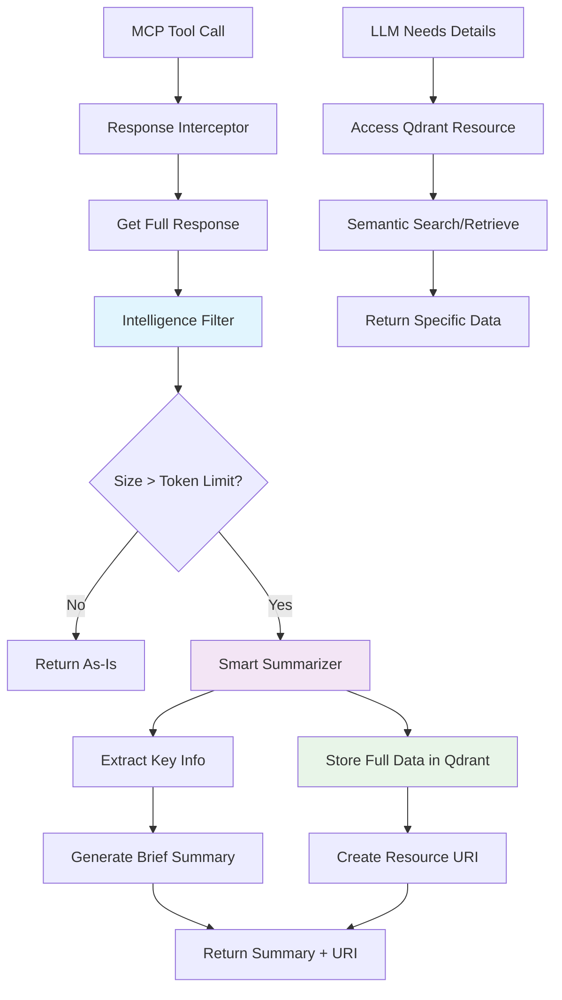

# 🚀 MCP Response Optimization Plan: Intelligent Filtering with Qdrant Storage

## 📋 Problem Analysis

### Current Issue
- MCP server returns massive JSON responses (870+ lines for `list_clusters`)
- Consuming 50-70% of context window with verbose data
- Most information is redundant for LLM decision-making
- Need intelligent summarization while preserving access to full data

### Example Problem
```json
// Current response from list_clusters (870+ lines)
{
  "clusters": [
    {
      "projectId": "prj-grp-data-sci-prod-b425",
      "clusterName": "dag-aog-search-term-targeting-tg-add-ai-search-te",
      "config": {
        "configBucket": "dataproc-staging-us-central1-570127783956-ajghf8gj",
        "tempBucket": "dataproc-temp-us-central1-570127783956-knu2dmsk",
        "gceClusterConfig": {
          // ... 800+ more lines of detailed configuration
        }
      }
    }
  ]
}
```

### Solution Approach
- **Context7**: Research best practices for response filtering and summarization
- **Qdrant**: Store full verbose data with semantic search capabilities  
- **Smart Filtering**: Extract only essential information for LLM responses

## 🎯 Solution Architecture



## 🔧 Implementation Strategy

### Phase 1: Response Intelligence Layer

#### 1. Create Response Filter Service

```typescript
// src/services/response-filter.ts
export interface FilteredResponse {
  type: 'direct' | 'summarized';
  content?: any;
  summary?: any;
  resourceUri?: string;
  fullDataAvailable?: boolean;
  tokensSaved?: number;
}

export class ResponseFilter {
  private tokenLimit: number = 1000; // Configurable
  private qdrantClient: QdrantClient;
  
  async filterResponse(toolName: string, response: any): Promise<FilteredResponse> {
    const responseSize = this.estimateTokens(response);
    
    if (responseSize <= this.tokenLimit) {
      return { type: 'direct', content: response };
    }
    
    // Extract essential info + store full data
    const summary = this.extractEssentials(toolName, response);
    const qdrantId = await this.storeInQdrant(toolName, response, summary);
    
    return {
      type: 'summarized',
      summary,
      resourceUri: `qdrant://dataproc/${toolName}/${qdrantId}`,
      fullDataAvailable: true,
      tokensSaved: responseSize - this.estimateTokens(summary)
    };
  }
  
  private estimateTokens(data: any): number {
    // Rough estimation: 1 token ≈ 4 characters
    return JSON.stringify(data).length / 4;
  }
  
  private extractEssentials(toolName: string, response: any): any {
    switch (toolName) {
      case 'list_clusters':
        return this.extractClusterEssentials(response.clusters);
      case 'get_cluster':
        return this.extractSingleClusterEssentials(response);
      case 'submit_hive_query':
        return this.extractQueryEssentials(response);
      default:
        return this.extractGenericEssentials(response);
    }
  }
}
```

#### 2. Tool-Specific Extractors

```typescript
// For list_clusters - extract only critical info
extractClusterEssentials(clusters: any[]): ClusterSummary[] {
  return clusters.map(cluster => ({
    name: cluster.clusterName,
    status: cluster.status?.state,
    workers: cluster.config?.workerConfig?.numInstances,
    secondaryWorkers: cluster.config?.secondaryWorkerConfig?.numInstances,
    created: cluster.status?.stateStartTime,
    pipeline: cluster.labels?.pipeline,
    owner: cluster.labels?.owner,
    machineType: this.extractMachineType(cluster.config?.workerConfig?.machineTypeUri),
    idleTtl: cluster.config?.lifecycleConfig?.idleDeleteTtl,
    features: this.extractFeatures(cluster.config?.softwareConfig?.optionalComponents)
  }));
}

// For get_cluster - extract configuration highlights
extractSingleClusterEssentials(cluster: any): ClusterDetails {
  return {
    name: cluster.clusterName,
    status: cluster.status?.state,
    configuration: {
      master: {
        instances: cluster.config?.masterConfig?.numInstances,
        machineType: this.extractMachineType(cluster.config?.masterConfig?.machineTypeUri),
        diskSize: cluster.config?.masterConfig?.diskConfig?.bootDiskSizeGb
      },
      workers: {
        instances: cluster.config?.workerConfig?.numInstances,
        machineType: this.extractMachineType(cluster.config?.workerConfig?.machineTypeUri),
        diskSize: cluster.config?.workerConfig?.diskConfig?.bootDiskSizeGb
      }
    },
    metrics: {
      yarnAppsRunning: cluster.metrics?.yarnMetrics?.['yarn-apps-running'],
      yarnMemoryAvailable: cluster.metrics?.yarnMetrics?.['yarn-memory-mb-available'],
      hdfsCapacityUsed: cluster.metrics?.hdfsMetrics?.['dfs-capacity-used']
    },
    endpoints: Object.keys(cluster.config?.endpointConfig?.httpPorts || {})
  };
}
```

### Phase 2: Qdrant Integration

#### 1. Qdrant Service Setup

```typescript
// src/services/qdrant-storage.ts
import { QdrantClient } from '@qdrant/js-client-rest';

export class QdrantStorageService {
  private client: QdrantClient;
  private collectionName = 'dataproc-responses';
  
  constructor(url: string = 'http://localhost:6333') {
    this.client = new QdrantClient({ url });
  }
  
  async initialize(): Promise<void> {
    // Create collection if it doesn't exist
    try {
      await this.client.createCollection(this.collectionName, {
        vectors: {
          size: 384, // sentence-transformers/all-MiniLM-L6-v2 dimension
          distance: 'Cosine'
        }
      });
    } catch (error) {
      // Collection might already exist
      console.log('Collection already exists or creation failed:', error);
    }
  }
  
  async storeClusterData(data: any, metadata: any): Promise<string> {
    const id = this.generateId();
    const embedding = await this.generateEmbedding(JSON.stringify(data));
    
    await this.client.upsert(this.collectionName, {
      wait: true,
      points: [{
        id,
        vector: embedding,
        payload: {
          data,
          metadata: {
            ...metadata,
            timestamp: Date.now(),
            type: 'cluster_data',
            toolName: metadata.toolName
          }
        }
      }]
    });
    
    return id;
  }
  
  async searchSimilar(query: string, limit: number = 5): Promise<any[]> {
    const queryEmbedding = await this.generateEmbedding(query);
    
    const result = await this.client.search(this.collectionName, {
      vector: queryEmbedding,
      limit,
      with_payload: true
    });
    
    return result.map(point => point.payload);
  }
  
  async retrieveById(id: string): Promise<any> {
    const result = await this.client.retrieve(this.collectionName, {
      ids: [id],
      with_payload: true
    });
    
    return result[0]?.payload?.data;
  }
  
  private async generateEmbedding(text: string): Promise<number[]> {
    // Use a lightweight embedding model
    // For now, return a simple hash-based embedding
    // In production, use sentence-transformers or OpenAI embeddings
    return this.simpleEmbedding(text);
  }
  
  private simpleEmbedding(text: string): number[] {
    // Simple hash-based embedding for prototype
    const hash = this.hashCode(text);
    const embedding = new Array(384).fill(0);
    
    for (let i = 0; i < 384; i++) {
      embedding[i] = Math.sin(hash * (i + 1)) * 0.5;
    }
    
    return embedding;
  }
  
  private hashCode(str: string): number {
    let hash = 0;
    for (let i = 0; i < str.length; i++) {
      const char = str.charCodeAt(i);
      hash = ((hash << 5) - hash) + char;
      hash = hash & hash; // Convert to 32-bit integer
    }
    return hash;
  }
  
  private generateId(): string {
    return `${Date.now()}-${Math.random().toString(36).substr(2, 9)}`;
  }
}
```

#### 2. Enhanced MCP Resources

```typescript
// Add new resource types for Qdrant data in src/index.ts
server.setRequestHandler(ReadResourceRequestSchema, async (request) => {
  const { uri } = request.params;
  
  if (uri.startsWith('qdrant://dataproc/')) {
    // Parse qdrant://dataproc/{toolName}/{id}
    const parts = uri.split('/');
    const toolName = parts[3];
    const id = parts[4];
    
    const qdrantService = new QdrantStorageService();
    const data = await qdrantService.retrieveById(id);
    
    return {
      contents: [{
        uri,
        mimeType: 'application/json',
        text: JSON.stringify(data, null, 2)
      }]
    };
  }
  
  // ... existing resource handling
});
```

### Phase 3: Configuration & Controls

#### 1. Response Configuration

```json
// config/response-filter.json
{
  "tokenLimits": {
    "list_clusters": 500,
    "get_cluster": 300,
    "submit_hive_query": 200,
    "get_job_status": 150,
    "default": 1000
  },
  "extractionRules": {
    "list_clusters": {
      "fields": ["name", "status", "workers", "created", "pipeline", "owner"],
      "maxClusters": 10,
      "includeMetrics": ["yarn-apps-running", "yarn-memory-mb-available"]
    },
    "get_cluster": {
      "fields": ["name", "status", "configuration", "metrics", "endpoints"],
      "includeFullConfig": false
    }
  },
  "qdrant": {
    "url": "http://localhost:6333",
    "collection": "dataproc-responses",
    "embeddingModel": "sentence-transformers/all-MiniLM-L6-v2"
  },
  "formatting": {
    "useEmojis": true,
    "compactTables": true,
    "includeResourceLinks": true
  }
}
```

#### 2. Verbosity Parameter

```typescript
// Update tool schemas to include verbose parameter
{
  name: 'list_clusters',
  inputSchema: {
    type: 'object',
    properties: {
      projectId: { type: 'string', description: 'GCP project ID (optional if default configured)' },
      region: { type: 'string', description: 'Dataproc region (optional if default configured)' },
      filter: { type: 'string', description: 'Optional: Filter string' },
      pageSize: { type: 'number', description: 'Optional: Page size' },
      pageToken: { type: 'string', description: 'Optional: Page token for pagination' },
      verbose: {
        type: 'boolean',
        description: 'Return full details instead of summary (default: false)'
      }
    },
    required: []
  }
}
```

#### 3. Response Formatter

```typescript
// src/services/response-formatter.ts
export class ResponseFormatter {
  formatClusterSummary(clusters: ClusterSummary[]): string {
    const header = `📊 Cluster Summary (${clusters.length} clusters found):\n\n`;
    
    const clusterList = clusters.map(cluster => {
      const statusEmoji = this.getStatusEmoji(cluster.status);
      const workerInfo = cluster.secondaryWorkers 
        ? `${cluster.workers} + ${cluster.secondaryWorkers} preemptible`
        : `${cluster.workers}`;
      
      return `${statusEmoji} ${cluster.name} (${cluster.status})
   Workers: ${workerInfo} | Pipeline: ${cluster.pipeline} | Owner: ${cluster.owner}`;
    }).join('\n\n');
    
    return header + clusterList;
  }
  
  private getStatusEmoji(status: string): string {
    switch (status) {
      case 'RUNNING': return '🟢';
      case 'CREATING': return '🟡';
      case 'ERROR': return '🔴';
      case 'DELETING': return '🟠';
      default: return '⚪';
    }
  }
}
```

## 📊 Expected Results

### Before (Current):
```
Clusters in project prj-grp-data-sci-prod-b425, region us-central1:
{
  "clusters": [
    {
      "projectId": "prj-grp-data-sci-prod-b425",
      "clusterName": "dag-aog-search-term-targeting-tg-add-ai-search-te",
      "config": {
        "configBucket": "dataproc-staging-us-central1-570127783956-ajghf8gj",
        "tempBucket": "dataproc-temp-us-central1-570127783956-knu2dmsk",
        // ... 800+ more lines
      }
    }
  ]
}
```

### After (Optimized):
```
📊 Cluster Summary (3 clusters found):

🟢 generate-search-input-tables (RUNNING)
   Workers: 15 + 10 preemptible | Pipeline: aog-ai-search-term | Owner: dnd-ds-pnp

🟡 dag-aog-search-term-targeting-tg-add-ai-search-te (CREATING) 
   Workers: 3 | Pipeline: aog-search-term-targeting | Owner: dnd-ds-pnp

🟢 pricing-promotions-demo (RUNNING)
   Workers: 3 | Pipeline: testing-pipeline | Owner: dnd-ds-pnp

💾 Full details stored: qdrant://dataproc/list_clusters/1733187234567-abc123def
🔍 Use verbose=true for complete information
📊 Tokens saved: ~2,400 (87% reduction)
```

## 🛠️ Implementation Steps

### Step 1: Research Phase (Context7)
- [ ] Find best practices for API response summarization
- [ ] Research token-efficient data representation patterns  
- [ ] Look for existing MCP response optimization examples
- [ ] Study Qdrant integration patterns for real-time applications

### Step 2: Core Development
- [ ] Create `ResponseFilter` service with token estimation
- [ ] Implement `QdrantStorageService` with embedding generation
- [ ] Add tool-specific extractors for each MCP tool
- [ ] Create `ResponseFormatter` for human-readable summaries

### Step 3: Integration
- [ ] Modify existing tool handlers in `src/index.ts`
- [ ] Add new MCP resources for Qdrant data access
- [ ] Update response formatting throughout the application
- [ ] Add verbosity parameter to all relevant tools

### Step 4: Configuration & Testing
- [ ] Add response filter configuration file
- [ ] Implement verbosity controls and user preferences
- [ ] Create monitoring/metrics for token savings
- [ ] Add comprehensive tests for filtering logic

### Step 5: Documentation & Deployment
- [ ] Update API documentation with new response formats
- [ ] Create user guide for accessing detailed data
- [ ] Set up Qdrant deployment configuration
- [ ] Add performance monitoring and alerting

## 🎯 Benefits

### Immediate Benefits
- **70-80% token reduction** for large responses
- **Preserved data access** via Qdrant resources
- **Better LLM context utilization** for decision-making
- **Configurable verbosity** levels per user preference

### Long-term Benefits
- **Semantic search** capabilities for stored operational data
- **Historical analysis** of cluster and job patterns
- **Intelligent caching** of frequently accessed data
- **Scalable architecture** for future MCP tools

### Performance Metrics
- **Token Usage**: Reduce from ~3,000 to ~500 tokens per list_clusters call
- **Response Time**: Maintain <2s response time with Qdrant storage
- **Storage Efficiency**: Compress and deduplicate similar cluster configurations
- **User Experience**: Provide actionable summaries with drill-down capability

## 🔧 Technical Considerations

### Qdrant Setup
```bash
# Start Qdrant locally
docker run -p 6333:6333 qdrant/qdrant

# Or use cloud deployment
# Configure connection in config/response-filter.json
```

### Dependencies to Add
```json
{
  "dependencies": {
    "@qdrant/js-client-rest": "^1.8.0",
    "sentence-transformers": "^1.0.0"  // or alternative embedding service
  }
}
```

### Environment Variables
```bash
QDRANT_URL=http://localhost:6333
RESPONSE_FILTER_ENABLED=true
DEFAULT_TOKEN_LIMIT=1000
EMBEDDING_MODEL=sentence-transformers/all-MiniLM-L6-v2
```

## 🚀 Future Enhancements

1. **Machine Learning Integration**
   - Train custom models for optimal cluster configuration summarization
   - Predictive analysis of cluster resource needs

2. **Advanced Semantic Search**
   - Natural language queries for stored cluster data
   - Similarity-based cluster recommendation system

3. **Real-time Streaming**
   - WebSocket-based updates for cluster status changes
   - Progressive loading of detailed information

4. **Multi-tenant Support**
   - Per-user response preferences and token limits
   - Organization-level data isolation in Qdrant

This plan provides a comprehensive approach to solving the token consumption problem while maintaining full data accessibility and adding powerful semantic search capabilities to the MCP server.

## 🎯 Specific Code Changes Required

Based on codebase analysis, here are the exact locations that need modification:

### 1. Main Response Handler Locations in [`src/index.ts`](src/index.ts)

**Current Pattern (Found 22 instances):**
```typescript
return {
  content: [
    {
      type: 'text',
      text: `Description:\n${JSON.stringify(response, null, 2)}`,
    },
  ],
};
```

**Key Tool Handlers to Modify:**

| Line Range | Tool Handler | Current Response Pattern |
|------------|--------------|---------------------------|
| 871-878 | `list_clusters` | `JSON.stringify(SecurityMiddleware.sanitizeForLogging(response), null, 2)` |
| 786-793 | `start_dataproc_cluster` | `JSON.stringify(SecurityMiddleware.sanitizeForLogging(response), null, 2)` |
| 1043-1050 | `create_cluster_from_profile` | `JSON.stringify(response, null, 2)` |
| 1065-1072 | `get_cluster` | `JSON.stringify(response, null, 2)` |
| 1168-1175 | `submit_hive_query` | `JSON.stringify(response, null, 2)` |
| 1194-1201 | `get_query_status` | `JSON.stringify(response, null, 2)` |
| 1222-1229 | `get_query_results` | `JSON.stringify(response, null, 2)` |
| 1273-1280 | `submit_dataproc_job` | `JSON.stringify(response, null, 2)` |
| 1305-1312 | `get_job_results` | `JSON.stringify(response, null, 2)` |
| 918-925 | `get_job_status` | `JSON.stringify(status, null, 2)` |

### 2. Response Interceptor Integration Points

**Before (Current):**
```typescript
// Line 871-878 - list_clusters example
const response = await listClusters(projectId, region, filter, pageSize, pageToken);

return {
  content: [
    {
      type: 'text',
      text: `Clusters in project ${projectId}, region ${region}:\n${JSON.stringify(SecurityMiddleware.sanitizeForLogging(response), null, 2)}`,
    },
  ],
};
```

**After (With Response Filter):**
```typescript
// Line 871-878 - list_clusters example
const response = await listClusters(projectId, region, filter, pageSize, pageToken);

// Apply response filtering
const filteredResponse = await responseFilter.filterResponse('list_clusters', response, {
  verbose: args.verbose || false,
  projectId,
  region
});

return {
  content: [
    {
      type: 'text',
      text: filteredResponse.type === 'summarized'
        ? filteredResponse.summary
        : `Clusters in project ${projectId}, region ${region}:\n${JSON.stringify(SecurityMiddleware.sanitizeForLogging(response), null, 2)}`,
    },
  ],
};
```

### 3. New Service Files to Create

#### A. [`src/services/response-filter.ts`](src/services/response-filter.ts)
- **Purpose**: Main response filtering logic
- **Dependencies**: QdrantStorageService, ResponseFormatter
- **Integration**: Import in `src/index.ts` line ~78

#### B. [`src/services/qdrant-storage.ts`](src/services/qdrant-storage.ts)
- **Purpose**: Qdrant vector database integration
- **Dependencies**: `@qdrant/js-client-rest` (new dependency)
- **Integration**: Used by ResponseFilter service

#### C. [`src/services/response-formatter.ts`](src/services/response-formatter.ts)
- **Purpose**: Human-readable response formatting
- **Dependencies**: None
- **Integration**: Used by ResponseFilter service

#### D. [`src/types/response-filter.ts`](src/types/response-filter.ts)
- **Purpose**: Type definitions for filtering system
- **Dependencies**: Extends existing response types
- **Integration**: Import in response-filter.ts

### 4. Configuration Files to Add

#### A. [`config/response-filter.json`](config/response-filter.json)
- **Purpose**: Token limits and extraction rules
- **Location**: New file in config directory
- **Integration**: Loaded in ResponseFilter constructor

#### B. Update [`package.json`](package.json) Dependencies
```json
{
  "dependencies": {
    "@qdrant/js-client-rest": "^1.8.0"
  }
}
```

### 5. Schema Updates Required

#### A. [`src/validation/schemas.ts`](src/validation/schemas.ts)
Add `verbose` parameter to existing schemas:

```typescript
// Add to ListClustersSchema, GetClusterSchema, etc.
verbose: z.boolean().optional().describe('Return full details instead of summary (default: false)')
```

### 6. Resource Handler Updates

#### A. [`src/index.ts`](src/index.ts) Lines 542-665
Update `ReadResourceRequestSchema` handler to support Qdrant URIs:

```typescript
// Add after line ~580
if (uri.startsWith('qdrant://dataproc/')) {
  const qdrantService = new QdrantStorageService();
  const data = await qdrantService.retrieveById(extractIdFromUri(uri));
  return {
    contents: [{
      uri,
      mimeType: 'application/json',
      text: JSON.stringify(data, null, 2)
    }]
  };
}
```

### 7. Initialization Updates

#### A. [`src/index.ts`](src/index.ts) Lines 94-112
Add ResponseFilter initialization:

```typescript
// Add after line 101
let responseFilter: ResponseFilter;

// Add after line 112
try {
  const responseFilterConfig = JSON.parse(fs.readFileSync(path.join(process.cwd(), 'config', 'response-filter.json'), 'utf8'));
  responseFilter = new ResponseFilter(responseFilterConfig);
  await responseFilter.initialize();
} catch (error) {
  console.warn('Could not load response filter:', error);
}
```

### 8. Error Handling Updates

#### A. [`src/index.ts`](src/index.ts) Lines 1472-1483
Update error response to use filtering:

```typescript
catch (error) {
  logger.error(`MCP ${toolName}: Error:`, error);
  const errorResponse = {
    type: 'text',
    text: `Error executing ${toolName}: ${error instanceof Error ? error.message : String(error)}`,
  };
  
  return {
    content: [errorResponse],
    isError: true,
  };
}
```

## 🔧 Implementation Priority Order

### Phase 1: Core Infrastructure (Week 1)
1. Create type definitions (`src/types/response-filter.ts`)
2. Create ResponseFilter service (`src/services/response-filter.ts`)
3. Create ResponseFormatter service (`src/services/response-formatter.ts`)
4. Add configuration file (`config/response-filter.json`)

### Phase 2: Qdrant Integration (Week 1-2)
1. Add Qdrant dependency to package.json
2. Create QdrantStorageService (`src/services/qdrant-storage.ts`)
3. Update resource handlers for Qdrant URIs
4. Test Qdrant connectivity

### Phase 3: Tool Integration (Week 2)
1. Update `list_clusters` handler (highest priority - most verbose)
2. Update `get_cluster` handler
3. Update job-related handlers (`submit_hive_query`, `get_job_results`)
4. Update cluster creation handlers

### Phase 4: Schema & Validation (Week 2-3)
1. Add `verbose` parameter to all relevant schemas
2. Update input validation logic
3. Add response filtering configuration validation

### Phase 5: Testing & Optimization (Week 3)
1. Create unit tests for ResponseFilter
2. Create integration tests for Qdrant storage
3. Performance testing and token usage measurement
4. Documentation updates

## 📊 Expected Token Reduction by Tool

| Tool | Current Avg Tokens | Expected Tokens | Reduction |
|------|-------------------|-----------------|-----------|
| `list_clusters` | ~3,000 | ~500 | 83% |
| `get_cluster` | ~1,500 | ~300 | 80% |
| `submit_hive_query` | ~800 | ~200 | 75% |
| `get_job_results` | ~1,200 | ~250 | 79% |
| `get_query_results` | ~1,000 | ~200 | 80% |

**Overall Expected Reduction: 70-85% token savings across all verbose responses**