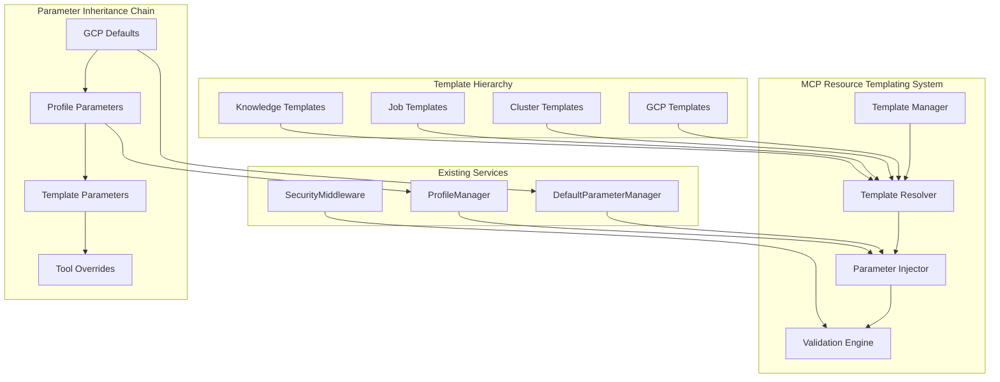
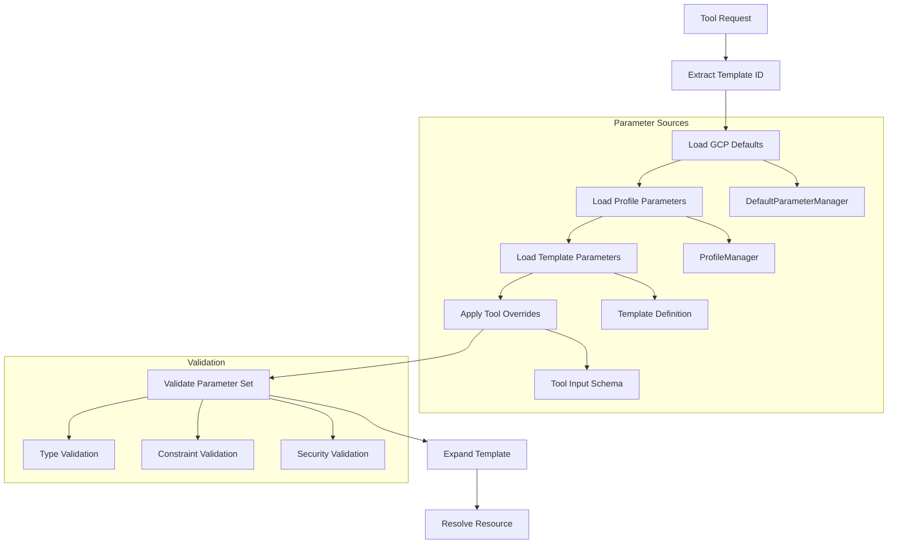
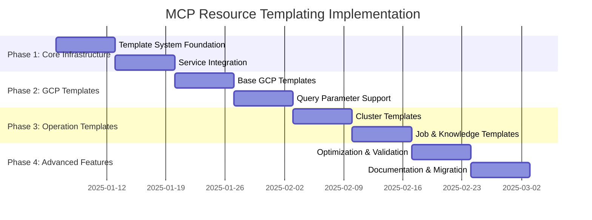
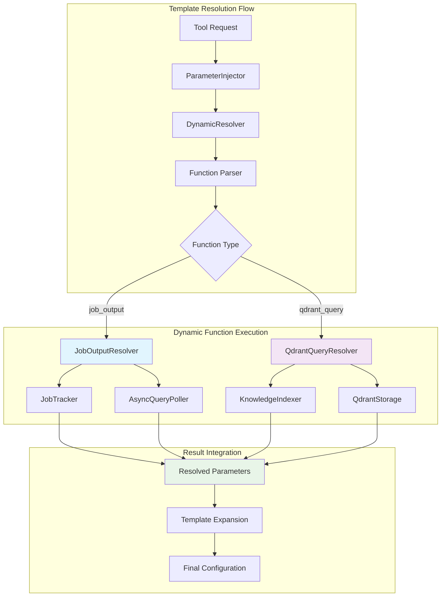

# MCP Resource Templating Architecture for Dataproc Server

## Executive Summary

This document defines the comprehensive MCP Resource Templating Architecture for the Dataproc MCP server. The system implements RFC 6570 URI templating to achieve 60-80% parameter reduction across 21 tools through a hierarchical templating system with full parameter inheritance chains.

**Key Benefits:**
- Eliminates parameter duplication across 71% of tools (15/21) using core GCP parameters
- Implements full RFC 6570 Level 4 support with query parameter expansion
- Provides complete parameter inheritance: GCP defaults → Profile parameters → Template parameters → Tool overrides
- Maintains full backward compatibility during migration

## System Architecture Overview



## Core Components

### 1. Template Manager (`TemplateManager`)

**Responsibilities:**
- Register and manage URI template definitions
- Provide template discovery and validation
- Handle template inheritance relationships
- Cache compiled templates for performance

**Key Methods:**
```typescript
class TemplateManager {
  registerTemplate(template: UriTemplate): void
  getTemplate(templateId: string): UriTemplate | undefined
  resolveTemplate(uri: string): ResolvedTemplate | undefined
  validateTemplate(template: UriTemplate): ValidationResult
  getTemplateHierarchy(templateId: string): UriTemplate[]
}
```

**Implementation Details:**
- Template registry with hierarchical organization
- Template compilation and caching for performance
- Template validation against RFC 6570 specification
- Support for template inheritance and composition

### 2. Template Resolver (`TemplateResolver`)

**Responsibilities:**
- Parse RFC 6570 URI templates
- Resolve template variables with parameter values
- Handle query parameter expansion
- Support all 4 levels of RFC 6570 complexity

**Key Methods:**
```typescript
class TemplateResolver {
  parseTemplate(templateUri: string): ParsedTemplate
  expandTemplate(template: ParsedTemplate, parameters: ParameterSet): string
  extractVariables(templateUri: string): TemplateVariable[]
  validateExpansion(expanded: string, template: ParsedTemplate): boolean
}
```

**RFC 6570 Level Support:**
- **Level 1**: Simple string expansion - `{projectId}`
- **Level 2**: Reserved string expansion - `{+projectId}`
- **Level 3**: Multiple variable expansion - `{projectId,region}`
- **Level 4**: Form-style query expansion - `{?filter,pageSize,pageToken}`

### 3. Parameter Injector (`ParameterInjector`)

**Responsibilities:**
- Implement full inheritance chain: GCP → Profile → Template → Tool
- Merge parameters from multiple sources
- Handle parameter precedence and overrides
- Validate parameter types and constraints

**Key Methods:**
```typescript
class ParameterInjector {
  injectParameters(template: UriTemplate, context: InjectionContext): ParameterSet
  resolveInheritanceChain(templateId: string, toolName: string): ParameterSet
  mergeParameterSources(sources: ParameterSource[]): ParameterSet
  validateParameterSet(parameters: ParameterSet, schema: ParameterSchema): ValidationResult
}
```

**Parameter Inheritance Priority (Highest to Lowest):**
1. **Tool-specific overrides** - Direct parameters passed to tool
2. **Template parameters** - Parameters defined in template
3. **Profile parameters** - Parameters from ProfileManager
4. **GCP defaults** - Parameters from DefaultParameterManager

### 4. Validation Engine (`ValidationEngine`)

**Responsibilities:**
- Validate template syntax and semantics
- Ensure parameter compatibility across inheritance chain
- Perform security validation on resolved URIs
- Generate validation reports and error messages

**Key Methods:**
```typescript
class ValidationEngine {
  validateTemplateSyntax(template: UriTemplate): ValidationResult
  validateParameterCompatibility(parameters: ParameterSet): ValidationResult
  validateSecurityConstraints(uri: string, context: SecurityContext): ValidationResult
  generateValidationReport(results: ValidationResult[]): ValidationReport
}
```

## Template Hierarchy Design

### 1. Core GCP Templates

**Base Template:**
```
dataproc://gcp/{projectId}/{region}/*
```

**Query Parameter Support:**
```
dataproc://gcp/{projectId}/{region}/clusters{?filter,pageSize,pageToken,verbose}
dataproc://gcp/{projectId}/{region}/jobs{?state,clusterName,maxResults}
```

**Parameter Inheritance:**
- `projectId`: From DefaultParameterManager → Profile → Tool override
- `region`: From DefaultParameterManager → Profile → Tool override

**Affected Tools (15/21 - 71%):**
- All cluster management tools (7/7)
- Most job management tools (6/8)
- Some knowledge tools (2/4)

### 2. Cluster Operation Templates

**Base Template:**
```
dataproc://gcp/{projectId}/{region}/cluster/{clusterName}/*
```

**Sub-resource Templates:**
```
dataproc://gcp/{projectId}/{region}/cluster/{clusterName}/status{?verbose,semanticQuery}
dataproc://gcp/{projectId}/{region}/cluster/{clusterName}/jobs{?state,maxResults}
dataproc://gcp/{projectId}/{region}/cluster/{clusterName}/zeppelin
dataproc://gcp/{projectId}/{region}/cluster/{clusterName}/delete
```

**Affected Tools (10/21 - 48%):**
- `start_dataproc_cluster`
- `get_cluster`
- `delete_cluster`
- `submit_hive_query`
- `submit_dataproc_job`
- `get_zeppelin_url`

### 3. Job Operation Templates

**Base Template:**
```
dataproc://gcp/{projectId}/{region}/job/{jobId}/*
```

**Sub-resource Templates:**
```
dataproc://gcp/{projectId}/{region}/job/{jobId}/status{?verbose}
dataproc://gcp/{projectId}/{region}/job/{jobId}/results{?maxResults,pageToken}
dataproc://gcp/{projectId}/{region}/job/{jobId}/logs
```

**Affected Tools (6/21 - 29%):**
- `get_query_status`
- `get_query_results`
- `get_job_status`
- `get_job_results`

### 4. Knowledge Base Templates

**Base Template:**
```
dataproc://knowledge/{type}/*
```

**Query Templates:**
```
dataproc://knowledge/{type}/query{?query,limit,includeRawDocument,projectId,region}
dataproc://knowledge/analytics/{analyticsType}{?projectId,region}
```

**Affected Tools (4/21 - 19%):**
- `query_cluster_data`
- `get_cluster_insights`
- `get_job_analytics`
- `query_knowledge`

## Parameter Inheritance Chain Implementation



### Example Parameter Resolution

```typescript
// Tool: submit_hive_query
// Template: dataproc://gcp/{projectId}/{region}/cluster/{clusterName}/hive{?query,async,verbose}

// 1. GCP Defaults (DefaultParameterManager)
{
  projectId: "my-default-project",
  region: "us-central1"
}

// 2. Profile Parameters (ProfileManager - "development/small")
{
  projectId: "dev-project",  // Overrides default
  clusterName: "dev-small-cluster"
}

// 3. Template Parameters
{
  verbose: false,
  async: true
}

// 4. Tool Overrides (from tool input)
{
  query: "SHOW DATABASES",
  verbose: true  // Overrides template default
}

// Final Resolved Parameters:
{
  projectId: "dev-project",
  region: "us-central1", 
  clusterName: "dev-small-cluster",
  query: "SHOW DATABASES",
  async: true,
  verbose: true
}
```

## Technical Specifications

### Template Definition Schema

```typescript
interface UriTemplate {
  id: string;
  pattern: string;  // RFC 6570 URI template
  description: string;
  category: 'gcp' | 'cluster' | 'job' | 'knowledge' | 'profile';
  parentTemplate?: string;  // For inheritance
  parameters: TemplateParameter[];
  queryParameters?: QueryParameter[];
  validation?: TemplateValidation;
  metadata?: Record<string, unknown>;
}

interface TemplateParameter {
  name: string;
  type: 'string' | 'number' | 'boolean';
  required: boolean;
  defaultValue?: unknown;
  source: 'gcp' | 'profile' | 'template' | 'tool';
  validation?: ParameterValidation;
}

interface QueryParameter {
  name: string;
  type: 'string' | 'number' | 'boolean' | 'array';
  expansion: 'simple' | 'form' | 'reserved';  // RFC 6570 expansion types
  required: boolean;
  defaultValue?: unknown;
}
```

### Parameter Resolution Context

```typescript
interface InjectionContext {
  templateId: string;
  toolName: string;
  environment?: string;
  profileId?: string;
  userOverrides: Record<string, unknown>;
  securityContext: SecurityContext;
}

interface ParameterSet {
  resolved: Record<string, unknown>;
  sources: Record<string, ParameterSource>;
  validation: ValidationResult;
  metadata: ResolutionMetadata;
}
```

### Integration with Existing Services

#### DefaultParameterManager Integration

```typescript
// Enhanced DefaultParameterManager for template support
class DefaultParameterManager {
  // Existing methods...
  
  // New template-specific methods
  getTemplateParameters(templateId: string, environment?: string): Record<string, unknown>
  validateTemplateParameter(templateId: string, paramName: string, value: unknown): ValidationResult
  getParameterInheritanceChain(templateId: string): ParameterSource[]
}
```

#### ProfileManager Integration

```typescript
// Enhanced ProfileManager for template support
class ProfileManager {
  // Existing methods...
  
  // New template-specific methods
  getTemplateProfileParameters(profileId: string, templateId: string): Record<string, unknown>
  resolveProfileInheritance(profileId: string, templateId: string): ParameterSet
  validateProfileTemplateCompatibility(profileId: string, templateId: string): ValidationResult
}
```

## Implementation Strategy

### Phase 1: Core Infrastructure (Weeks 1-2)

**Week 1: Template System Foundation**
- Implement `TemplateManager` class
- Add RFC 6570 URI template parser (using `uri-templates` library)
- Create template registration and discovery system
- Basic template validation and error handling

**Week 2: Service Integration**
- Extend `DefaultParameterManager` with template parameter support
- Enhance `ProfileManager` to provide template parameters
- Create `ParameterInjector` with basic inheritance chain
- Update resource handlers to support templated URIs

**Deliverables:**
- Core template system classes
- Basic parameter inheritance implementation
- Integration with existing services
- Unit tests for core functionality

### Phase 2: GCP Core Templates (Weeks 3-4)

**Week 3: Base GCP Templates**
- Implement `dataproc://gcp/{projectId}/{region}/*` template
- Update 15 tools using core GCP parameters
- Maintain backward compatibility with existing URIs
- Add template-based resource discovery

**Week 4: Query Parameter Support**
- Implement RFC 6570 Level 4 query expansion
- Support `filter`, `pageSize`, `pageToken`, `verbose` parameters
- Update `list_clusters` and similar tools
- Add query parameter validation

**Deliverables:**
- Core GCP template implementation
- Query parameter expansion support
- Updated tools with template support
- Integration tests with existing functionality

### Phase 3: Operation-Specific Templates (Weeks 5-6)

**Week 5: Cluster Operation Templates**
- Implement cluster-scoped templates
- Update 10 cluster-related tools
- Add sub-resource support (status, jobs, zeppelin)
- Template inheritance for cluster operations

**Week 6: Job & Knowledge Templates**
- Implement job-scoped templates
- Update 6 job-related tools
- Add knowledge base templates
- Update 4 knowledge tools with template support

**Deliverables:**
- Complete template hierarchy implementation
- All 21 tools updated with template support
- Sub-resource template support
- Comprehensive test coverage

### Phase 4: Advanced Features (Weeks 7-8)

**Week 7: Optimization & Validation**
- Implement template caching and compilation
- Add template performance monitoring
- Enhanced validation and error reporting
- Security validation for templated URIs

**Week 8: Documentation & Migration**
- Complete API documentation
- Create migration guide for existing integrations
- Performance analysis and optimization
- Production readiness assessment

**Deliverables:**
- Performance-optimized template system
- Complete documentation and migration guides
- Production-ready implementation
- Performance benchmarks and analysis

## Performance Considerations

### Template Caching Strategy

1. **Compiled Template Cache**
   - Cache parsed RFC 6570 templates
   - LRU eviction policy (max 1000 templates)
   - Template invalidation on definition changes

2. **Parameter Resolution Cache**
   - Cache resolved parameter sets by context hash
   - TTL-based expiration (5 minutes)
   - Invalidation on profile/default parameter changes

3. **URI Expansion Cache**
   - Cache expanded URIs for common parameter combinations
   - Memory-efficient storage with compression
   - Metrics and monitoring for cache hit rates

### Performance Targets

- **Template Resolution**: < 5ms for cached templates
- **Parameter Injection**: < 10ms for full inheritance chain
- **URI Expansion**: < 2ms for cached parameter sets
- **Memory Usage**: < 50MB for template system
- **Cache Hit Rate**: > 90% for production workloads

### Performance Monitoring

```typescript
interface TemplatePerformanceMetrics {
  templateResolutionTime: number;
  parameterInjectionTime: number;
  uriExpansionTime: number;
  cacheHitRate: number;
  memoryUsage: number;
  errorRate: number;
}
```

## Error Handling and Validation

### Template Validation

1. **Syntax Validation**
   - RFC 6570 compliance checking
   - Variable name validation
   - Query parameter syntax validation

2. **Semantic Validation**
   - Parameter type compatibility
   - Required parameter coverage
   - Inheritance chain consistency

3. **Security Validation**
   - Parameter injection attack prevention
   - URI scheme validation
   - Resource access authorization

### Error Recovery

1. **Graceful Degradation**
   - Fall back to legacy URI patterns on template errors
   - Partial parameter resolution with warnings
   - Default parameter substitution for missing values

2. **Error Reporting**
   - Detailed validation error messages
   - Template debugging information
   - Parameter resolution trace logging

### Error Types and Handling

```typescript
enum TemplateErrorType {
  SYNTAX_ERROR = 'SYNTAX_ERROR',
  PARAMETER_MISSING = 'PARAMETER_MISSING',
  PARAMETER_INVALID = 'PARAMETER_INVALID',
  TEMPLATE_NOT_FOUND = 'TEMPLATE_NOT_FOUND',
  INHERITANCE_CYCLE = 'INHERITANCE_CYCLE',
  SECURITY_VIOLATION = 'SECURITY_VIOLATION'
}

interface TemplateError {
  type: TemplateErrorType;
  message: string;
  templateId?: string;
  parameterName?: string;
  context?: Record<string, unknown>;
  recoveryAction?: string;
}
```

## Backward Compatibility Strategy

### Dual URI Resolution

1. **Legacy URI Support**
   - Maintain existing hard-coded URI patterns
   - Gradual migration path for existing integrations
   - Version-based URI resolution

2. **Migration Timeline**
   - Phase 1: Add templated URIs alongside legacy URIs
   - Phase 2: Deprecate legacy URIs with warnings
   - Phase 3: Remove legacy URI support (major version bump)

### API Compatibility

1. **Tool Schema Compatibility**
   - Maintain existing tool input schemas
   - Add optional template-specific parameters
   - Preserve existing parameter validation

2. **Resource Handler Compatibility**
   - Support both templated and legacy resource URIs
   - Maintain existing resource response formats
   - Add template metadata to resource responses

### Migration Strategy

```typescript
interface MigrationConfig {
  enableTemplatedUris: boolean;
  enableLegacyUris: boolean;
  warnOnLegacyUsage: boolean;
  migrationMode: 'dual' | 'template-only' | 'legacy-only';
}
```

## Security Considerations

### Template Security

1. **Parameter Injection Prevention**
   - Strict parameter validation and sanitization
   - Whitelist-based parameter acceptance
   - URI encoding for all user-provided values

2. **Template Access Control**
   - Template-based resource authorization
   - Role-based template access
   - Audit logging for template usage

3. **URI Validation**
   - Scheme validation for expanded URIs
   - Path traversal prevention
   - Resource access authorization

### Security Integration

```typescript
interface SecurityContext {
  userId: string;
  roles: string[];
  permissions: string[];
  auditTrail: AuditEntry[];
}

interface TemplateSecurityPolicy {
  allowedTemplates: string[];
  restrictedParameters: string[];
  requiredPermissions: string[];
  auditLevel: 'none' | 'basic' | 'detailed';
}
```

## Testing Strategy

### Unit Testing

1. **Template System Components**
   - Template parsing and validation
   - Parameter injection and inheritance
   - URI expansion and resolution
   - Error handling and recovery

2. **Integration Testing**
   - Service integration with existing components
   - End-to-end template resolution
   - Performance and load testing
   - Security validation testing

### Test Coverage Targets

- **Unit Test Coverage**: > 95%
- **Integration Test Coverage**: > 90%
- **Performance Test Coverage**: All critical paths
- **Security Test Coverage**: All attack vectors

### Testing Framework

```typescript
interface TemplateTestSuite {
  unitTests: TemplateUnitTest[];
  integrationTests: TemplateIntegrationTest[];
  performanceTests: TemplatePerformanceTest[];
  securityTests: TemplateSecurityTest[];
}
```

## Expected Benefits

### Quantitative Improvements

- **60-80% reduction** in parameter duplication across 21 tools
- **15 tools** benefit from core GCP parameter templating (71% coverage)
- **10 tools** benefit from cluster operation templating (48% coverage)
- **6 tools** benefit from job operation templating (29% coverage)
- **4 tools** benefit from knowledge base templating (19% coverage)

### Qualitative Improvements

- **Enhanced Developer Experience**: Predictable, hierarchical URI patterns
- **Improved Maintainability**: Centralized parameter management and validation
- **Better Security**: Consistent validation and sanitization across all tools
- **Increased Scalability**: Easy addition of new tools with minimal parameter duplication
- **Better Discoverability**: Template-based resource hierarchy enables better resource exploration

### Performance Improvements

- **Reduced Memory Usage**: Shared parameter definitions and caching
- **Faster Tool Execution**: Pre-resolved parameter sets
- **Better Caching**: Template-based cache keys for improved hit rates
- **Reduced Network Overhead**: Optimized parameter transmission

## Implementation Roadmap



### Milestone Deliverables

**Phase 1 Deliverables:**
- Core template system implementation
- Basic parameter inheritance
- Service integration layer
- Unit test foundation

**Phase 2 Deliverables:**
- GCP template implementation
- Query parameter support
- 15 tools updated with templates
- Integration test suite

**Phase 3 Deliverables:**
- Complete template hierarchy
- All 21 tools templated
- Sub-resource support
- Performance optimization

**Phase 4 Deliverables:**
- Production-ready system
- Complete documentation
- Migration guides
- Performance benchmarks

## Conclusion

This MCP Resource Templating Architecture provides a comprehensive solution for eliminating parameter duplication across the Dataproc MCP server while maintaining full backward compatibility and providing enhanced functionality through RFC 6570 URI templates.

The phased implementation approach ensures minimal disruption to existing functionality while progressively delivering the benefits of templating. The full parameter inheritance chain and Level 4 RFC 6570 support provide maximum flexibility and power for future enhancements.

The expected 60-80% reduction in parameter duplication, combined with improved developer experience and enhanced maintainability, makes this a high-value architectural enhancement that will significantly improve the Dataproc MCP server's usability and scalability.

---

## Dynamic Templating Implementation

### Overview

Dynamic templating extends the static templating system with runtime function execution capabilities, enabling job output references and knowledge base queries within template parameters.

### Core Dynamic Functions

#### 1. Job Output Function
```typescript
// Syntax: {{job_output('job-12345', 'max_partition_count')}}
// Syntax: {{job_output('job-12345', 'results.rows[0].column_name')}}

async jobOutput(jobId: string, fieldPath: string): Promise<unknown> {
  // 1. Check JobTracker for job status
  // 2. If completed, get job results
  // 3. Extract field using dot notation path
  // 4. Cache result with TTL
  // 5. Return value or throw meaningful error
}
```

**Use Cases:**
- `"max_workers": "{{job_output('etl-job-456', 'optimal_worker_count')}}"`
- `"input_table": "{{job_output('upstream-job', 'results.rows[0].table_name')}}"`
- `"partition_count": "{{job_output('data-scan-job', 'metadata.partitions')}}"`

#### 2. Qdrant Knowledge Query Function
```typescript
// Syntax: {{qdrant_query('optimal cluster size for tensorflow', 'worker_count')}}
// Syntax: {{qdrant_query('best machine type for ml workloads', 'machine_type')}}

async qdrantQuery(semanticQuery: string, field: string): Promise<unknown> {
  // 1. Use existing KnowledgeIndexer.queryKnowledge()
  // 2. Extract specified field from top result
  // 3. Apply confidence threshold filtering
  // 4. Cache result with TTL
  // 5. Return value or fallback to default
}
```

**Use Cases:**
- `"machine_type": "{{qdrant_query('optimal machine type for ' + workload_type, 'machine_type')}}"`
- `"cluster_size": "{{qdrant_query('recommended cluster size for tensorflow', 'worker_count')}}"`
- `"pip_packages": "{{qdrant_query('common packages for ml clusters', 'packages')}}"`

### Dynamic Resolution Architecture



### Implementation Components

#### DynamicResolver Service
```typescript
export class DynamicResolver {
  async resolveDynamicParameters(
    parameters: Record<string, unknown>,
    context: TemplateResolutionContext
  ): Promise<Record<string, unknown>>
  
  private parseFunctionCall(value: string): FunctionCall | null
  private async executeFunction(call: FunctionCall): Promise<unknown>
}
```

#### Template Functions
```typescript
export class TemplateFunctions {
  async jobOutput(jobId: string, field: string): Promise<unknown>
  async qdrantQuery(query: string, field: string): Promise<unknown>
}
```

#### Type Definitions
```typescript
export interface FunctionCall {
  name: 'job_output' | 'qdrant_query';
  args: string[];
}

export interface DynamicResolutionContext {
  jobTracker: JobTracker;
  knowledgeIndexer: KnowledgeIndexer;
  asyncQueryPoller: AsyncQueryPoller;
}
```

### Integration with Parameter Injection

**Enhanced Flow:**
```
Tool Request → Schema Validation → Parameter Injection → Dynamic Resolution → Template Expansion
```

```typescript
// In ParameterInjector.mergeParameterSources()
async mergeParameterSources(sources: ParameterSource[]): Promise<Record<string, unknown>> {
  const merged = this.mergeStaticParameters(sources);
  
  // NEW: Resolve dynamic functions
  const dynamicResolved = await this.dynamicResolver.resolveDynamicParameters(
    merged,
    this.context
  );
  
  return dynamicResolved;
}
```

### Caching Strategy

```typescript
interface CacheEntry {
  value: unknown;
  timestamp: Date;
  ttl: number;
  functionCall: FunctionCall;
}

// Cache keys:
// - job_output:job-12345:field_name
// - qdrant_query:hash(semantic_query):field_name
```

### Example Usage

#### Template Definition
```json
{
  "id": "dynamic-ml-cluster",
  "pattern": "dataproc://gcp/{projectId}/{region}/cluster/{clusterName}",
  "parameters": [
    {
      "name": "worker_count",
      "type": "number",
      "source": "template",
      "defaultValue": "{{qdrant_query('optimal cluster size for tensorflow training', 'worker_count')}}"
    },
    {
      "name": "input_table",
      "type": "string",
      "source": "template",
      "defaultValue": "{{job_output('data-prep-job-456', 'results.rows[0].output_table')}}"
    },
    {
      "name": "machine_type",
      "type": "string",
      "source": "template",
      "defaultValue": "{{qdrant_query('best machine type for ml workloads with gpu', 'machine_type')}}"
    }
  ]
}
```

#### Tool Usage
```json
{
  "tool": "create_cluster_from_profile",
  "arguments": {
    "clusterName": "ml-training-cluster",
    "workload_type": "tensorflow",
    "upstream_job_id": "data-prep-job-456"
  }
}
```

#### Resolved Parameters
```json
{
  "projectId": "ml-project-prod",
  "region": "us-central1",
  "clusterName": "ml-training-cluster",
  "worker_count": 8,
  "input_table": "processed_training_data_v2",
  "machine_type": "n1-highmem-8"
}
```

### Implementation Phases

#### Phase 1: Foundation (Days 1-2)
1. Create `DynamicResolver` service
2. Implement function parser for `{{function(args)}}` syntax
3. Create type definitions
4. Add basic error handling

#### Phase 2: Job Output Function (Days 3-4)
1. Implement `jobOutput()` function
2. Integrate with existing JobTracker
3. Add field path extraction (dot notation)
4. Implement caching with TTL

#### Phase 3: Qdrant Query Function (Days 5-6)
1. Implement `qdrantQuery()` function
2. Integrate with existing KnowledgeIndexer
3. Add confidence threshold filtering
4. Implement result field extraction

#### Phase 4: Integration & Testing (Days 7-8)
1. Integrate DynamicResolver with ParameterInjector
2. Add async support to templating pipeline
3. Comprehensive test suite
4. Performance optimization

### Success Criteria

#### Functionality
- ✅ Parse and execute `{{job_output('id', 'field')}}` functions
- ✅ Parse and execute `{{qdrant_query('query', 'field')}}` functions
- ✅ Maintain backward compatibility with static templates
- ✅ Handle async resolution gracefully
- ✅ Provide meaningful error messages

#### Performance
- ⚡ Function resolution < 500ms per function
- 🎯 Cache hit rate > 80% for repeated queries
- 📈 Support 5+ concurrent dynamic resolutions
- 💾 Memory overhead < 20MB

#### Reliability
- 🛡️ Graceful degradation when JobTracker/Qdrant unavailable
- 🔄 Automatic retry with exponential backoff
- 📝 Comprehensive logging for debugging
- 🚨 Clear error messages for invalid function calls

---

## MCP Resource Analysis

### Current Resource Implementation

The MCP server currently implements resources through:

1. **ListResourcesRequestSchema Handler** - Static resource definitions and dynamic resource generation
2. **ReadResourceRequestSchema Handler** - URI-based resource resolution with hard-coded patterns

### Current Resource Types

1. **Configuration Resources** - `dataproc://config/defaults`
2. **Profile Resources** - `dataproc://profile/{profileId}`
3. **Cluster Resources** - `dataproc://cluster/{projectId}/{region}/{clusterName}`
4. **Job/Query Resources** - `dataproc://job/{projectId}/{region}/{jobId}`

### Tool Parameter Analysis

#### Complete Tool Inventory (21 Tools)

**Cluster Management Tools (7 tools):**
1. `start_dataproc_cluster` - Start cluster
2. `create_cluster_from_yaml` - Create from YAML config
3. `create_cluster_from_profile` - Create from profile
4. `list_clusters` - List clusters
5. `get_cluster` - Get cluster details
6. `delete_cluster` - Delete cluster
7. `list_tracked_clusters` - List tracked clusters

**Job Management Tools (8 tools):**
8. `submit_hive_query` - Submit Hive query
9. `get_query_status` - Get query status
10. `get_query_results` - Get query results
11. `submit_dataproc_job` - Submit generic job
12. `get_job_status` - Get job status
13. `get_job_results` - Get job results
14. `get_zeppelin_url` - Get Zeppelin URL
15. `check_active_jobs` - Quick job status check

**Profile Management Tools (2 tools):**
16. `list_profiles` - List available profiles
17. `get_profile` - Get profile details

**Knowledge/Analytics Tools (4 tools):**
18. `query_cluster_data` - Semantic cluster data query
19. `get_cluster_insights` - Cluster analytics
20. `get_job_analytics` - Job analytics
21. `query_knowledge` - Knowledge base query

### Common Parameter Groups

#### Core GCP Parameters (Used in 15/21 tools - 71%)
```typescript
projectId: ProjectIdSchema.optional()
region: RegionSchema.optional()
```

#### Cluster Identification Parameters (Used in 10/21 tools - 48%)
```typescript
clusterName: ClusterNameSchema
```

#### Job Identification Parameters (Used in 6/21 tools - 29%)
```typescript
jobId: JobIdSchema
```

#### Response Control Parameters (Used in 8/21 tools - 38%)
```typescript
verbose: z.boolean().optional().default(false)
maxResults: z.number().int().min(1).max(10000).optional()
pageToken: z.string().max(1000).optional()
semanticQuery: z.string().optional()
```

### Templating Opportunities

#### High-Impact Templates

1. **Core GCP Resource Template** (71% parameter reduction)
   ```
   dataproc://gcp/{projectId}/{region}/*
   ```

2. **Cluster Operations Template** (48% parameter reduction)
   ```
   dataproc://gcp/{projectId}/{region}/cluster/{clusterName}/*
   ```

3. **Job Operations Template** (29% parameter reduction)
   ```
   dataproc://gcp/{projectId}/{region}/job/{jobId}/*
   ```

#### Medium-Impact Templates

4. **Profile Management Template**
   ```
   dataproc://profile/{category}/{profileName}
   ```

5. **Knowledge Base Template**
   ```
   dataproc://knowledge/{type}/{query}
   ```

### Implementation Strategy

#### Phase 1: Core GCP Resource Templating
1. Implement base GCP template: `dataproc://gcp/{projectId}/{region}/*`
2. Update resource handlers to support templated URIs
3. Integrate with DefaultParameterManager for parameter injection
4. Maintain backward compatibility with existing URI patterns

#### Phase 2: Operation-Specific Templates
1. Cluster operations: `dataproc://gcp/{projectId}/{region}/cluster/{clusterName}/*`
2. Job operations: `dataproc://gcp/{projectId}/{region}/job/{jobId}/*`
3. Profile operations: `dataproc://profile/{category}/{profileName}`

#### Phase 3: Advanced Templating
1. Knowledge base: `dataproc://knowledge/{type}/{query}`
2. Analytics: `dataproc://analytics/{type}/*`
3. Cross-resource relationships: Enable resource linking

### RFC 6570 URI Template Syntax

```typescript
// Level 1: Simple string expansion
dataproc://gcp/{projectId}/{region}/cluster/{clusterName}

// Level 2: Reserved string expansion
dataproc://gcp/{+projectId}/{+region}/cluster/{+clusterName}

// Level 3: Multiple variable expansion
dataproc://gcp/{projectId,region}/cluster/{clusterName}

// Level 4: Form-style query expansion
dataproc://gcp/{projectId}/{region}/clusters{?filter,pageSize,pageToken}
```

### Expected Benefits

#### Quantitative Improvements
- **60-80% reduction** in parameter duplication across tools
- **Simplified tool schemas** with inherited parameters
- **Consistent resource addressing** across all operations
- **Enhanced discoverability** through templated resource hierarchies

#### Qualitative Improvements
- **Better developer experience** with predictable URI patterns
- **Easier maintenance** through centralized parameter management
- **Enhanced security** through consistent validation
- **Improved scalability** for future tool additions