# Plan for Implementing Default Parameters in MCP Server

## Objective
Analyze the feasibility of implementing default parameters for commonly used arguments in the MCP server, specifically focusing on `projectId` and `region` from existing YAML profile files.

## Current Architecture Analysis
*   Profile data is loaded and parsed by `ProfileManager` using `readYamlConfig` and `extractProfileInfo`.
*   `readYamlConfig` (from `src/config/yaml.ts`) handles both "traditional" and "enhanced" YAML formats.
*   The `ProfileInfo` object stores the parsed configuration, including a `metadata` field that captures `projectId`.
*   The `convertYamlToDataprocConfig` function in `src/config/yaml.ts` is responsible for transforming the YAML structure into the Dataproc API format. This is where the actual cluster configuration is assembled before being sent to the Dataproc API.

## Parameter Extraction
*   The `projectId` is the top-level key in the enhanced YAML (e.g., `prj-grp-data-sci-prod-b425`).
*   The `region` is a direct child of the `projectId` (e.g., `region: us-central1`).

## Implementation Feasibility
The current architecture supports this. We need to ensure that when a cluster creation request comes in, if `projectId` or `region` are not explicitly provided in the request, the values from the selected profile are used.

## Key Considerations
*   **Flexibility:** Explicit parameters in the cluster creation request should always override the profile's defaults.
*   **Environment-Specific Defaults:** The `projectId` and `region` from the profile inherently provide environment-specific defaults.
*   **Handling Conflicts:** The request parameters take precedence over profile defaults.

## Revised Architectural Recommendation

The core idea is to leverage the `projectId` and `region` already present in the "enhanced" YAML profiles as implicit defaults when a user requests to create a cluster using a profile.

### Proposed Flow

```mermaid
graph TD
    A[Start Server] --> B[Init Profile Manager]
    B --> C[Scan Profiles]
    C --> D{Process YAML}
    D --> E[Parse Config]
    E --> F[Extract Info &#40;YAML, path&#41;]
    F --> G{Store Profile}
    G --> H[Create Cluster Request]
    H --> I{Has projectId?}
    I -- No --> J[Use Profile projectId]
    H --> K{Has region?}
    K -- No --> L[Use Profile region]
    J & L --> M[Build API Request]
    M --> N[Submit to API]
```

## Detailed Steps for Implementation

1.  **Update `ProfileInfo` type:**
    *   In `src/types/profile.ts`, add an optional `region?: string;` property to the `ProfileInfo` interface.

2.  **Modify `extractProfileInfo` in `src/services/profile.ts`:**
    *   When processing the "enhanced" format, extract the `region` from `projectConfig.region` and include it in the `ProfileInfo` object.

3.  **Modify `create_cluster_from_profile` tool implementation (likely in `src/services/cluster-manager.ts`):**
    *   When `create_cluster_from_profile` is called, it will first retrieve the `ProfileInfo` using `profileManager.getProfile(profileId)`.
    *   Before making the Dataproc API call, check if `projectId` and `region` were provided in the tool's arguments.
    *   If not, use `profileInfo.metadata.projectId` and `profileInfo.region` as fallbacks.