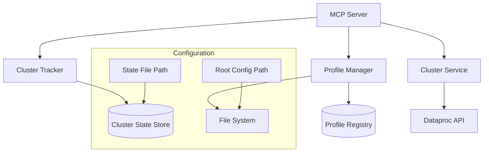
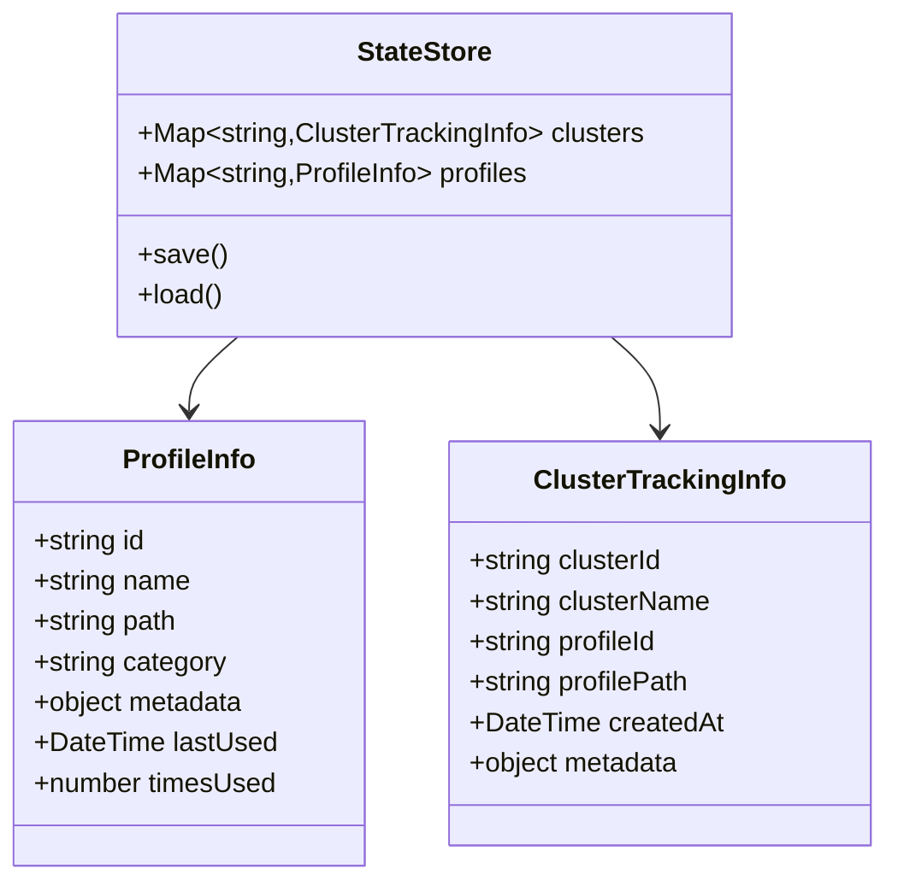

# Dataproc Cluster Management System Design

## Overview

This document outlines the design for enhancing the MCP server's Dataproc cluster management capabilities with profile management and cluster tracking features.

## System Architecture



## Core Components

### Profile Manager

Responsible for discovering and managing cluster configuration profiles.

Key Features:
- Recursive scanning of config directory structure
- Profile categorization based on directory structure
- Profile metadata extraction (name, description, tags)
- Profile validation against schema

### Cluster Tracker

Maintains the relationship between running clusters and their configurations.

Key Features:
- In-memory state for fast access
- Periodic persistence to disk (configurable interval)
- Cluster-to-profile mapping
- Creation timestamp and metadata tracking

### Extended Cluster Service

Enhanced version of existing cluster service with new capabilities.

New Features:
- Profile-aware cluster creation
- Extended cluster listing with profile information
- Historical tracking integration

## Data Structures



## Configuration Structure

The system supports flexible organization of cluster configuration profiles in any directory structure under a configurable root path:

```
/configs                          # Root config path (configurable)
├── development/
│   ├── small.yaml               # Small development cluster
│   └── standard.yaml            # Standard development cluster
├── production/
│   ├── high-memory/
│   │   └── analysis.yaml        # High-memory analysis cluster
│   └── high-cpu/
│       └── processing.yaml      # High-CPU processing cluster
└── testing/
    └── integration.yaml         # Integration testing cluster
```

## State Storage

The system maintains state in both memory and disk using a JSON format:

```json
{
  "clusters": {
    "cluster-uuid-1": {
      "clusterId": "cluster-uuid-1",
      "clusterName": "dev-cluster-1",
      "profileId": "dev/small",
      "profilePath": "/configs/development/small.yaml",
      "createdAt": "2025-05-15T16:47:53.000Z",
      "metadata": {
        "createdBy": "mcp-server",
        "version": "1.0.0"
      }
    }
  },
  "profiles": {
    "dev/small": {
      "id": "dev/small",
      "name": "Small Development Cluster",
      "path": "/configs/development/small.yaml",
      "category": "development",
      "lastUsed": "2025-05-15T16:47:53.000Z",
      "timesUsed": 5,
      "metadata": {
        "description": "Small cluster for development work"
      }
    }
  }
}
```

## Implementation Plan

### 1. Configuration Management
- Add server configuration for root config path
- Implement profile discovery and registry
- Add profile metadata extraction

### 2. State Management
- Design state file format
- Create state manager service
- Implement periodic state persistence

### 3. Service Enhancements
- Extend cluster creation to track profile usage
- Enhance list clusters to include profile information
- Add new endpoints for profile management

### 4. New API Endpoints

#### Profile Management
- `GET /profiles` - List available cluster profiles
- `GET /profiles/:id` - Get specific profile details

#### Cluster Management
- `GET /clusters/tracked` - List MCP-tracked clusters
- `GET /clusters/:id/profile` - Get cluster's profile info

## Configuration Options

The system will support the following configuration options:

- `rootConfigPath`: Base directory for cluster configuration profiles
- `stateFilePath`: Location of the state persistence file
- `stateSaveInterval`: How often to save state to disk (milliseconds)
- `profileScanInterval`: How often to scan for profile changes (milliseconds)