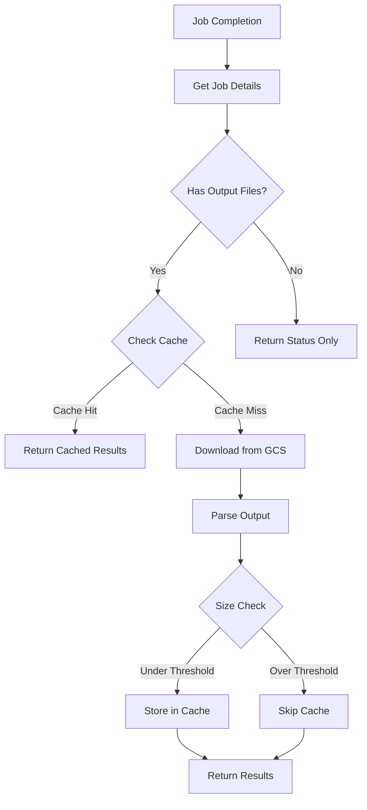
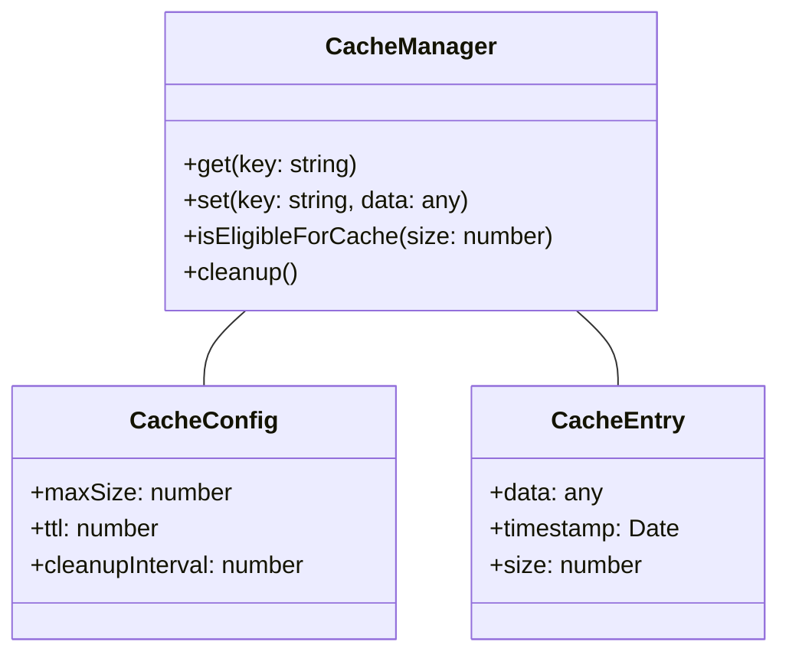
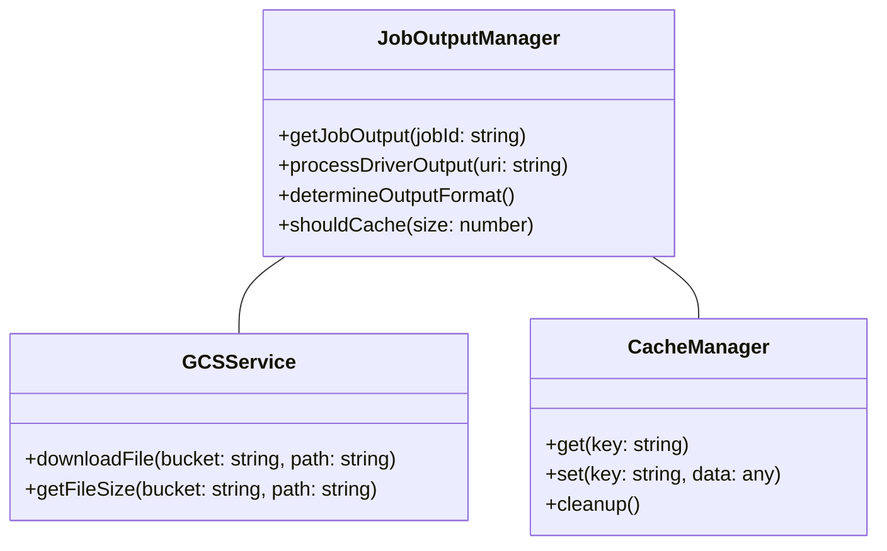

# GCS Output Handler Implementation Plan

## Overview
This document outlines the implementation plan for handling Dataproc job outputs stored in Google Cloud Storage (GCS), including a hybrid caching approach for optimizing performance.

## Architecture

### Job Output Flow


### Cache Management


### Job Output Manager


## Implementation Details

### 1. Cache Configuration
```typescript
interface CacheConfig {
  enabled: boolean;
  maxSize: 52428800;     // 50MB per file
  totalSize: 524288000;  // 500MB total
  ttl: 14400;           // 4 hours in seconds
  cleanupInterval: 3600; // Cleanup every hour
}
```

### 2. Directory Structure
```
src/
  services/
    cache.ts             # Cache management
    gcs.ts              # GCS operations
    output-parser.ts    # Output parsing logic
    job-output.ts      # Job output management
  types/
    gcs-types.ts       # GCS-related type definitions
    output-types.ts    # Output format type definitions
    cache-types.ts     # Cache-related type definitions
  config/
    gcs-config.ts      # GCS configuration
    cache-config.ts    # Cache configuration
```

### 3. Implementation Steps

#### Phase 1: Core Services
1. Implement GCSService for file operations
2. Create CacheManager with size-based decisions
3. Develop OutputParser for different formats

#### Phase 2: Integration
1. Extend existing JobService
2. Add cache integration
3. Implement output format detection

#### Phase 3: Configuration & Monitoring
1. Add cache configuration options
2. Implement cache statistics
3. Add monitoring capabilities

### 4. Cache Management Flow
1. Check cache before GCS download
2. Evaluate file size for cache eligibility
3. Implement TTL-based expiration
4. Maintain cache size limits
5. Periodic cleanup of expired entries

## Testing Strategy
1. Unit tests for each component
2. Integration tests for cache behavior
3. Performance testing with various file sizes
4. Cache efficiency metrics collection

## Error Handling
1. GCS connectivity issues
2. Cache overflow scenarios
3. Invalid output formats
4. File size limit violations

## Monitoring
1. Cache hit/miss rates
2. Storage usage metrics
3. Download times
4. Parse operation performance