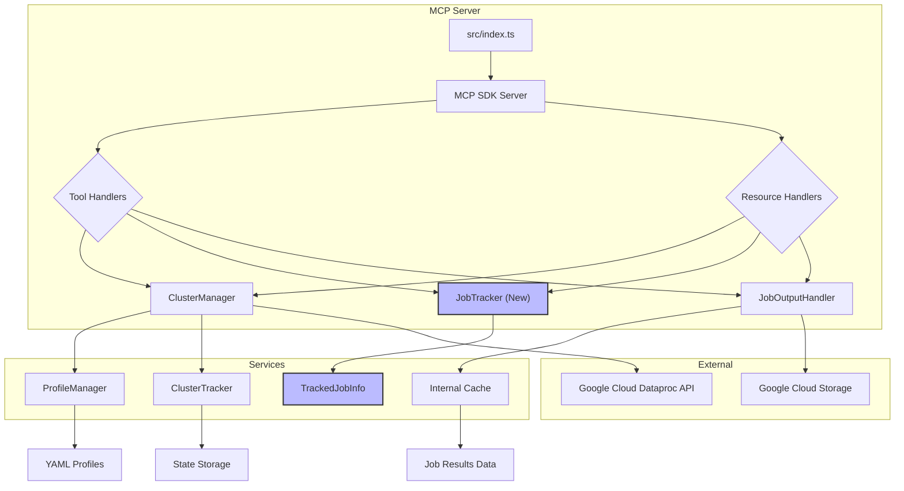

# Plan: Incorporating MCP Resources into the Dataproc Server

## 1. Objective

To expose key operational data (running clusters, submitted jobs, and job results) as accessible MCP resources, enabling the AI assistant to retrieve this information directly via resource URIs.

## 2. Proposed Resources

We will define the following MCP resources:

*   **`dataproc://clusters/tracked`**: A list of all Dataproc clusters currently tracked by this MCP server instance.
*   **`dataproc://jobs/session`**: A list of all Dataproc jobs submitted by this MCP server instance during its current session.
*   **`dataproc://job-results/{jobId}`**: The full dataset retrieved from a specific job ID, if available in the server's cache.

## 3. Data Management Strategy

To support these resources, we will leverage existing services and introduce a new `JobTracker` service.

### 3.1. For `dataproc://clusters/tracked` (List of Running Clusters)

*   **Source**: The existing `ClusterTracker` service (`src/services/tracker.ts`) already maintains a list of clusters created and tracked by this server.
*   **Population**: The `ClusterTracker` is populated on server startup by loading its state from `state/dataproc-state.json` and updated whenever a cluster is created or deleted via the MCP tools.
*   **Access**: We will expose a method from `ClusterTracker` (or `ClusterManager`) to retrieve this list.

### 3.2. For `dataproc://jobs/session` (List of Running Jobs Created During This Session)

*   **Source**: This is a new requirement. We will introduce a new `JobTracker` service.
*   **Data Model**: The `JobTracker` will maintain an in-memory list of jobs submitted by the MCP server. Each entry will include:
    *   `jobId`: The unique ID of the Dataproc job.
    *   `toolName`: The MCP tool that submitted the job (e.g., `submit_hive_query`, `submit_dataproc_job`).
    *   `submissionTime`: Timestamp when the job was submitted.
    *   `status`: Current status of the job (e.g., `PENDING`, `RUNNING`, `DONE`, `ERROR`).
    *   `lastUpdated`: Timestamp of the last status update.
    *   (Optional) `resultsCached`: Boolean indicating if results for this job are in the `JobOutputHandler` cache.
*   **Population**:
    *   When `submit_dataproc_job` (or `submit_hive_query`) is called, the new `JobTracker` will record the job.
    *   When `get_job_status` or `get_job_results` are called, the `JobTracker` will update the job's status.
*   **Persistence**: This tracker will primarily be in-memory for the current session, as requested ("during this session"). If persistence across server restarts is needed later, we can extend it to save/load state like `ClusterTracker`.
*   **Access**: The `JobTracker` will provide methods to list all tracked jobs or get details for a specific job.

### 3.3. For `dataproc://job-results/{jobId}` (Full Data Set Retrieved from `get_job_results`)

*   **Source**: The existing `JobOutputHandler` (`src/services/job-output-handler.ts`) already caches job results.
*   **Population**: The cache in `JobOutputHandler` is populated when `getDataprocJobResults` is successfully called.
*   **Access**: We will extend `JobOutputHandler` to provide a method to retrieve cached results by `jobId`. This will be a temporary resource, as the cache has a TTL.

## 4. MCP Server Integration (`src/index.ts`)

We will modify `src/index.ts` to:

1.  **Initialize `JobTracker`**: Create an instance of the new `JobTracker` service.
2.  **Define Resource Capabilities**: Add the new resource URIs to the `server.capabilities.resources` object.
3.  **Implement Resource Handlers**: Add `server.setRequestHandler` calls for `ReadResourceRequestSchema` to handle requests for these new resources.

## 5. Detailed Implementation Steps

### Step 1: Create `src/types/job-tracker.ts` (New File)

Define interfaces for `TrackedJobInfo` and `JobTrackerConfig`.

```typescript
// src/types/job-tracker.ts
export interface TrackedJobInfo {
  jobId: string;
  toolName: string;
  submissionTime: string;
  status: string; // e.g., PENDING, RUNNING, DONE, ERROR
  lastUpdated: string;
  resultsCached?: boolean;
  projectId: string;
  region: string;
  clusterName: string;
}

export interface JobTrackerConfig {
  // Configuration options for the job tracker, if any (e.g., max jobs to track)
}
```

### Step 2: Create `src/services/job-tracker.ts` (New File)

Implement the `JobTracker` class.

```typescript
// src/services/job-tracker.ts
import { TrackedJobInfo, JobTrackerConfig } from '../types/job-tracker.js';
import { logger } from '../utils/logger.js';

export class JobTracker {
  private jobs: Map<string, TrackedJobInfo> = new Map();
  private config: JobTrackerConfig;

  constructor(config: JobTrackerConfig = {}) {
    this.config = config;
    logger.debug('JobTracker: Initialized');
  }

  /**
   * Adds or updates a job in the tracker.
   */
  addOrUpdateJob(jobInfo: Partial<TrackedJobInfo> & { jobId: string }): void {
    const now = new Date().toISOString();
    const existingJob = this.jobs.get(jobInfo.jobId);

    const updatedJob: TrackedJobInfo = {
      ...existingJob,
      ...jobInfo,
      lastUpdated: now,
      submissionTime: existingJob?.submissionTime || now, // Keep original submission time
      status: jobInfo.status || existingJob?.status || 'UNKNOWN',
      toolName: jobInfo.toolName || existingJob?.toolName || 'UNKNOWN',
      projectId: jobInfo.projectId || existingJob?.projectId || 'UNKNOWN',
      region: jobInfo.region || existingJob?.region || 'UNKNOWN',
      clusterName: jobInfo.clusterName || existingJob?.clusterName || 'UNKNOWN',
    };
    this.jobs.set(jobInfo.jobId, updatedJob);
    logger.debug(`JobTracker: Job ${jobInfo.jobId} ${existingJob ? 'updated' : 'added'}. Status: ${updatedJob.status}`);
  }

  /**
   * Retrieves a specific job by its ID.
   */
  getJob(jobId: string): TrackedJobInfo | undefined {
    return this.jobs.get(jobId);
  }

  /**
   * Lists all tracked jobs.
   */
  listJobs(): TrackedJobInfo[] {
    return Array.from(this.jobs.values());
  }

  /**
   * Clears all tracked jobs (e.g., on session end).
   */
  clearJobs(): void {
    this.jobs.clear();
    logger.debug('JobTracker: All jobs cleared.');
  }
}
```

### Step 3: Update `src/index.ts`

1.  **Import `JobTracker`**:
    ```typescript
    import { JobTracker } from "./services/job-tracker.js";
    import { JobOutputHandler } from "./services/job-output-handler.js"; // Ensure this is imported
    ```
2.  **Initialize `jobTracker`**:
    ```typescript
    let profileManager: ProfileManager;
    let clusterTracker: ClusterTracker;
    let clusterManager: ClusterManager;
    let jobTracker: JobTracker; // Add this line
    let jobOutputHandler: JobOutputHandler; // Add this line
    ```
3.  **Instantiate `JobTracker` and `JobOutputHandler` in `main()`**:
    ```typescript
    async function main() {
      // ... existing code ...

      // Initialize profile manager
      profileManager = new ProfileManager(serverConfig.profileManager);
      await profileManager.initialize();

      // Initialize cluster tracker
      clusterTracker = new ClusterTracker(serverConfig.clusterTracker);
      await clusterTracker.initialize();

      // Initialize job output handler (if not already done)
      jobOutputHandler = new JobOutputHandler(); // Assuming default config is fine

      // Initialize job tracker
      jobTracker = new JobTracker(); // Add this line

      // Initialize cluster manager
      clusterManager = new ClusterManager(profileManager, clusterTracker);

      // ... rest of main function ...
    }
    ```
4.  **Update Tool Handlers to Use `JobTracker`**:
    *   **`submit_dataproc_job`**: After successful submission, add/update job in `jobTracker`.
        ```typescript
        case "submit_dataproc_job": {
          // ... existing code ...
          const response = await submitDataprocJob({ /* ... */ });
          jobTracker.addOrUpdateJob({
            jobId: response.jobId || response.jobReference?.jobId,
            toolName: toolName,
            status: response.status || 'SUBMITTED',
            projectId: String(projectId),
            region: String(region),
            clusterName: String(clusterName),
            resultsCached: false // Initially no results cached
          });
          // ... return content ...
        }
        ```
    *   **`get_job_status`**: Update job status in `jobTracker`.
        ```typescript
        case "get_job_status": {
          // ... existing code ...
          const status = await getDataprocJobStatus({ /* ... */ });
          jobTracker.addOrUpdateJob({
            jobId: String(jobId),
            status: status.status?.state,
            projectId: String(projectId),
            region: String(region),
            // clusterName might not be available here, so rely on initial submission
          });
          // ... return content ...
        }
        ```
    *   **`get_job_results`**: Update `resultsCached` in `jobTracker` if results are successfully retrieved.
        ```typescript
        case "get_job_results": {
          // ... existing code ...
          const results: any = await getDataprocJobResults({ /* ... */ });
          jobTracker.addOrUpdateJob({
            jobId: String(jobId),
            status: results.status?.state || 'DONE', // Assume DONE if results are here
            resultsCached: true,
            projectId: String(projectId),
            region: String(region),
            // clusterName might not be available here
          });
          // ... return content ...
        }
        ```
5.  **Define Resource Capabilities**: In the `server` initialization, add the `resources` definitions.

    ```typescript
    const server = new Server(
      {
        name: "dataproc-server",
        version: "0.3.0",
      },
      {
        capabilities: {
          resources: {
            "dataproc://clusters/tracked": {
              description: "List of Dataproc clusters tracked by this server instance.",
            },
            "dataproc://jobs/session": {
              description: "List of Dataproc jobs submitted by this server instance during the current session.",
            },
            "dataproc://job-results/{jobId}": {
              description: "Full dataset of results for a specific Dataproc job, if available in cache.",
              parameters: {
                jobId: { type: "string", description: "The ID of the Dataproc job." },
              },
            },
          },
          tools: {}, // Existing tools
          prompts: {},
        },
      }
    );
    ```

6.  **Implement Resource Handlers**: Add `server.setRequestHandler` for `ReadResourceRequestSchema`.

    ```typescript
    import { ReadResourceRequestSchema } from "@modelcontextprotocol/sdk/types.js"; // Add this import

    // ... existing code ...

    server.setRequestHandler(ReadResourceRequestSchema, async (request) => {
      const uri = request.params.uri;
      logger.debug(`MCP ReadResource: Received request for URI: ${uri}`);

      // Handle dataproc://clusters/tracked
      if (uri === "dataproc://clusters/tracked") {
        const trackedClusters = clusterManager.listTrackedClusters();
        return {
          content: [
            {
              type: "json",
              json: trackedClusters,
            },
          ],
        };
      }

      // Handle dataproc://jobs/session
      if (uri === "dataproc://jobs/session") {
        const sessionJobs = jobTracker.listJobs();
        return {
          content: [
            {
              type: "json",
              json: sessionJobs,
            },
          ],
        };
      }

      // Handle dataproc://job-results/{jobId}
      const jobResultsMatch = uri.match(/^dataproc:\/\/job-results\/(.+)$/);
      if (jobResultsMatch) {
        const jobId = jobResultsMatch[1];
        logger.debug(`MCP ReadResource: Attempting to retrieve cached results for jobId: ${jobId}`);
        try {
          // Assuming JobOutputHandler has a method to get cached results by jobId
          // You might need to add a getCachedOutput(jobId: string) method to JobOutputHandler
          const cachedResults = jobOutputHandler.getCachedOutput(jobId);

          if (cachedResults) {
            return {
              content: [
                {
                  type: "json",
                  json: cachedResults,
                },
              ],
            };
          } else {
            throw new McpError(ErrorCode.NotFound, `Job results for ${jobId} not found in cache.`);
          }
        } catch (error) {
          logger.error(`MCP ReadResource: Error retrieving job results for ${jobId}:`, error);
          throw new McpError(ErrorCode.InternalError, `Failed to retrieve job results: ${error instanceof Error ? error.message : String(error)}`);
        }
      }

      throw new McpError(ErrorCode.NotFound, `Resource not found: ${uri}`);
    });
    ```

### Step 4: Update `src/services/job-output-handler.ts` (Modify Existing File)

Add a method to retrieve cached output by `jobId`.

```typescript
// src/services/job-output-handler.ts
// ... existing imports and class definition ...

export class JobOutputHandler {
  // ... existing properties and methods ...

  /**
   * Retrieves cached output for a given job ID.
   * @param jobId The ID of the job.
   * @returns The cached output, or undefined if not found.
   */
  getCachedOutput(jobId: string): any | undefined {
    // Assuming your cache key includes the jobId.
    // You might need to adjust this based on your actual cache key structure.
    // For example, if cache keys are full GCS URIs, you'd need to map jobId to URI.
    // A simple approach for now: iterate through cache entries or store jobId in cache value.
    for (const [key, entry] of this.cache.entries()) {
      if (key.includes(jobId)) { // Simple check, might need refinement
        return entry.value;
      }
    }
    return undefined;
  }
}
```

### 6. Architectural Diagram
