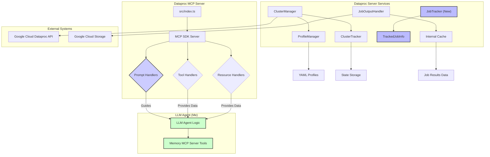

# Plan: Incorporating MCP Resources into the Dataproc Server

## 1. Objective

To expose key operational data (running clusters, submitted jobs, and job results) as accessible MCP resources, enabling the AI assistant to retrieve this information directly via resource URIs.

## 2. Proposed Resources

We will define the following MCP resources:

*   **`dataproc://clusters/tracked`**: A list of all Dataproc clusters currently tracked by this MCP server instance.
*   **`dataproc://jobs/session`**: A list of all Dataproc jobs submitted by this MCP server instance during its current session.
*   **`dataproc://job-results/{jobId}`**: The full dataset retrieved from a specific job ID, if available in the server's cache.

## 3. Data Management Strategy

To support these resources, we will leverage existing services and introduce a new `JobTracker` service.

### 3.1. For `dataproc://clusters/tracked` (List of Running Clusters)

*   **Source**: The existing `ClusterTracker` service (`src/services/tracker.ts`) already maintains a list of clusters created and tracked by this server.
*   **Population**: The `ClusterTracker` is populated on server startup by loading its state from `state/dataproc-state.json` and updated whenever a cluster is created or deleted via the MCP tools.
*   **Access**: We will expose a method from `ClusterTracker` (or `ClusterManager`) to retrieve this list.

### 3.2. For `dataproc://jobs/session` (List of Running Jobs Created During This Session)

*   **Source**: This is a new requirement. We will introduce a new `JobTracker` service.
*   **Data Model**: The `JobTracker` will maintain an in-memory list of jobs submitted by the MCP server. Each entry will include:
    *   `jobId`: The unique ID of the Dataproc job.
    *   `toolName`: The MCP tool that submitted the job (e.g., `submit_hive_query`, `submit_dataproc_job`).
    *   `submissionTime`: Timestamp when the job was submitted.
    *   `status`: Current status of the job (e.g., `PENDING`, `RUNNING`, `DONE`, `ERROR`).
    *   `lastUpdated`: Timestamp of the last status update.
    *   (Optional) `resultsCached`: Boolean indicating if results for this job are in the `JobOutputHandler` cache.
*   **Population**:
    *   When `submit_dataproc_job` (or `submit_hive_query`) is called, the new `JobTracker` will record the job.
    *   When `get_job_status` or `get_job_results` are called, the `JobTracker` will update the job's status.
*   **Persistence**: This tracker will primarily be in-memory for the current session, as requested ("during this session"). If persistence across server restarts is needed later, we can extend it to save/load state like `ClusterTracker`.
*   **Access**: The `JobTracker` will provide methods to list all tracked jobs or get details for a specific job.

### 3.3. For `dataproc://job-results/{jobId}` (Full Data Set Retrieved from `get_job_results`)

*   **Source**: The existing `JobOutputHandler` (`src/services/job-output-handler.ts`) already caches job results.
*   **Population**: The cache in `JobOutputHandler` is populated when `getDataprocJobResults` is successfully called.
*   **Access**: We will extend `JobOutputHandler` to provide a method to retrieve cached results by `jobId`. This will be a temporary resource, as the cache has a TTL.

## 4. Role of Prompts in Guiding LLM Agent for Context Management

The `prompts` capability within the MCP server will be utilized to provide explicit guidance to the LLM agent (me) on how to leverage the `memory` MCP server for tracking and managing operational context. This Dataproc server will *not* directly integrate with the `memory` MCP server; instead, it will provide information that *I* can use to inform my interactions with the `memory` server.

### 4.1. Objective

To instruct the LLM agent to actively use the `memory` MCP server to maintain a persistent, structured record of Dataproc operations (clusters, jobs, outputs), thereby enabling more intelligent and context-aware interactions.

### 4.2. Proposed Prompts

Based on the MCP specification, we will define the following prompts:

*   **`track_new_dataproc_entity`**: Instructs the LLM agent to create entities in the memory server for new Dataproc clusters or jobs.
*   **`update_dataproc_entity_status`**: Instructs the LLM agent to update the status of existing entities in the memory server.
*   **`record_dataproc_relationship`**: Instructs the LLM agent to establish relationships between entities in the memory server.
*   **`store_dataproc_job_results_reference`**: Instructs the LLM agent to store references to job results in the memory server.
*   **`query_memory_for_dataproc_context`**: Suggests the LLM agent query the memory server for relevant operational context.

### 4.3. Agent's Responsibility

The LLM agent (me) will be responsible for interpreting these prompts and executing the appropriate `memory` MCP server tools to manage its internal context and knowledge graph. This separation of concerns ensures the Dataproc server remains focused on Dataproc operations, while the agent manages its own state and understanding.

## 5. MCP Server Integration (`src/index.ts`)

We will modify `src/index.ts` to:

1.  **Initialize `JobTracker`**: Create an instance of the new `JobTracker` service.
2.  **Define Resource Capabilities**: Add the new resource URIs to the `server.capabilities.resources` object.
3.  **Implement Resource Handlers**: Add `server.setRequestHandler` calls for `ReadResourceRequestSchema` and `ListResourcesRequestSchema` to handle requests for these new resources.
4.  **Define Prompt Capabilities**: Populate the `server.capabilities.prompts` object with the guidance prompts for the LLM agent.
5.  **Implement Prompt Handlers**: Add `server.setRequestHandler` calls for `ListPromptsRequestSchema` and `GetPromptRequestSchema` to handle prompt-related requests.

## 6. Detailed Implementation Steps

### Step 1: Create `src/types/job-tracker.ts` (New File)

Define interfaces for `TrackedJobInfo` and `JobTrackerConfig`.

```typescript
// src/types/job-tracker.ts
export interface TrackedJobInfo {
  jobId: string;
  toolName: string;
  submissionTime: string;
  status: string; // e.g., PENDING, RUNNING, DONE, ERROR
  lastUpdated: string;
  resultsCached?: boolean;
  projectId: string;
  region: string;
  clusterName: string;
}

export interface JobTrackerConfig {
  // Configuration options for the job tracker, if any (e.g., max jobs to track)
}
```

### Step 2: Create `src/services/job-tracker.ts` (New File)

Implement the `JobTracker` class.

```typescript
// src/services/job-tracker.ts
import { TrackedJobInfo, JobTrackerConfig } from '../types/job-tracker.js';
import { logger } from '../utils/logger.js';

export class JobTracker {
  private jobs: Map<string, TrackedJobInfo> = new Map();
  private config: JobTrackerConfig;

  constructor(config: JobTrackerConfig = {}) {
    this.config = config;
    logger.debug('JobTracker: Initialized');
  }

  /**
   * Adds or updates a job in the tracker.
   */
  addOrUpdateJob(jobInfo: Partial<TrackedJobInfo> & { jobId: string }): void {
    const now = new Date().toISOString();
    const existingJob = this.jobs.get(jobInfo.jobId);

    const updatedJob: TrackedJobInfo = {
      ...existingJob,
      ...jobInfo,
      lastUpdated: now,
      submissionTime: existingJob?.submissionTime || now, // Keep original submission time
      status: jobInfo.status || existingJob?.status || 'UNKNOWN',
      toolName: jobInfo.toolName || existingJob?.toolName || 'UNKNOWN',
      projectId: jobInfo.projectId || existingJob?.projectId || 'UNKNOWN',
      region: jobInfo.region || existingJob?.region || 'UNKNOWN',
      clusterName: jobInfo.clusterName || existingJob?.clusterName || 'UNKNOWN',
    };
    this.jobs.set(jobInfo.jobId, updatedJob);
    logger.debug(`JobTracker: Job ${jobInfo.jobId} ${existingJob ? 'updated' : 'added'}. Status: ${updatedJob.status}`);
  }

  /**
   * Retrieves a specific job by its ID.
   */
  getJob(jobId: string): TrackedJobInfo | undefined {
    return this.jobs.get(jobId);
  }

  /**
   * Lists all tracked jobs.
   */
  listJobs(): TrackedJobInfo[] {
    return Array.from(this.jobs.values());
  }

  /**
   * Clears all tracked jobs (e.g., on session end).
   */
  clearJobs(): void {
    this.jobs.clear();
    logger.debug('JobTracker: All jobs cleared.');
  }
}
```

### Step 3: Update `src/index.ts`

1.  **Import Required Schemas**:
    ```typescript
    import { 
      CallToolRequestSchema, 
      ListToolsRequestSchema, 
      ReadResourceRequestSchema,
      ListResourcesRequestSchema,
      ListPromptsRequestSchema,
      GetPromptRequestSchema,
      ErrorCode, 
      McpError 
    } from "@modelcontextprotocol/sdk/types.js";
    ```

2.  **Import `JobTracker`**:
    ```typescript
    import { JobTracker } from "./services/job-tracker.js";
    import { JobOutputHandler } from "./services/job-output-handler.js"; // Ensure this is imported
    ```

3.  **Initialize `jobTracker`**:
    ```typescript
    let profileManager: ProfileManager;
    let clusterTracker: ClusterTracker;
    let clusterManager: ClusterManager;
    let jobTracker: JobTracker; // Add this line
    let jobOutputHandler: JobOutputHandler; // Add this line
    ```

4.  **Instantiate `JobTracker` and `JobOutputHandler` in `main()`**:
    ```typescript
    async function main() {
      // ... existing code ...

      // Initialize profile manager
      profileManager = new ProfileManager(serverConfig.profileManager);
      await profileManager.initialize();

      // Initialize cluster tracker
      clusterTracker = new ClusterTracker(serverConfig.clusterTracker);
      await clusterTracker.initialize();

      // Initialize job output handler (if not already done)
      jobOutputHandler = new JobOutputHandler(); // Assuming default config is fine

      // Initialize job tracker
      jobTracker = new JobTracker(); // Add this line

      // Initialize cluster manager
      clusterManager = new ClusterManager(profileManager, clusterTracker);

      // ... rest of main function ...
    }
    ```

5.  **Update Tool Handlers to Use `JobTracker`**:
    *   **`submit_dataproc_job`**: After successful submission, add/update job in `jobTracker`.
        ```typescript
        case "submit_dataproc_job": {
          // ... existing code ...
          const response = await submitDataprocJob({ /* ... */ });
          jobTracker.addOrUpdateJob({
            jobId: response.jobId || response.jobReference?.jobId,
            toolName: toolName,
            status: response.status || 'SUBMITTED',
            projectId: String(projectId),
            region: String(region),
            clusterName: String(clusterName),
            resultsCached: false // Initially no results cached
          });
          // ... return content ...
        }
        ```
    *   **`get_job_status`**: Update job status in `jobTracker`.
        ```typescript
        case "get_job_status": {
          // ... existing code ...
          const status = await getDataprocJobStatus({ /* ... */ });
          jobTracker.addOrUpdateJob({
            jobId: String(jobId),
            status: status.status?.state,
            projectId: String(projectId),
            region: String(region),
            // clusterName might not be available here, so rely on initial submission
          });
          // ... return content ...
        }
        ```
    *   **`get_job_results`**: Update `resultsCached` in `jobTracker` if results are successfully retrieved.
        ```typescript
        case "get_job_results": {
          // ... existing code ...
          const results: any = await getDataprocJobResults({ /* ... */ });
          jobTracker.addOrUpdateJob({
            jobId: String(jobId),
            status: results.status?.state || 'DONE', // Assume DONE if results are here
            resultsCached: true,
            projectId: String(projectId),
            region: String(region),
            // clusterName might not be available here
          });
          // ... return content ...
        }
        ```

6.  **Define Server Capabilities**: In the `server` initialization, add the `resources` and `prompts` definitions.

    ```typescript
    const server = new Server(
      {
        name: "dataproc-server",
        version: "0.3.0",
      },
      {
        capabilities: {
          resources: {
            // Declare support for resources
            listChanged: true
          },
          tools: {}, // Existing tools
          prompts: {
            // Declare support for prompts
            listChanged: true
          },
        },
      }
    );
    ```

7.  **Define Prompts**: Create a constant to hold the prompt definitions.

    ```typescript
    // Define available prompts
    const PROMPTS = {
      "track_new_dataproc_entity": {
        name: "track_new_dataproc_entity",
        description: "Instructs the LLM agent to use the `memory` MCP server to create entities for new Dataproc clusters or jobs.",
        arguments: [
          {
            name: "entityType",
            description: "Type of entity (e.g., 'Cluster', 'Job').",
            required: true
          },
          {
            name: "entityName",
            description: "Name or ID of the entity.",
            required: true
          },
          {
            name: "properties",
            description: "Key properties of the entity (e.g., projectId, region, status).",
            required: true
          }
        ]
      },
      "update_dataproc_entity_status": {
        name: "update_dataproc_entity_status",
        description: "Instructs the LLM agent to update the status of a Dataproc entity in the `memory` MCP server.",
        arguments: [
          {
            name: "entityType",
            description: "Type of entity (e.g., 'Cluster', 'Job').",
            required: true
          },
          {
            name: "entityName",
            description: "Name or ID of the entity.",
            required: true
          },
          {
            name: "newStatus",
            description: "The new status of the entity.",
            required: true
          }
        ]
      },
      "record_dataproc_relationship": {
        name: "record_dataproc_relationship",
        description: "Instructs the LLM agent to record a relationship between Dataproc entities in the `memory` MCP server.",
        arguments: [
          {
            name: "fromEntity",
            description: "Name of the source entity.",
            required: true
          },
          {
            name: "toEntity",
            description: "Name of the target entity.",
            required: true
          },
          {
            name: "relationshipType",
            description: "Type of relationship (e.g., 'ran_on', 'produced_output').",
            required: true
          }
        ]
      },
      "store_dataproc_job_results_reference": {
        name: "store_dataproc_job_results_reference",
        description: "Instructs the LLM agent to store a reference to Dataproc job results in the `memory` MCP server.",
        arguments: [
          {
            name: "jobId",
            description: "ID of the job.",
            required: true
          },
          {
            name: "resultSummary",
            description: "Summary of the results (e.g., first few rows, schema).",
            required: true
          },
          {
            name: "fullResultURI",
            description: "URI to the full results (e.g., GCS path).",
            required: true
          }
        ]
      },
      "query_memory_for_dataproc_context": {
        name: "query_memory_for_dataproc_context",
        description: "Suggests the LLM agent query the `memory` MCP server for relevant Dataproc operational context.",
        arguments: [
          {
            name: "queryHint",
            description: "Hint for the type of context to query (e.g., 'active clusters', 'job history').",
            required: true
          }
        ]
      }
    };
    ```

8.  **Implement Resource Handlers**: Add handlers for `ListResourcesRequestSchema` and `ReadResourceRequestSchema`.

    ```typescript
    // Handler for listing available resources
    server.setRequestHandler(ListResourcesRequestSchema, async () => {
      logger.debug(`MCP ListResources: Received request`);
      
      return {
        resources: [
          {
            uri: "dataproc://clusters/tracked",
            name: "Tracked Clusters",
            description: "List of Dataproc clusters tracked by this server instance.",
            mimeType: "application/json"
          },
          {
            uri: "dataproc://jobs/session",
            name: "Session Jobs",
            description: "List of Dataproc jobs submitted by this server instance during the current session.",
            mimeType: "application/json"
          },
          // We don't list the parameterized resource here, as it requires a jobId parameter
        ]
      };
    });

    // Handler for reading resource contents
    server.setRequestHandler(ReadResourceRequestSchema, async (request) => {
      const uri = request.params.uri;
      logger.debug(`MCP ReadResource: Received request for URI: ${uri}`);

      // Handle dataproc://clusters/tracked
      if (uri === "dataproc://clusters/tracked") {
        const trackedClusters = clusterManager.listTrackedClusters();
        return {
          contents: [
            {
              uri: uri,
              mimeType: "application/json",
              text: JSON.stringify(trackedClusters, null, 2)
            }
          ]
        };
      }

      // Handle dataproc://jobs/session
      if (uri === "dataproc://jobs/session") {
        const sessionJobs = jobTracker.listJobs();
        return {
          contents: [
            {
              uri: uri,
              mimeType: "application/json",
              text: JSON.stringify(sessionJobs, null, 2)
            }
          ]
        };
      }

      // Handle dataproc://job-results/{jobId}
      const jobResultsMatch = uri.match(/^dataproc:\/\/job-results\/(.+)$/);
      if (jobResultsMatch) {
        const jobId = jobResultsMatch[1];
        logger.debug(`MCP ReadResource: Attempting to retrieve cached results for jobId: ${jobId}`);
        try {
          // Assuming JobOutputHandler has a method to get cached results by jobId
          // You might need to add a getCachedOutput(jobId: string) method to JobOutputHandler
          const cachedResults = jobOutputHandler.getCachedOutput(jobId);

          if (cachedResults) {
            return {
              contents: [
                {
                  uri: uri,
                  mimeType: "application/json",
                  text: JSON.stringify(cachedResults, null, 2)
                }
              ]
            };
          } else {
            throw new McpError(ErrorCode.NotFound, `Job results for ${jobId} not found in cache.`);
          }
        } catch (error) {
          logger.error(`MCP ReadResource: Error retrieving job results for ${jobId}:`, error);
          throw new McpError(ErrorCode.InternalError, `Failed to retrieve job results: ${error instanceof Error ? error.message : String(error)}`);
        }
      }

      throw new McpError(ErrorCode.NotFound, `Resource not found: ${uri}`);
    });
    ```

9.  **Implement Prompt Handlers**: Add handlers for `ListPromptsRequestSchema` and `GetPromptRequestSchema`.

    ```typescript
    // Handler for listing available prompts
    server.setRequestHandler(ListPromptsRequestSchema, async () => {
      logger.debug(`MCP ListPrompts: Received request`);
      
      return {
        prompts: Object.values(PROMPTS)
      };
    });

    // Handler for getting a specific prompt
    server.setRequestHandler(GetPromptRequestSchema, async (request) => {
      const promptName = request.params.name;
      const promptArgs = request.params.arguments || {};
      
      logger.debug(`MCP GetPrompt: Received request for prompt: ${promptName}`, promptArgs);
      
      const prompt = PROMPTS[promptName];
      if (!prompt) {
        throw new McpError(ErrorCode.NotFound, `Prompt not found: ${promptName}`);
      }
      
      // Generate prompt messages based on the requested prompt and arguments
      if (promptName === "track_new_dataproc_entity") {
        const { entityType, entityName, properties } = promptArgs;
        return {
          description: `Track a new ${entityType} entity in the memory MCP server`,
          messages: [
            {
              role: "user",
              content: {
                type: "text",
                text: `Please use the memory MCP server to create a new ${entityType} entity named "${entityName}" with the following properties:\n\n${JSON.stringify(properties, null, 2)}`
              }
            }
          ]
        };
      }
      
      if (promptName === "update_dataproc_entity_status") {
        const { entityType, entityName, newStatus } = promptArgs;
        return {
          description: `Update the status of a ${entityType} entity in the memory MCP server`,
          messages: [
            {
              role: "user",
              content: {
                type: "text",
                text: `Please use the memory MCP server to update the status of ${entityType} "${entityName}" to "${newStatus}".`
              }
            }
          ]
        };
      }
      
      if (promptName === "record_dataproc_relationship") {
        const { fromEntity, toEntity, relationshipType } = promptArgs;
        return {
          description: `Record a relationship between entities in the memory MCP server`,
          messages: [
            {
              role: "user",
              content: {
                type: "text",
                text: `Please use the memory MCP server to create a "${relationshipType}" relationship from "${fromEntity}" to "${toEntity}".`
              }
            }
          ]
        };
      }
      
      if (promptName === "store_dataproc_job_results_reference") {
        const { jobId, resultSummary, fullResultURI } = promptArgs;
        return {
          description: `Store a reference to job results in the memory MCP server`,
          messages: [
            {
              role: "user",
              content: {
                type: "text",
                text: `Please use the memory MCP server to store a reference to the results of job "${jobId}".\n\nSummary: ${resultSummary}\n\nFull results URI: ${fullResultURI}`
              }
            }
          ]
        };
      }
      
      if (promptName === "query_memory_for_dataproc_context") {
        const { queryHint } = promptArgs;
        return {
          description: `Query the memory MCP server for Dataproc context`,
          messages: [
            {
              role: "user",
              content: {
                type: "text",
                text: `Before proceeding, please query the memory MCP server for relevant context about ${queryHint}.`
              }
            }
          ]
        };
      }
      
      throw new McpError(ErrorCode.InternalError, `Prompt implementation not found for: ${promptName}`);
    });
    ```

### Step 4: Update `src/services/job-output-handler.ts` (Modify Existing File)

Add a method to retrieve cached output by `jobId`.

```typescript
// src/services/job-output-handler.ts
// ... existing imports and class definition ...

export class JobOutputHandler {
  // ... existing properties and methods ...

  /**
   * Retrieves cached output for a given job ID.
   * @param jobId The ID of the job.
   * @returns The cached output, or undefined if not found.
   */
  getCachedOutput(jobId: string): any | undefined {
    // Assuming your cache key includes the jobId.
    // You might need to adjust this based on your actual cache key structure.
    // For example, if cache keys are full GCS URIs, you'd need to map jobId to URI.
    // A simple approach for now: iterate through cache entries or store jobId in cache value.
    for (const [key, entry] of this.cache.entries()) {
      if (key.includes(jobId)) { // Simple check, might need refinement
        return entry.value;
      }
    }
    return undefined;
  }
}
```

### 7. Architectural Diagram
