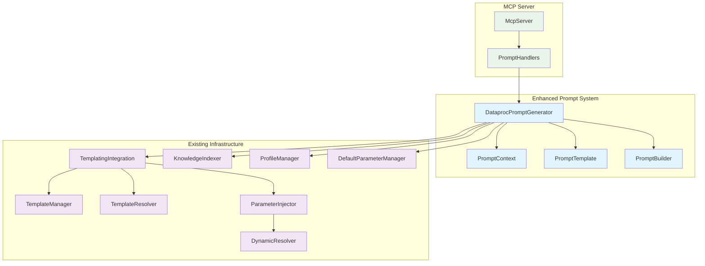
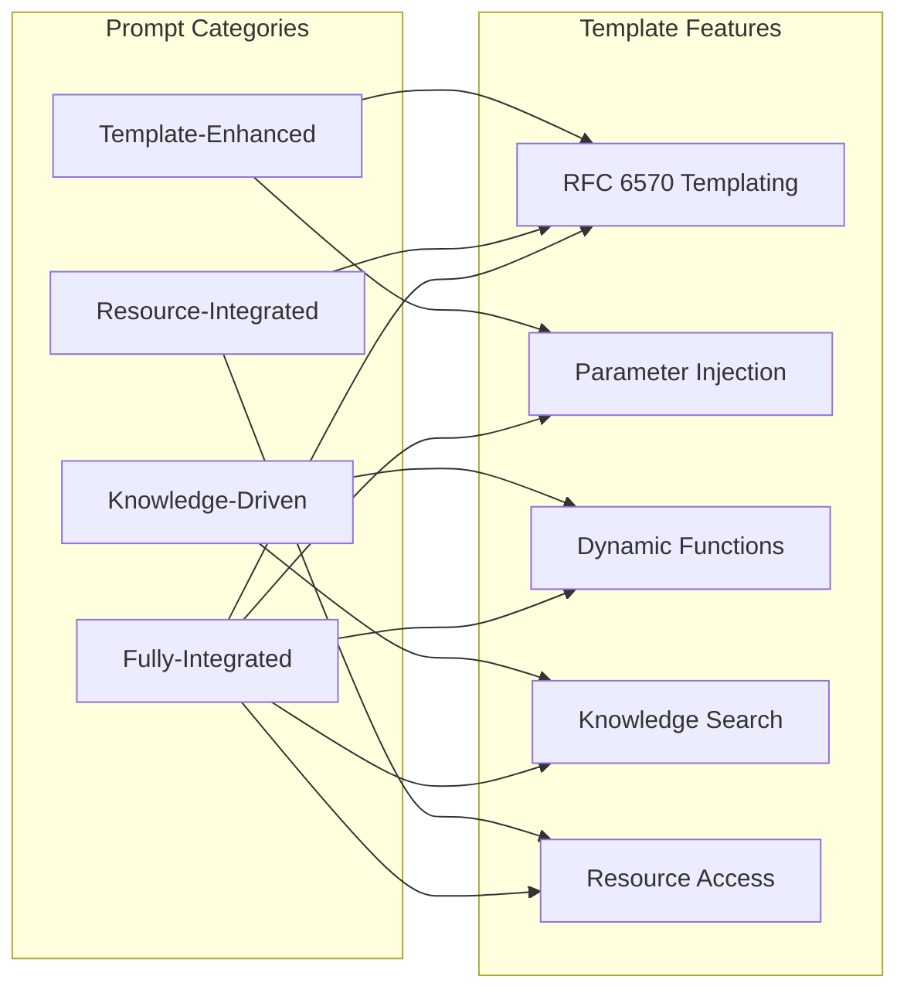
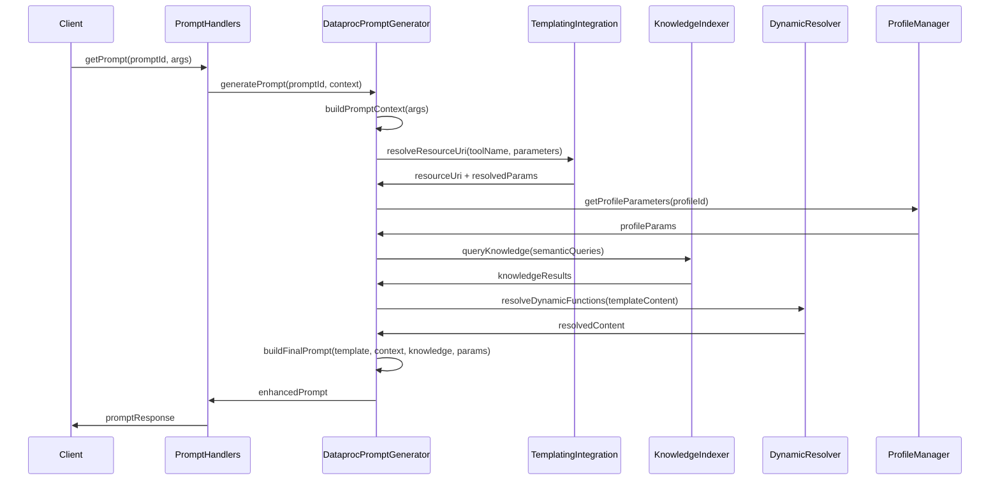

# Enhanced Built-in Prompt System Architecture

## Executive Summary

This document outlines the architecture for an enhanced built-in prompt system that replaces the current static prompts in `src/prompts/dataproc-prompts.ts` with a sophisticated, context-aware system that leverages the existing MCP infrastructure including RFC 6570 templating, Qdrant knowledge base, profile management, and parameter injection.

## System Architecture Overview



## Core Components Design

### 1. DataprocPromptGenerator Class

The central orchestrator that coordinates all prompt generation activities.

```typescript
interface DataprocPromptGeneratorConfig {
  enableTemplating: boolean;
  enableKnowledgeIntegration: boolean;
  enableProfileIntegration: boolean;
  cacheConfig: {
    enableCaching: boolean;
    defaultTtlMs: number;
    maxCacheSize: number;
  };
  dynamicResolution: {
    executeAtGenerationTime: boolean;
    timeoutMs: number;
  };
}

class DataprocPromptGenerator {
  private templatingIntegration: TemplatingIntegration;
  private knowledgeIndexer: KnowledgeIndexer;
  private profileManager: ProfileManager;
  private parameterInjector: ParameterInjector;
  private dynamicResolver: DynamicResolver;
  private promptCache: Map<string, CachedPrompt>;
  
  // Core methods
  async generatePrompt(promptId: string, context: PromptContext): Promise<EnhancedPrompt>
  async resolvePromptTemplate(template: PromptTemplate, context: PromptContext): Promise<ResolvedPrompt>
  private async executeKnowledgeQueries(template: PromptTemplate, context: PromptContext): Promise<KnowledgeResults>
  private async resolveProfileParameters(context: PromptContext): Promise<ProfileParameters>
  private async resolveDynamicFunctions(content: string, context: PromptContext): Promise<string>
}
```

### 2. PromptContext Interface

Comprehensive context information for prompt generation.

```typescript
interface PromptContext {
  // Core context
  promptId: string;
  toolName: string;
  userParameters: Record<string, unknown>;
  
  // Environment context
  environment?: string;
  profileId?: string;
  projectId?: string;
  region?: string;
  
  // Knowledge context
  knowledgeQueries?: KnowledgeQuery[];
  semanticContext?: string[];
  
  // Template context
  templateOverrides?: Record<string, unknown>;
  dynamicFunctions?: DynamicFunction[];
  
  // Security context
  securityContext: SecurityContext;
  
  // Metadata
  requestId?: string;
  timestamp: Date;
  metadata?: Record<string, unknown>;
}

interface KnowledgeQuery {
  type: 'semantic' | 'tag-based' | 'hybrid';
  query: string;
  filters?: Record<string, unknown>;
  limit?: number;
  minConfidence?: number;
}

interface DynamicFunction {
  name: 'job_output' | 'qdrant_query' | 'profile_config' | 'cluster_status';
  args: string[];
  cacheKey?: string;
  ttl?: number;
}
```

### 3. Enhanced Prompt Template System

Prompts are categorized into four types based on their integration complexity:



## Prompt Generation Flow



## Enhanced Prompt Specifications

### 1. analyze-dataproc-query (Knowledge-Driven)

**Purpose**: Analyze Hive/Spark queries with knowledge base examples and optimization insights.

**Key Features**:
- Semantic search for similar successful queries
- Performance optimization recommendations from knowledge base
- Context-aware analysis based on cluster configuration

```typescript
const analyzeDataprocQueryTemplate: PromptTemplate = {
  id: 'analyze-dataproc-query',
  category: 'knowledge-driven',
  description: 'Analyze Hive/Spark queries with knowledge base examples',
  
  template: `Analyze this {{queryType || 'SQL'}} query for optimization and best practices:

**Query to Analyze:**
\`\`\`sql
{{query}}
\`\`\`

**Context:**
- Target Cluster: {{clusterName || 'any'}}
- Optimization Level: {{optimizationLevel || 'basic'}}
- Query Type: {{queryType || 'auto-detect'}}

**Similar Query Examples from Knowledge Base:**
{{qdrant_query("similar queries " + queryType, "limit:3 type:job")}}

**Performance Insights:**
{{qdrant_query("query optimization " + queryType, "limit:2 type:cluster")}}

**Analysis Requirements:**
1. Query performance analysis with specific bottlenecks
2. Optimization suggestions based on similar successful queries
3. Best practices recommendations from knowledge base
4. Potential issues or warnings with suggested fixes
5. Alternative query approaches if applicable`,

  parameters: [
    { name: 'query', type: 'string', required: true, source: 'tool' },
    { name: 'queryType', type: 'string', required: false, source: 'tool' },
    { name: 'clusterName', type: 'string', required: false, source: 'profile' },
    { name: 'optimizationLevel', type: 'string', required: false, source: 'tool' }
  ],
  
  knowledgeQueries: [
    {
      type: 'semantic',
      query: 'similar queries {{queryType}}',
      filters: { type: 'job' },
      limit: 3
    },
    {
      type: 'semantic', 
      query: 'query optimization {{queryType}}',
      filters: { type: 'cluster' },
      limit: 2
    }
  ],
  
  dynamicFunctions: [
    { name: 'qdrant_query', args: ['similar queries " + queryType', 'limit:3 type:job'] },
    { name: 'qdrant_query', args: ['query optimization " + queryType', 'limit:2 type:cluster'] }
  ]
};
```

### 2. design-dataproc-cluster (Resource-Integrated)

**Purpose**: Generate cluster configuration recommendations with profile integration and regional best practices.

**Key Features**:
- Profile-based configuration templates
- Regional optimization recommendations
- Cost and performance optimization strategies

```typescript
const designDataprocClusterTemplate: PromptTemplate = {
  id: 'design-dataproc-cluster',
  category: 'resource-integrated',
  description: 'Generate cluster configuration with profile integration',
  
  template: `Design an optimal Dataproc cluster configuration for the following requirements:

**Workload Requirements:**
- Type: {{workloadType}}
- Data Size: {{dataSize}}
- Budget: {{budget}}
- Region: {{region || 'flexible'}}
- Additional Requirements: {{requirements || 'none specified'}}

**Profile-Based Recommendations:**
{{profile_config(profileId, "cluster-templates")}}

**Similar Cluster Configurations:**
{{qdrant_query("workload " + workloadType + " " + dataSize, "limit:3 type:cluster")}}

**Regional Best Practices:**
{{qdrant_query("region " + region + " cluster configuration", "limit:2")}}

**Design Requirements:**
1. Recommended cluster configuration (machine types, disk sizes, node counts)
2. Software components and versions based on workload type
3. Networking and security recommendations for {{region}}
4. Cost optimization strategies for {{budget}} budget
5. Performance tuning suggestions for {{dataSize}} data
6. Complete YAML configuration file
7. Scaling recommendations and auto-scaling policies`,

  parameters: [
    { name: 'workloadType', type: 'string', required: true, source: 'tool' },
    { name: 'dataSize', type: 'string', required: true, source: 'tool' },
    { name: 'budget', type: 'string', required: true, source: 'tool' },
    { name: 'region', type: 'string', required: false, source: 'gcp' },
    { name: 'requirements', type: 'string', required: false, source: 'tool' },
    { name: 'profileId', type: 'string', required: false, source: 'profile' }
  ],
  
  resourceAccess: [
    {
      uri: 'dataproc://profile/{{category}}/{{profileId}}/config',
      purpose: 'cluster-templates'
    }
  ],
  
  knowledgeQueries: [
    {
      type: 'semantic',
      query: 'workload {{workloadType}} {{dataSize}}',
      filters: { type: 'cluster' },
      limit: 3
    },
    {
      type: 'semantic',
      query: 'region {{region}} cluster configuration',
      limit: 2
    }
  ]
};
```

### 3. troubleshoot-dataproc-issue (Fully-Integrated)

**Purpose**: Comprehensive troubleshooting with semantic error matching, job output analysis, and historical resolution patterns.

**Key Features**:
- Job output analysis for error context
- Semantic matching of similar error patterns
- Historical resolution strategies
- Cluster configuration analysis

```typescript
const troubleshootDataprocIssueTemplate: PromptTemplate = {
  id: 'troubleshoot-dataproc-issue',
  category: 'fully-integrated',
  description: 'Comprehensive troubleshooting with semantic error matching',
  
  template: `Troubleshoot this Dataproc issue with comprehensive analysis:

**Issue Details:**
- Type: {{issueType}}
- Error Message: {{errorMessage || 'not provided'}}
- Job ID: {{jobId || 'not applicable'}}
- Cluster: {{clusterName || 'not specified'}}
- Timeline: {{timeline || 'not specified'}}
- Context: {{context || 'not provided'}}

**Job Output Analysis:**
{{job_output(jobId, "error-analysis")}}

**Similar Error Patterns:**
{{qdrant_query("error " + issueType + " " + errorMessage, "limit:5 type:error")}}

**Cluster Configuration Analysis:**
{{qdrant_query("cluster " + clusterName + " configuration issues", "limit:3 type:cluster")}}

**Historical Resolution Patterns:**
{{qdrant_query("resolved " + issueType + " troubleshooting", "limit:3")}}

**Troubleshooting Analysis:**
1. **Root Cause Analysis**: Based on error patterns and job output
2. **Step-by-Step Troubleshooting Guide**: Prioritized diagnostic steps
3. **Diagnostic Commands**: Specific commands to gather more information
4. **Resolution Strategies**: Multiple approaches based on similar cases
5. **Prevention Recommendations**: Avoid future occurrences
6. **Escalation Path**: When to involve Google Cloud Support`,

  parameters: [
    { name: 'issueType', type: 'string', required: true, source: 'tool' },
    { name: 'errorMessage', type: 'string', required: false, source: 'tool' },
    { name: 'jobId', type: 'string', required: false, source: 'tool' },
    { name: 'clusterName', type: 'string', required: false, source: 'tool' },
    { name: 'timeline', type: 'string', required: false, source: 'tool' },
    { name: 'context', type: 'string', required: false, source: 'tool' }
  ],
  
  dynamicFunctions: [
    { name: 'job_output', args: ['{{jobId}}', 'error-analysis'] },
    { name: 'qdrant_query', args: ['error {{issueType}} {{errorMessage}}', 'limit:5 type:error'] },
    { name: 'qdrant_query', args: ['cluster {{clusterName}} configuration issues', 'limit:3 type:cluster'] },
    { name: 'qdrant_query', args: ['resolved {{issueType}} troubleshooting', 'limit:3'] }
  ]
};
```

### 4. generate-dataproc-query (Template-Enhanced)

**Purpose**: Generate optimized queries with template-driven optimization and cluster-specific recommendations.

**Key Features**:
- Template-based parameter resolution
- Cluster-specific optimization hints
- Performance level-based recommendations
- Query pattern examples from knowledge base

```typescript
const generateDataprocQueryTemplate: PromptTemplate = {
  id: 'generate-dataproc-query',
  category: 'template-enhanced',
  description: 'Generate optimized queries with template-driven optimization',
  
  template: `Generate an optimized {{dialect}} query for the following requirements:

**Requirements:**
- Purpose: {{queryPurpose}}
- Tables: {{tableNames || 'to be determined'}}
- Query Type: {{queryType}}
- Dialect: {{dialect}}
- Performance Level: {{performanceLevel}}
- Target Cluster: {{clusterName || 'any'}}

**Cluster-Specific Optimizations:**
{{cluster_status(clusterName, "optimization-hints")}}

**Query Pattern Examples:**
{{qdrant_query("successful " + queryType + " " + dialect + " queries", "limit:3 type:job")}}

**Performance Best Practices:**
{{qdrant_query(dialect + " " + performanceLevel + " optimization", "limit:2")}}

**Generation Requirements:**
1. **Complete, Runnable Query**: Fully functional {{dialect}} query
2. **Query Explanation**: Logic and approach explanation
3. **Performance Optimizations**: Specific to {{performanceLevel}} level
4. **Alternative Approaches**: Different strategies if applicable
5. **Execution Considerations**: Memory, parallelism, and resource usage
6. **Monitoring Recommendations**: Key metrics to track during execution`,

  parameters: [
    { name: 'queryPurpose', type: 'string', required: true, source: 'tool' },
    { name: 'tableNames', type: 'string', required: false, source: 'tool' },
    { name: 'queryType', type: 'string', required: true, source: 'tool' },
    { name: 'dialect', type: 'string', required: true, source: 'tool' },
    { name: 'performanceLevel', type: 'string', required: true, source: 'tool' },
    { name: 'clusterName', type: 'string', required: false, source: 'profile' }
  ],
  
  templateResolution: {
    enableParameterInjection: true,
    enableDynamicFunctions: true,
    cacheResults: true
  }
};
```

## Integration Points

### 1. TemplateManager and TemplateResolver Integration

- **RFC 6570 URI templating**: Leverage existing template parsing and expansion
- **Parameter inheritance chains**: Use existing parameter injection hierarchy
- **Template validation**: Utilize existing validation framework

### 2. KnowledgeIndexer Integration

- **Semantic search capabilities**: Query Qdrant for relevant examples and patterns
- **Dynamic insights**: Access field analysis and pattern detection
- **Result formatting**: Use existing result formatting and confidence scoring

### 3. ResourceAccessor Integration

- **MCP resource access**: Access profile configurations and cluster data
- **Resource URI resolution**: Use templating system for resource URIs
- **Caching**: Leverage existing resource caching mechanisms

### 4. ParameterInjector Integration

- **Dynamic parameter resolution**: Resolve parameters at generation time
- **Inheritance chain**: GCP defaults → Profile → Template → Tool overrides
- **Validation**: Use existing parameter validation framework

### 5. ProfileManager Integration

- **Profile-based configurations**: Access cluster templates and defaults
- **Environment-specific settings**: Load environment-appropriate configurations
- **Parameter inheritance**: Integrate with parameter injection system

## Implementation Plan

### Phase 1: Core Infrastructure (Week 1-2)

**Deliverables:**
- `DataprocPromptGenerator` class with basic structure
- `PromptContext` interface and context building logic
- Integration with existing services (TemplatingIntegration, KnowledgeIndexer, ProfileManager)
- Basic caching mechanism
- Updated prompt handlers to use new system

**Key Tasks:**
1. Create core class structure and configuration
2. Implement service integration points
3. Build context resolution logic
4. Add caching and performance monitoring
5. Update MCP prompt registration system

### Phase 2: Template System (Week 2-3)

**Deliverables:**
- Template-Enhanced prompts (basic RFC 6570 templating)
- Knowledge-Driven prompts (Qdrant integration)
- Dynamic function resolution system
- Parameter injection integration

**Key Tasks:**
1. Implement template parsing and resolution
2. Add knowledge base query execution
3. Create dynamic function system
4. Integrate parameter inheritance chains
5. Add template validation and error handling

### Phase 3: Advanced Features (Week 3-4)

**Deliverables:**
- Resource-Integrated prompts (MCP resource access)
- Fully-Integrated prompts (all systems combined)
- Advanced caching and optimization
- Performance monitoring and metrics

**Key Tasks:**
1. Implement MCP resource access integration
2. Create complex prompt templates
3. Add advanced caching strategies
4. Implement performance optimization
5. Add comprehensive error handling and fallbacks

### Phase 4: Testing & Optimization (Week 4-5)

**Deliverables:**
- Comprehensive test suite
- Performance benchmarks
- Documentation and examples
- Migration guide from static prompts

**Key Tasks:**
1. Unit tests for all components
2. Integration tests with existing services
3. Performance testing and optimization
4. Documentation and usage examples
5. Migration strategy and backward compatibility

## File Structure

```
src/
├── prompts/
│   ├── enhanced-dataproc-prompts.ts     # New enhanced prompt system
│   ├── prompt-generator.ts              # DataprocPromptGenerator class
│   ├── prompt-context.ts                # PromptContext interface
│   ├── prompt-templates.ts              # Enhanced template definitions
│   └── template-functions.ts            # Dynamic function implementations
├── types/
│   ├── enhanced-prompts.ts              # Type definitions
│   └── prompt-templates.ts              # Template type definitions
└── handlers/
    └── enhanced-prompt-handlers.ts      # Updated prompt handlers
```

## Benefits and Expected Outcomes

### 1. Enhanced User Experience
- **Context-aware prompts**: Prompts adapt to user's environment, profile, and historical data
- **Intelligent recommendations**: Leverage knowledge base for relevant examples and best practices
- **Reduced cognitive load**: Pre-populated with relevant information and examples

### 2. Improved System Integration
- **Unified infrastructure**: Leverages all existing MCP services in a cohesive manner
- **Consistent parameter handling**: Uses established parameter inheritance chains
- **Scalable architecture**: Easily extensible for new prompt types and features

### 3. Performance Optimization
- **Intelligent caching**: Cache dynamic function results with appropriate TTLs
- **Parallel execution**: Execute knowledge queries and resource access concurrently
- **Optimized generation**: Execute dynamic functions at generation time for faster LLM processing

### 4. Maintainability and Extensibility
- **Modular design**: Clear separation of concerns and well-defined interfaces
- **Type safety**: Comprehensive TypeScript interfaces and validation
- **Testable architecture**: Each component can be tested independently

This architecture provides a sophisticated foundation for intelligent, context-aware prompts that leverage the full power of the existing MCP infrastructure while delivering a superior user experience through dynamic, personalized prompt generation.